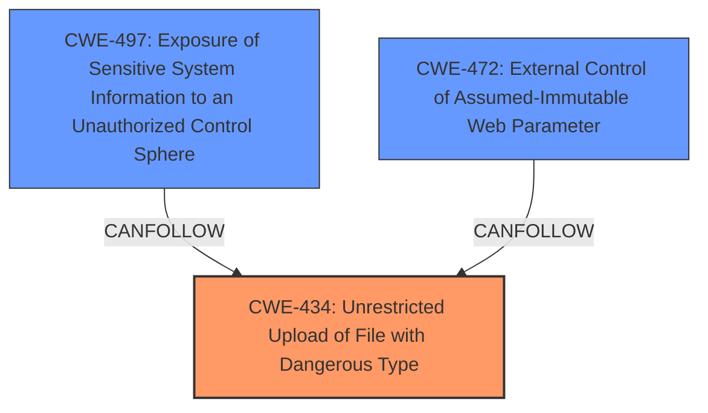

# Analysis Report for CVE-2025-0399

# Vulnerability Analysis Report: CVE-2025-0399

## Description

A vulnerability was found in StarSea99 starsea-mall 1.0. It has been declared as critical. This vulnerability affects the function UploadController of the file src/main/java/com/siro/mall/controller/common/uploadController.java. The manipulation of the argument file leads to **unrestricted upload**. The attack can be initiated remotely. The exploit has been disclosed to the public and may be used.

## Vulnerability Description Key Phrases

- **Rootcause:** unrestricted upload
- **Product:** StarSea99 starsea-mall
- **Version:** 1
- **Component:** src/main/java/com/siro/mall/controller/common/uploadController.java

## Analysis (with Relationship Data)

# Summary

| CWE ID | CWE Name | Confidence | CWE Abstraction Level | CWE Vulnerability Mapping Label | CWE-Vulnerability Mapping Notes |
|---|---|---|---|---|---|
| CWE-434 | Unrestricted Upload of File with Dangerous Type | 1.0 | Base | Allowed | Primary CWE: The application does not validate file types, allowing the upload of dangerous files. |
| CWE-497 | Exposure of Sensitive System Information to an Unauthorized Control Sphere | 0.7 | Base | Allowed | Secondary Candidate: Uploading arbitrary files can allow access to sensitive system information. |
| CWE-472 | External Control of Assumed-Immutable Web Parameter | 0.7 | Base | Allowed | Secondary Candidate: The application doesn't sufficiently verify uploaded file content. |

## Evidence and Confidence

*   **Confidence Score:** 0.9
*   **Evidence Strength:** HIGH

## Relationship Analysis
The primary CWE is CWE-434, which describes the core issue of unrestricted file uploads. Several other CWEs were considered, but ultimately deemed secondary. CWE-497 and CWE-472 are included as secondary issues because the unrestricted file upload can lead to sensitive information exposure and external control. The abstraction levels of the selected CWEs are all Base, providing the most specific representation of the weaknesses.



## Vulnerability Chain
The vulnerability chain starts with the **unrestricted upload** (CWE-434), which then can lead to exposure of sensitive information (CWE-497) and external control (CWE-472).

## Summary of Analysis
The primary weakness is clearly the **unrestricted upload** functionality, which directly aligns with CWE-434. This assessment is based on the provided vulnerability description and the CVE reference link analysis, both of which emphasize the lack of file type validation. The secondary CWEs highlight potential consequences of this initial weakness.

The graph relationships show how the primary weakness (CWE-434) can lead to the secondary weaknesses. The selected CWEs are at the optimal level of specificity because they directly address the root cause and its immediate consequences. The analysis is based on the evidence that the "**rootcause:** **unrestricted upload**" from the "Vulnerability Description Key Phrases" coupled with the CVE Reference Links Content Summary: "**Root cause of vulnerability:** The upload method in `src/main/java/com/siro/mall/controller/common/uploadController.java` **does not restrict the types of files that can be uploaded**."

Relevant CWE Information:

# Enhanced Context (25 CWEs)
The following CWEs were identified as potentially relevant to this vulnerability:

## CWE-434: Unrestricted Upload of File with Dangerous Type
**Abstraction Level**: Base
**Similarity Score**: 0.83
**Source**: dense

**Description**:
The product allows the upload or transfer of dangerous file types that are automatically processed within its environment.

**Mapping Guidance**:
- Usage: Allowed
- Rationale: This CWE entry is at the Base level of abstraction, which is a preferred level of abstraction for mapping to the root causes of vulnerabilities.

## CWE-497: Exposure of Sensitive System Information to an Unauthorized Control Sphere
**Abstraction Level**: Base
**Similarity Score**: 0.76
**Source**: dense

**Description**:
The product does not properly prevent sensitive system-level information from being accessed by unauthorized actors who do not have the same level of access to the underlying system as the product does.

**Mapping Guidance**:
- Usage: Allowed
- Rationale: This CWE entry is at the Base level of abstraction, which is a preferred level of abstraction for mapping to the root causes of vulnerabilities.

## CWE-472: External Control of Assumed-Immutable Web Parameter
**Abstraction Level**: Base
**Similarity Score**: 0.76
**Source**: dense

**Description**:
The web application does not sufficiently verify inputs that are assumed to be immutable but are actually externally controllable, such as hidden form fields.

**Mapping Guidance**:
- Usage: Allowed
- Rationale: This CWE entry is at the Base level of abstraction, which is a preferred level of abstraction for mapping to the root causes of vulnerabilities.

## CWE-22: Improper Limitation of a Pathname to a Restricted Directory ('Path Traversal')
Was not selected because there is no evidence of path traversal in the description.

## CWE-79: Improper Neutralization of Input During Web Page Generation ('Cross-site Scripting')
Was not selected because although the description mentions XSS, the root cause is in the file upload and not the output generation.

## CWE-89: Improper Neutralization of Special Elements used in an SQL Command ('SQL Injection')
Was not selected because there is no evidence of SQL injection in the description.

## CWE-78: Improper Neutralization of Special Elements used in an OS Command ('OS Command Injection')
Was not selected because there is no evidence of OS Command Injection in the description.


## CWE Relationship Analysis

Current CWEs represent these abstraction levels: .


### Vulnerability Chain Analysis

**Chain starting from CWE-89:**
- 89 (Improper Neutralization of Special Elements used in an SQL Command ('SQL Injection')) - ROOT


**Chain starting from CWE-22:**
- 22 (Improper Limitation of a Pathname to a Restricted Directory ('Path Traversal')) - ROOT


### CWE Relationship Diagram

```mermaid
graph TD
    classDef primary fill:#f96,stroke:#333,stroke-width:2px
    classDef secondary fill:#69f,stroke:#333
    classDef tertiary fill:#9e9,stroke:#333
```


*Report generated on 2025-07-14 05:46:33*
