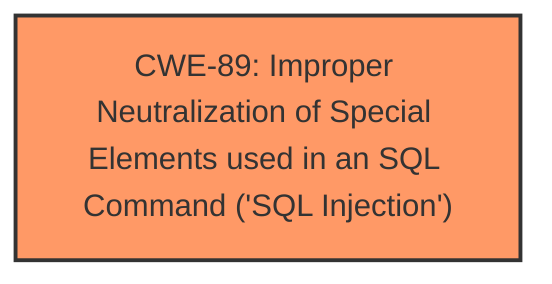

# Analysis Report for CVE-2025-0405

# Vulnerability Analysis Report: CVE-2025-0405

## Description

A vulnerability was found in liujianview gymxmjpa 1.0 and classified as critical. This issue affects the function GoodsDaoImpl of the file src/main/java/com/liujian/gymxmjpa/controller/GoodsController.java. The manipulation of the argument goodsName leads to **sql injection**. The attack may be initiated remotely. The exploit has been disclosed to the public and may be used.

## Vulnerability Description Key Phrases

- **Weakness:** sql injection
- **Vector:** manipulation of goodsName argument
- **Product:** liujianview gymxmjpa
- **Version:** 1.0
- **Component:** GoodsDaoImpl

## Analysis (with Relationship Data)

# Summary
| CWE ID | CWE Name | Confidence | CWE Abstraction Level | CWE Vulnerability Mapping Label | CWE-Vulnerability Mapping Notes |
|---|---|---|---|---|---|
| CWE-89 | Improper Neutralization of Special Elements used in an SQL Command ('SQL Injection') | 1.0 | Base | Allowed | Primary CWE |

## Evidence and Confidence

*   **Confidence Score:** 1.0
*   **Evidence Strength:** HIGH

## Relationship Analysis
The primary relationship that influenced the decision was the direct match of the vulnerability to the definition of CWE-89. The vulnerability description clearly states a SQL Injection vulnerability due to the manipulation of the `goodsName` argument, which directly aligns with CWE-89's description of improper neutralization of special elements used in an SQL command. Other CWEs considered were related to general injection or improper neutralization, but CWE-89 was the most specific and accurate.



## Vulnerability Chain
The vulnerability chain consists of a single step:

1.  **Root Cause:** CWE-89 - Improper Neutralization of Special Elements used in an SQL Command ('SQL Injection') due to the lack of input validation/sanitization of the `goodsName` parameter.
    - This directly leads to the vulnerability.

## Summary of Analysis
The analysis is based on the provided evidence, which clearly indicates a SQL injection vulnerability. The "Vulnerability Description Key Phrases" explicitly mentions "**sql injection**" as the weakness and "manipulation of goodsName argument" as the vector. The "CVE Reference Links Content Summary" confirms that the `count` method in `src/main/java/com/liujian/gymxmjpa/controller/GoodsController.java` does not filter the `goodsName` parameter, leading to SQL injection.

The retriever results also strongly support CWE-89, with a score of 1.0. The CWE description perfectly matches the vulnerability: "The product constructs all or part of an SQL command using externally-influenced input from an upstream component, but it does not neutralize or incorrectly neutralizes special elements that could modify the intended SQL command."

The graph relationships did not significantly influence the decision, as the evidence directly points to CWE-89. The selected CWE is at the optimal level of specificity (Base), as it accurately represents the root cause of the vulnerability. Other CWEs like CWE-74 (Improper Neutralization of Special Elements in Output Used by a Downstream Component ('Injection')) are more general and less appropriate.

Relevant CWE Information:

# Enhanced Context (25 CWEs)
The following CWEs were identified as potentially relevant to this vulnerability:

## CWE-89: Improper Neutralization of Special Elements used in an SQL Command ('SQL Injection')
**Abstraction Level**: Base
**Similarity Score**: 0.74
**Source**: dense

**Description**:
The product constructs all or part of an SQL command using externally-influenced input from an upstream component, but it does not neutralize or incorrectly neutralizes special elements that could modify the intended SQL command when it is sent to a downstream component. Without sufficient removal or quoting of SQL syntax in user-controllable inputs, the generated SQL query can cause those inputs to be interpreted as SQL instead of ordinary user data.

**Mapping Guidance**:
- Usage: Allowed
- Rationale: This CWE entry is at the Base level of abstraction, which is a preferred level of abstraction for mapping to the root causes of vulnerabilities.

## CWE-89: Improper Neutralization of Special Elements used in an SQL Command ('SQL Injection')
**Abstraction Level**: Base
**Similarity Score**: 983.91
**Source**: sparse

**Description**:
The product constructs all or part of an SQL command using externally-influenced input from an upstream component, but it does not neutralize or incorrectly neutralizes special elements that could modify the intended SQL command when it is sent to a downstream component. Without sufficient removal or quoting of SQL syntax in user-controllable inputs, the generated SQL query can cause those inputs to be interpreted as SQL instead of ordinary user data.

**Mapping Guidance**:
- Usage: Allowed
- Rationale: This CWE entry is at the Base level of abstraction, which is a preferred level of abstraction for mapping to the root causes of vulnerabilities.


## CWE Relationship Analysis

Current CWEs represent these abstraction levels: .


### Vulnerability Chain Analysis

**Chain starting from CWE-89:**
- 89 (Improper Neutralization of Special Elements used in an SQL Command ('SQL Injection')) - ROOT


**Chain starting from CWE-74:**
- 74 (Improper Neutralization of Special Elements in Output Used by a Downstream Component ('Injection')) - ROOT


### CWE Relationship Diagram

```mermaid
graph TD
    classDef primary fill:#f96,stroke:#333,stroke-width:2px
    classDef secondary fill:#69f,stroke:#333
    classDef tertiary fill:#9e9,stroke:#333
```


*Report generated on 2025-07-14 05:47:47*
