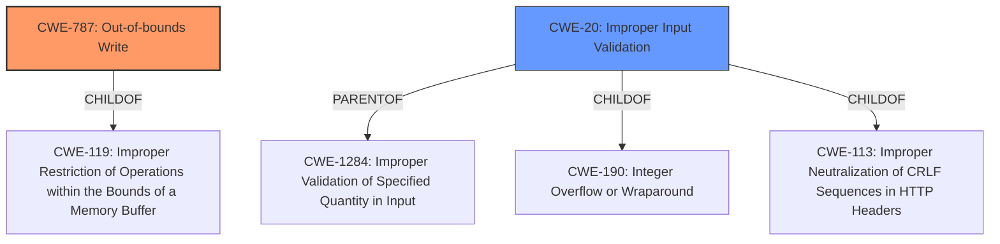

# Analysis for CVE-2025-0412

# Summary
| CWE ID | CWE Name | Confidence | CWE Abstraction Level | CWE Vulnerability Mapping Label | CWE-Vulnerability Mapping Notes |
|---|---|---|---|---|---|
| CWE-787 | Out-of-bounds Write | 1.0 | Base |  Primary | Allowed |
| CWE-20 | Improper Input Validation | 0.7 | Class | Secondary | Discouraged |

## Evidence and Confidence

*   **Confidence Score:** 0.9
*   **Evidence Strength:** HIGH

## Relationship Analysis
The primary CWE is CWE-787 **Out-of-bounds Write**, which is a Base level CWE. The secondary CWE is CWE-20 **Improper Input Validation**, which is a Class level CWE. CWE-787 is a child of CWE-119 **Improper Restriction of Operations within the Bounds of a Memory Buffer**. CWE-20 can be a parent of many other CWEs including CWE-1284 **Improper Validation of Specified Quantity in Input**, CWE-190 **Integer Overflow or Wraparound** and CWE-113 **Improper Neutralization of CRLF Sequences in HTTP Headers ('HTTP Request/Response Splitting')**.

## Vulnerability Chain
The vulnerability chain starts with **lack of proper validation of user-supplied data** (CWE-20). This leads to a **memory corruption** condition, specifically an **Out-of-bounds Write** (CWE-787), which can then result in remote code execution.

## Summary of Analysis
The primary weakness is the **Out-of-bounds Write** (CWE-787) due to the **lack of proper validation of user-supplied data** (CWE-20). The vulnerability description and CVE Reference Links Content Summary both highlight the **lack of proper validation** as the root cause. The description also mentions that this leads to **memory corruption**, and the Content Summary explicitly mentions that this could be an **Out-of-bounds Write**. The final impact is that an attacker can leverage this vulnerability to execute code in the context of the current process.

CWE-787 is chosen as the primary CWE because the vulnerability ultimately results in writing data outside the intended buffer. CWE-20 is added as a secondary CWE to represent the root cause of **lack of proper validation**. While CWE-20 is generally discouraged, it is useful to identify the **lack of proper validation of user-supplied data** as the initial cause of the vulnerability. The retriever results support the choice of CWE-787 and CWE-20 with high scores.

Other CWEs considered but not used:
*   CWE-119: Improper Restriction of Operations within the Bounds of a Memory Buffer - While CWE-787 is a child of CWE-119, CWE-787 is more specific to the nature of this vulnerability.
*   CWE-121 and CWE-122: Stack-based Buffer Overflow and Heap-based Buffer Overflow - There isn't sufficient evidence to determine whether the buffer is allocated on the stack or the heap, so a more general CWE-787 is selected.
*   CWE-1284: Improper Validation of Specified Quantity in Input - While this is related to input validation, the description doesn't specify that it's related to a quantity, so CWE-20 is preferred.