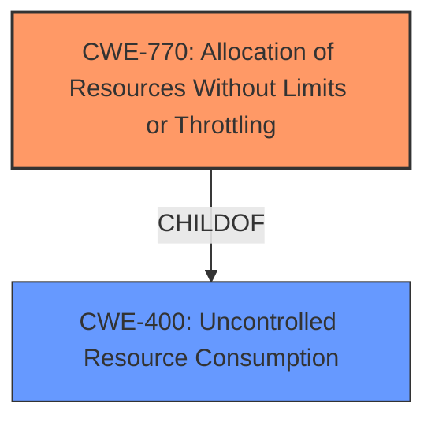

# Analysis Report for CVE-2025-0426

# Vulnerability Analysis Report: CVE-2025-0426

## Description

A security issue was discovered in Kubernetes where a large number of container checkpoint requests made to the unauthenticated kubelet read-only HTTP endpoint may cause a Node Denial of Service by filling the Nodes disk.

## Vulnerability Description Key Phrases

- **Impact:** Denial of Service
- **Vector:** large number of container checkpoint requests
- **Product:** Kubernetes
- **Component:** unauthenticated kubelet read-only HTTP endpoint

## Analysis (with Relationship Data)

# Summary
| CWE ID  | CWE Name                                                    | Confidence | CWE Abstraction Level | CWE Vulnerability Mapping Label | CWE-Vulnerability Mapping Notes |
| :------- | :---------------------------------------------------------- | :--------- | :-------------------- | :------------------------------ | :------------------------------ |
| CWE-770  | Allocation of Resources Without Limits or Throttling        | 0.9        | Base                  | Primary CWE                     | Allowed                       |
| CWE-400  | Uncontrolled Resource Consumption                           | 0.7        | Class                 | Secondary Candidate             | Discouraged                     |

## Evidence and Confidence

*   **Confidence Score:** 0.8
*   **Evidence Strength:** HIGH

## Relationship Analysis
The primary CWE is CWE-770 (Allocation of Resources Without Limits or Throttling), which is a base-level CWE. CWE-400 (Uncontrolled Resource Consumption) is a class-level CWE and a parent of CWE-770. Since CWE-770 provides a more specific description of the **root cause** (unlimited allocation), it is preferred over the more general CWE-400.



## Vulnerability Chain
The vulnerability chain starts with the **uncontrolled allocation** of resources due to the lack of limits or throttling on container checkpoint requests (CWE-770). This leads to the Node's disk being filled, resulting in a Denial of Service (DoS), which is the impact (CWE-400).

## Summary of Analysis
The initial analysis focused on identifying the **root cause** of the vulnerability. The description clearly states that a large number of container checkpoint requests can fill the Node's disk, leading to a Denial of Service. This indicates an issue with resource allocation.

The evidence from "CVE Reference Links Content Summary" is: "A large number of container checkpoint requests made to the unauthenticated kubelet read-only HTTP endpoint may cause a Node Denial of Service by filling the Node's disk."

The retriever results suggested CWE-770 (Allocation of Resources Without Limits or Throttling) and CWE-400 (Uncontrolled Resource Consumption) as potential candidates. CWE-770 aligns better with the **root cause** because it explicitly mentions the lack of limits or throttling during resource allocation. CWE-400 is a more general description of resource consumption issues.

The relationship analysis shows that CWE-770 is a child of CWE-400. Therefore, CWE-770 is more specific and accurately describes the weakness.

The chosen CWEs are at the optimal level of specificity. CWE-770 is a Base-level CWE, which is preferred for mapping to the **root causes** of vulnerabilities. CWE-400 is a Class-level CWE and describes the resulting impact.

Relevant CWE Information:

# Enhanced Context (25 CWEs)
The following CWEs were identified as potentially relevant to this vulnerability:

## CWE-789: Memory Allocation with Excessive Size Value
**Abstraction Level**: Variant
**Similarity Score**: 0.71
**Source**: dense

**Description**:
The product allocates memory based on an untrusted, large size value, but it does not ensure that the size is within expected limits, allowing arbitrary amounts of memory to be allocated.

**Mapping Guidance**:
- Usage: Allowed
- Rationale: This CWE entry is at the Variant level of abstraction, which is a preferred level of abstraction for mapping to the root causes of vulnerabilities.

*   **Not Used**: While memory allocation is involved, this CWE is too specific, focusing on excessive size values rather than the broader issue of resource allocation without limits.

## CWE-770: Allocation of Resources Without Limits or Throttling
**Abstraction Level**: Base
**Similarity Score**: 0.69
**Source**: dense

**Description**:
The product allocates a reusable resource or group of resources on behalf of an actor without imposing any restrictions on the size or number of resources that can be allocated, in violation of the intended security policy for that actor.

**Mapping Guidance**:
- Usage: Allowed
- Rationale: This CWE entry is at the Base level of abstraction, which is a preferred level of abstraction for mapping to the root causes of vulnerabilities.

*   **Used**: This is the primary CWE. The vulnerability is caused by the lack of limits on the number of container checkpoint requests, which leads to uncontrolled resource allocation.

## CWE-400: Uncontrolled Resource Consumption
**Abstraction Level**: Class
**Similarity Score**: 0.69
**Source**: dense

**Description**:
The product does not properly control the allocation and maintenance of a limited resource, thereby enabling an actor to influence the amount of resources consumed, eventually leading to the exhaustion of available resources.

**Mapping Guidance**:
- Usage: Discouraged
- Rationale: CWE-400 is intended for incorrect behaviors in which the product is expected to track and restrict how many resources it consumes, but CWE-400 is often misused because it is conflated with the "technical impact" of vulnerabilities in which resource consumption occurs. It is sometimes used for low-information vulnerability reports. It is a level-1 Class (i.e., a child of a Pillar).

*   **Used**: This CWE represents the impact of the vulnerability. The uncontrolled resource consumption (disk space) leads to a denial of service. Although it is listed as discouraged, it is still valid as a secondary weakness.

## CWE-617: Reachable Assertion
**Abstraction Level**: Base
**Similarity Score**: 0.68
**Source**: dense

**Description**:
The product contains an assert() or similar statement that can be triggered by an attacker, which leads to an application exit or other behavior that is more severe than necessary.

**Mapping Guidance**:
- Usage: Allowed
- Rationale: This CWE entry is at the Base level of abstraction, which is a preferred level of abstraction for mapping to the root causes of vulnerabilities.

*   **Not Used**: This CWE is not relevant because the vulnerability does not involve assertions.

## CWE-212: Improper Removal of Sensitive Information Before Storage or Transfer
**Abstraction Level**: Base
**Similarity Score**: 0.67
**Source**: dense

**Description**:
The product stores, transfers, or shares a resource that contains sensitive information, but it does not properly remove that information before the product makes the resource available to unauthorized actors.

**Mapping Guidance**:
- Usage: Allowed
- Rationale: This CWE entry is at the Base level of abstraction, which is a preferred level of abstraction for mapping to the root causes of vulnerabilities.

*   **Not Used**: This CWE is not relevant because the vulnerability does not involve the storage or transfer of sensitive information.

## CWE-1284: Improper Validation of Specified Quantity in Input
**Abstraction Level**: Base
**Similarity Score**: 0.67
**Source**: dense

**Description**:
The product receives input that is expected to specify a quantity (such as size or length), but it does not validate or incorrectly validates that the quantity has the required properties.

**Mapping Guidance**:
- Usage: Allowed
- Rationale: This CWE entry is at the Base level of abstraction, which is a preferred level of abstraction for mapping to the root causes of vulnerabilities.

*   **Not Used**: While the number of requests is a quantity, the core issue is not the validation of that quantity, but the lack of limits on processing those requests.

## CWE-404: Improper Resource Shutdown or Release
**Abstraction Level**: Class
**Similarity Score**: 0.66
**Source**: dense

**Description**:
The product does not release or incorrectly releases a resource before it is made available for re-use.

**Mapping Guidance**:
- Usage: Allowed-with-Review
- Rationale: This CWE entry is a Class and might have Base-level children that would be more appropriate

*   **Not Used**: The issue is not about releasing resources but about allocating them without limits.

## CWE-696: Incorrect Behavior Order
**Abstraction Level**: Class
**Similarity Score**: 0.66
**Source**: dense

**Description**:
The product performs multiple related behaviors, but the behaviors are performed in the wrong order in ways which may produce resultant weaknesses.

**Mapping Guidance**:
- Usage: Allowed-with-Review
- Rationale: This CWE entry is a Class and might have Base-level children that would be more appropriate

*   **Not Used**: The vulnerability does not involve incorrect ordering of behaviors.

## CWE-252: Unchecked Return Value
**Abstraction Level**: Base
**Similarity Score**: 0.66
**Source**: dense

**Description**:
The product does not check the return value from a method or function, which can prevent it from detecting unexpected states and conditions.

**Mapping Guidance**:
- Usage: Allowed
- Rationale: This CWE entry is at the Base level of abstraction, which is


## CWE Relationship Analysis

Current CWEs represent these abstraction levels: .


### Vulnerability Chain Analysis

**Chain starting from CWE-1284:**
- 1284 (Improper Validation of Specified Quantity in Input) - ROOT


**Chain starting from CWE-400:**
- 400 (Uncontrolled Resource Consumption) - ROOT


### CWE Relationship Diagram

```mermaid
graph TD
    classDef primary fill:#f96,stroke:#333,stroke-width:2px
    classDef secondary fill:#69f,stroke:#333
    classDef tertiary fill:#9e9,stroke:#333
```


*Report generated on 2025-07-14 05:51:57*
