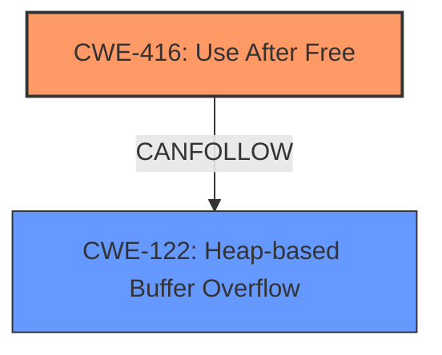

# Enhanced Analysis for CVE-2025-0444

# Summary
| CWE ID | CWE Name | Confidence | CWE Abstraction Level | CWE Vulnerability Mapping Label | CWE-Vulnerability Mapping Notes |
|---|---|---|---|---|---|
| CWE-416 | Use After Free | 1.0 | Variant | Allowed | Primary CWE |
| CWE-122 | Heap-based Buffer Overflow | 0.4 | Variant | Allowed | Secondary Candidate |

## Evidence and Confidence

*   **Confidence Score:** 0.9
*   **Evidence Strength:** HIGH

## Relationship Analysis
The primary relationship observed is that CWE-416 (Use After Free) can lead to other issues such as CWE-123 (Write-what-where Condition) or CWE-122 (Heap-based Buffer Overflow). The selected CWE is at the Variant level, which is the preferred level of abstraction.



## Vulnerability Chain
The vulnerability chain starts with a **use after free** condition (CWE-416), which allows a remote attacker to potentially trigger **heap corruption**. This **heap corruption** can then potentially be exploited.

## Summary of Analysis
The vulnerability description explicitly mentions "**use after free**" and "**heap corruption**". The CVE Reference Links Content Summary also highlights "**Use after free** in Skia". The Retriever Results list CWE-416 (Use After Free) as the top candidate. Given this strong evidence, CWE-416 is selected as the primary CWE. The description mentions potential **heap corruption**, and the graph relationships indicate that a use-after-free can lead to heap corruption, so CWE-122 (Heap-based Buffer Overflow) is considered as a secondary candidate.

Relevant CWE Information:

# Enhanced Context (25 CWEs)
The following CWEs were identified as potentially relevant to this vulnerability:

## CWE-416: Use After Free
**Abstraction Level**: Variant
**Similarity Score**: 0.78
**Source**: dense

**Description**:
The product reuses or references memory after it has been freed. At some point afterward, the memory may be allocated again and saved in another pointer, while the original pointer references a location somewhere within the new allocation. Any operations using the original pointer are no longer valid because the memory "belongs" to the code that operates on the new pointer.

**Mapping Guidance**:
- Usage: Allowed
- Rationale: This CWE entry is at the Variant level of abstraction, which is a preferred level of abstraction for mapping to the root causes of vulnerabilities.

## CWE-122: Heap-based Buffer Overflow
**Abstraction Level**: Variant
**Similarity Score**: 0.234
**Source**: sparse

**Description**:
The product writes data outside the boundaries of a buffer allocated in the heap.

**Mapping Guidance**:
- Usage: Allowed
- Rationale: This CWE entry is at the Variant level of abstraction, which is a preferred level of abstraction for mapping to the root causes of vulnerabilities.

**CWE Selection Details:**

*   **CWE-416: Use After Free**
    *   **Match:** The vulnerability description explicitly states "**use after free**". The description of CWE-416 perfectly aligns: "The product reuses or references memory after it has been freed."
    *   **Security Implications:** Use-after-free vulnerabilities can lead to arbitrary code execution, denial of service, or information disclosure.
    *   **Relationships:** CWE-416 can lead to other weaknesses, such as CWE-123 (Write-what-where Condition).
    *   **Mapping Guidance:** The Usage is "Allowed" and the Abstraction Level is "Variant," which is preferred.
    *   **Justification:** The evidence directly supports this classification, and the CWE characteristics match the vulnerability description.
    *   **Confidence:** 1.0
*   **CWE-122: Heap-based Buffer Overflow**
    *   **Match:** The vulnerability description mentions "**heap corruption**". A use-after-free can lead to heap corruption in the form of a heap-based buffer overflow if the freed memory is reallocated and then written to improperly.
    *   **Security Implications:** Heap-based buffer overflows can lead to arbitrary code execution.
    *   **Relationships:** This is a potential impact of a use-after-free.
    *   **Mapping Guidance:** The Usage is "Allowed" and the Abstraction Level is "Variant," which is preferred.
    *   **Justification:** While heap corruption is mentioned, the root cause is still the use-after-free. Therefore, this is a secondary candidate.
    *   **Confidence:** 0.4

**CWEs Considered but Not Used:**

*   CWE-843: Access of Resource Using Incompatible Type ('Type Confusion'): This was considered due to the possibility of type confusion after a use-after-free. However, the description does not specifically mention type confusion, so it was not selected.
*   CWE-366: Race Condition within a Thread and CWE-362: Concurrent Execution using Shared Resource with Improper Synchronization ('Race Condition'): These were considered because use-after-free can sometimes be related to race conditions. However, the description provides no evidence of a race condition.
*   CWE-415: Double Free: This was considered because it is related to memory management issues. However, the description explicitly states "use after free" and not a double free.
*   CWE-911: Improper Update of Reference Count: While related to memory management, the description doesn't mention reference counting issues.
*   CWE-356 and CWE-451: Product UI does not Warn User of Unsafe Actions / User Interface (UI) Misrepresentation of Critical Information: These are not relevant to the described vulnerability, which is a memory management issue in Skia.
*   CWE-123: Write-what-where Condition: While a use-after-free *could* lead to a write-what-where condition, there is no direct evidence in the description. Therefore, it is not chosen as the primary.


## CWE Relationship Analysis

Current CWEs represent these abstraction levels: .


### Vulnerability Chain Analysis

**Chain starting from CWE-123:**
- 123 (Write-what-where Condition) - ROOT


**Chain starting from CWE-416:**
- 416 (Use After Free) - ROOT


### CWE Relationship Diagram

```mermaid
graph TD
    classDef primary fill:#f96,stroke:#333,stroke-width:2px
    classDef secondary fill:#69f,stroke:#333
    classDef tertiary fill:#9e9,stroke:#333
```