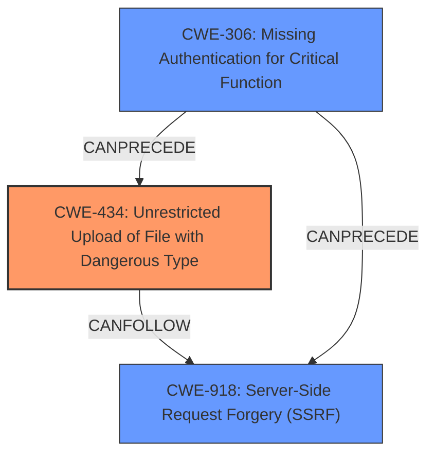

# Analysis Report for CVE-2025-0460

# Vulnerability Analysis Report: CVE-2025-0460

## Description

A vulnerability, which was classified as critical, was found in Blog Botz for Journal Theme 1.0 on OpenCart. This affects an unknown part of the file /index.php?route=extension/module/blog_add. The manipulation of the argument image leads to **unrestricted upload**. It is possible to initiate the attack remotely. The exploit has been disclosed to the public and may be used. The vendor was contacted early about this disclosure but did not respond in any way.

## Vulnerability Description Key Phrases

- **Weakness:** unrestricted upload
- **Vector:** manipulation of the argument image
- **Product:** Blog Botz for Journal Theme
- **Version:** 1
- **Component:** /index.php?route=extension/module/blog_add

## Analysis (with Relationship Data)

# Summary
| CWE ID | CWE Name | Confidence | CWE Abstraction Level | CWE Vulnerability Mapping Label | CWE-Vulnerability Mapping Notes |
|---|---|---|---|---|---|
| CWE-434 | Unrestricted Upload of File with Dangerous Type | 1.0 | Base | Allowed | Primary CWE. The vulnerability description explicitly mentions "**unrestricted upload**". The CVE reference confirms that the `image` parameter allows uploading files without proper validation. |
| CWE-918 | Server-Side Request Forgery (SSRF) | 0.8 | Base | Allowed | Secondary CWE. The CVE reference mentions that the application downloads a file from a URL provided by the user. This suggests the possibility of an SSRF attack, where an attacker could potentially force the server to make requests to internal resources.|
| CWE-306 | Missing Authentication for Critical Function | 0.7 | Base | Allowed | Secondary CWE. The CVE reference explicitly states, "Unauthenticated - no authentication is required," before processing file uploads. This means that anyone can upload files, which is a critical flaw. |

## Evidence and Confidence

*   **Confidence Score:** 0.9
*   **Evidence Strength:** HIGH

## Relationship Analysis
- CWE-434 is the primary weakness, allowing the upload of dangerous file types.
- CWE-918 can occur because the application fetches data from an external URL without proper validation.
- CWE-306 exacerbates both CWE-434 and CWE-918 because the lack of authentication allows any attacker to exploit these weaknesses.
- CWE-434, CWE-918, and CWE-306 are all Base level CWEs, offering the most specific descriptions for this vulnerability.



## Vulnerability Chain
1.  **CWE-306: Missing Authentication for Critical Function:** This is the starting point. The application lacks authentication for the file upload functionality.
2.  **CWE-434: Unrestricted Upload of File with Dangerous Type:** Because there's no authentication, an attacker can upload any file type.
3.  **CWE-918: Server-Side Request Forgery (SSRF):** The application fetches files from URLs provided by the user, which can be abused to make internal requests.

## Summary of Analysis
The vulnerability is primarily an **unrestricted upload** issue (CWE-434), which is directly stated in the vulnerability description. The CVE reference confirms this by explaining how the `image` parameter is vulnerable. Since no authentication is required before processing file uploads (CWE-306), anyone can exploit this vulnerability. The server fetches the file from an external URL (CWE-918), compounding the issue.

The Retriever Results also suggest CWE-434 as a strong candidate. The graph-based results list CWE-434 and other related weaknesses like CWE-73 (External Control of File Name or Path) and CWE-22 (Improper Limitation of a Pathname to a Restricted Directory).

I considered other CWEs from the Retriever Results but did not include them because they were not as directly relevant:
- CWE-89 (SQL Injection): There's no direct evidence of SQL injection in the description.
- CWE-79 (Cross-Site Scripting): There's no direct evidence of XSS in the description.
- CWE-22 (Path Traversal): While possible, the primary issue is the unrestricted upload itself, not necessarily a path traversal vulnerability.
- CWE-73 (External Control of File Name or Path): This is related to CWE-434 but less specific to the core problem.

The selected CWEs are at the optimal level of specificity (Base). They directly address the root cause and contributing factors of the vulnerability based on the evidence provided in the vulnerability description and CVE reference.


## CWE Relationship Analysis

Current CWEs represent these abstraction levels: .


### Vulnerability Chain Analysis

**Chain starting from CWE-89:**
- 89 (Improper Neutralization of Special Elements used in an SQL Command ('SQL Injection')) - ROOT


**Chain starting from CWE-22:**
- 22 (Improper Limitation of a Pathname to a Restricted Directory ('Path Traversal')) - ROOT


### CWE Relationship Diagram

```mermaid
graph TD
    classDef primary fill:#f96,stroke:#333,stroke-width:2px
    classDef secondary fill:#69f,stroke:#333
    classDef tertiary fill:#9e9,stroke:#333
```


*Report generated on 2025-07-14 05:54:04*
