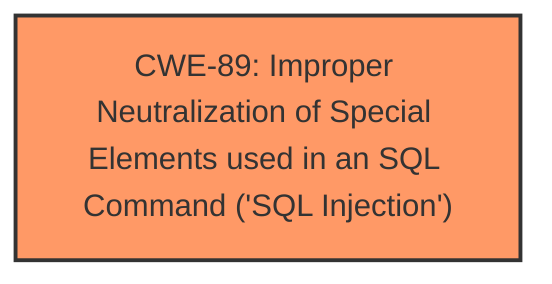

# Analysis Report for CVE-2025-0462

# Vulnerability Analysis Report: CVE-2025-0462

## Description

A vulnerability was found in Shanghai Lingdang Information Technology Lingdang CRM up to 8.6.0.0 and classified as critical. This issue affects some unknown processing of the file /crm/weixinmp/index.php?userid=123&module=Users&usid=1&action=UsersAjax&minipro_const_type=1. The manipulation of the argument searchcontent leads to **sql injection**. The attack may be initiated remotely. The exploit has been disclosed to the public and may be used. The vendor was contacted early about this disclosure but did not respond in any way.

## Vulnerability Description Key Phrases

- **Weakness:** sql injection
- **Vector:** manipulation of the argument searchcontent
- **Product:** Shanghai Lingdang Information Technology Lingdang CRM
- **Version:** up to 8.6.0.0
- **Component:** /crm/weixinmp/index.php?userid=123&module=Users&usid=1&action=UsersAjax&minipro_const_type=1

## Analysis (with Relationship Data)

# Summary
| CWE ID | CWE Name | Confidence | CWE Abstraction Level | CWE Vulnerability Mapping Label | CWE-Vulnerability Mapping Notes |
|---|---|---|---|---|---|
| CWE-89 | Improper Neutralization of Special Elements used in an SQL Command ('SQL Injection') | 1.0 | Base | Allowed | Primary CWE: The vulnerability description explicitly states "**sql injection**" due to manipulation of the argument `searchcontent`. |

## Evidence and Confidence

*   **Confidence Score:** 1.0
*   **Evidence Strength:** HIGH

## Relationship Analysis
The primary CWE selected is CWE-89, which is a Base level CWE. No parent or child relationships affected this decision, as the description directly indicates SQL Injection. The other CWEs considered had different attack vectors (XSS, File Upload) or were too abstract.



## Vulnerability Chain
The vulnerability chain is simple:
1.  **Root Cause:** **Improper Neutralization of Special Elements used in an SQL Command ('SQL Injection')** (CWE-89)
2.  Impact: Remote attacker can inject SQL commands by manipulating the `searchcontent` parameter.

## Summary of Analysis
The vulnerability description clearly states that the vulnerability is an **sql injection** vulnerability, where manipulation of the argument `searchcontent` leads to **sql injection**. The primary CWE, CWE-89, directly matches the weakness.

The supporting evidence is the Vulnerability Description Key Phrases which states the **weakness** is **sql injection**.

The Retriever Results also gives CWE-89 the highest score.

I am confident in this assessment.


## CWE Relationship Analysis

Current CWEs represent these abstraction levels: .


### Vulnerability Chain Analysis

**Chain starting from CWE-89:**
- 89 (Improper Neutralization of Special Elements used in an SQL Command ('SQL Injection')) - ROOT


### CWE Relationship Diagram

```mermaid
graph TD
    classDef primary fill:#f96,stroke:#333,stroke-width:2px
    classDef secondary fill:#69f,stroke:#333
    classDef tertiary fill:#9e9,stroke:#333
```


*Report generated on 2025-07-14 05:54:17*
