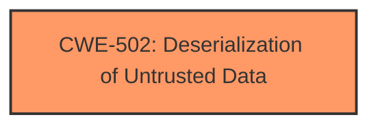

# Analysis Report for CVE-2025-0465

# Vulnerability Analysis Report: CVE-2025-0465

## Description

A vulnerability was found in AquilaCMS 1.412.13. It has been rated as critical. Affected by this issue is some unknown functionality of the file /api/v2/categories. The manipulation of the argument PostBody.populate leads to **deserialization**. The attack may be launched remotely. The exploit has been disclosed to the public and may be used. The vendor was contacted early about this disclosure but did not respond in any way.

## Vulnerability Description Key Phrases

- **Rootcause:** improper deserialization
- **Weakness:** deserialization
- **Vector:** manipulation of PostBody.populate argument
- **Product:** AquilaCMS
- **Version:** 1.412.13
- **Component:** /api/v2/categories

## Analysis (with Relationship Data)

# Summary
| CWE ID | CWE Name | Confidence | CWE Abstraction Level | CWE Vulnerability Mapping Label | CWE-Vulnerability Mapping Notes |
|---|---|---|---|---|---|
| CWE-502 | Deserialization of Untrusted Data | 1.0 | Base | Allowed | Primary CWE: The application deserializes untrusted data without proper validation, leading to potential exploitation. |

## Evidence and Confidence

*   **Confidence Score:** 1.0
*   **Evidence Strength:** HIGH

## Relationship Analysis
The primary identified weakness is CWE-502 **Deserialization of Untrusted Data**.
There are no direct parent or child relationships that strongly influence the classification in this particular case, given the direct match of the **rootcause**. There are no other relevant relationships identified.



## Vulnerability Chain
The vulnerability chain consists of:
1.  **Root Cause:** CWE-502 **Deserialization of Untrusted Data** due to manipulation of the PostBody.populate argument.
2.  **Impact:** Remote code execution (implied by critical severity and public exploit).

## Summary of Analysis
The primary assessment is based on the explicit mention of "**deserialization**" in the vulnerability description, as well as the "**rootcause:** **improper deserialization**" phrase. This directly aligns with CWE-502 **Deserialization of Untrusted Data**. The high confidence is due to the clear statement of the vulnerability type.

The Retriever Results list CWE-502 with a reasonable score, which supports this conclusion.

Other CWEs were considered but deemed less relevant:
*   CWE-89 **Improper Neutralization of Special Elements used in an SQL Command ('SQL Injection')**, CWE-79 **Improper Neutralization of Input During Web Page Generation ('Cross-site Scripting')**, CWE-1336 **Improper Neutralization of Special Elements Used in a Template Engine**, CWE-117 **Improper Output Neutralization for Logs**: These CWEs are related to injection and neutralization, which are not the primary **weakness** in this case.
*   CWE-434 **Unrestricted Upload of File with Dangerous Type**: Involves file uploads, which is not mentioned in the description.
*   CWE-73 **External Control of File Name or Path**: Involves file paths, which is not mentioned in the description.
*   CWE-306 **Missing Authentication for Critical Function**, CWE-285 **Improper Authorization**, CWE-425 **Direct Request ('Forced Browsing')**, CWE-639 **Authorization Bypass Through User-Controlled Key**: These CWEs relate to authorization, which is not the primary **weakness** in this case.
*   CWE-96 **Improper Neutralization of Directives in Statically Saved Code ('Static Code Injection')**: Involves code injection, but deserialization is a more precise description.
* CWE-116 **Improper Encoding or Escaping of Output**: This is a class level CWE and not a direct fit for the vulnerability.

The selected CWE-502 is at the Base level of abstraction, which is appropriate for mapping to the **root cause** of the vulnerability.


## CWE Relationship Analysis

Current CWEs represent these abstraction levels: .


### Vulnerability Chain Analysis

**Chain starting from CWE-502:**
- 502 (Deserialization of Untrusted Data) - ROOT


**Chain starting from CWE-89:**
- 89 (Improper Neutralization of Special Elements used in an SQL Command ('SQL Injection')) - ROOT


### CWE Relationship Diagram

```mermaid
graph TD
    classDef primary fill:#f96,stroke:#333,stroke-width:2px
    classDef secondary fill:#69f,stroke:#333
    classDef tertiary fill:#9e9,stroke:#333
```


*Report generated on 2025-07-14 05:54:50*
