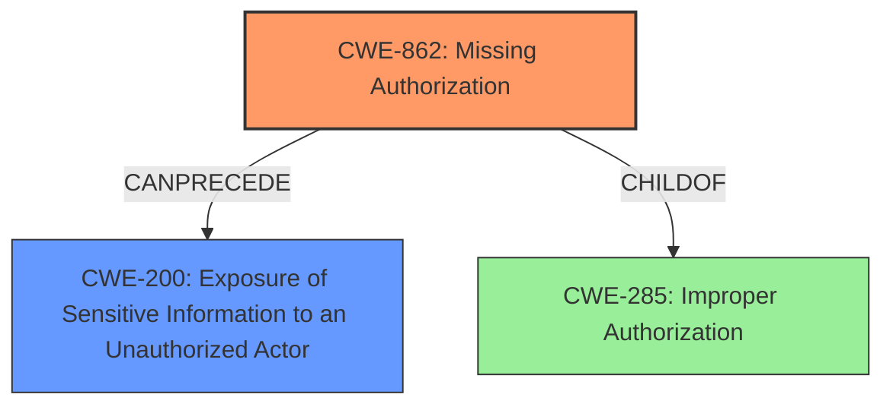

# Analysis Report for CVE-2025-0466

# Vulnerability Analysis Report: CVE-2025-0466

## Description

The Sensei LMS WordPress plugin before 4.24.4 **does not properly protect some its REST API routes**, allowing unauthenticated attackers to leak sensei_email and sensei_message Information.

## Vulnerability Description Key Phrases

- **Weakness:** does not properly protect some its REST API routes
- **Impact:** leak sensei_email and sensei_message Information
- **Attacker:** unauthenticated attackers
- **Product:** Sensei LMS WordPress plugin
- **Version:** before 4.24.4

## Analysis (with Relationship Data)

# Summary
| CWE ID | CWE Name | Confidence | CWE Abstraction Level | CWE Vulnerability Mapping Label | CWE-Vulnerability Mapping Notes |
|---|---|---|---|---|---|
| CWE-862 | Missing Authorization | 0.9 | Class | Allowed-with-Review | Primary CWE: The plugin **does not perform an authorization check** when an actor attempts to access a resource or perform an action. |
| CWE-200 | Exposure of Sensitive Information to an Unauthorized Actor | 0.7 | Class | Discouraged | Secondary Candidate: The plugin exposes `sensei_email` and `sensei_message` information to an actor that is not explicitly authorized to have access to that information. |

## Evidence and Confidence

*   **Confidence Score:** 0.8
*   **Evidence Strength:** HIGH

## Relationship Analysis
The primary weakness is **CWE-862 Missing Authorization**, which is a Class-level CWE. While it would be ideal to have a more specific Base-level CWE, there isn't enough information to pinpoint the exact authorization mechanism that is missing. **CWE-200 Exposure of Sensitive Information to an Unauthorized Actor** is a secondary concern, representing the impact of the missing authorization. **CWE-200** is discouraged as it represents the technical impact and not the root cause.



## Vulnerability Chain
The vulnerability chain starts with **CWE-862 Missing Authorization**, which leads to **CWE-200 Exposure of Sensitive Information to an Unauthorized Actor**. The initial flaw is the **lack of authorization** checks on certain REST API routes. This allows unauthenticated attackers to access sensitive information, resulting in data exposure.

## Summary of Analysis
The primary assessment is based on the provided evidence, specifically the vulnerability description stating that the plugin "**does not properly protect some its REST API routes**". The CVE reference links content summary further confirms that the root cause is that the plugin **does not perform an authorization check** when an actor attempts to access a resource or perform an action.

The graph relationships influenced the final selection by highlighting that **CWE-862** can precede **CWE-200**, indicating a chain from missing authorization to information exposure. While **CWE-200** is a plausible secondary effect, the primary focus is on the **missing authorization**.

The selected CWEs are at the optimal level of specificity. While a more specific Base-level CWE for authorization might exist, the provided information does not give enough information to specify the exact authorization scheme that is missing. **CWE-862** is the best fit given the available evidence.

**CWE-285 Improper Authorization** was considered but not selected. Although related to authorization, it is more general than **CWE-862** and also discouraged, as a more specific CWE can likely be used instead. The vulnerability description states that the authorization is missing, not improperly implemented.

**CWE-306 Missing Authentication for Critical Function** was considered, but the description highlights a **missing authorization** issue on REST API routes, not a missing authentication issue.

**CWE-359 Exposure of Private Personal Information to an Unauthorized Actor** was considered, but not selected because it is more specific than the information provided. The information is described as `sensei_email` and `sensei_message` and it is unknown if this qualifies as Private Personal Information.

**CWE-79: Improper Neutralization of Input During Web Page Generation ('Cross-site Scripting')** was not selected because the provided content does not describe XSS.

**CWE-434: Unrestricted Upload of File with Dangerous Type** was not selected because the provided content does not describe a file upload vulnerability.

**CWE-917: Improper Neutralization of Special Elements used in an Expression Language Statement ('Expression Language Injection')** was not selected because the provided content does not describe an injection vulnerability.


## CWE Relationship Analysis

Current CWEs represent these abstraction levels: .


### Vulnerability Chain Analysis

**Chain starting from CWE-359:**
- 359 (Exposure of Private Personal Information to an Unauthorized Actor) - ROOT


**Chain starting from CWE-862:**
- 862 (Missing Authorization) - ROOT


### CWE Relationship Diagram

```mermaid
graph TD
    classDef primary fill:#f96,stroke:#333,stroke-width:2px
    classDef secondary fill:#69f,stroke:#333
    classDef tertiary fill:#9e9,stroke:#333
```


*Report generated on 2025-07-14 05:55:05*
