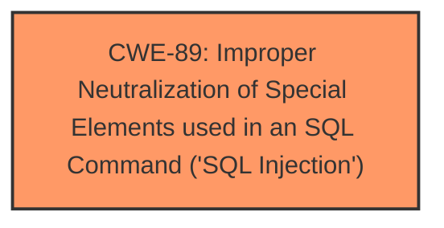

# Raw Analyzer Response for CVE-2025-0487

# Summary
| CWE ID | CWE Name | Confidence | CWE Abstraction Level | CWE Vulnerability Mapping Label | CWE-Vulnerability Mapping Notes |
|---|---|---|---|---|---|
| CWE-89 | Improper Neutralization of Special Elements used in an SQL Command ('SQL Injection') | 1.0 | Base | Allowed | Primary CWE. The **SQL Injection** is due to **improper neutralization**. |

## Evidence and Confidence

*   **Confidence Score:** 1.0
*   **Evidence Strength:** HIGH

## Relationship Analysis
The primary CWE is CWE-89, which is a Base level CWE. There are no direct parent-child or chain relationships that significantly influence the decision in this case. The selection is based on the direct match of the vulnerability description to the CWE description.

## Vulnerability Chain
The vulnerability chain consists of a single step:
1.  **Root Cause:** **Improper Neutralization** of input leading to CWE-89.

## Summary of Analysis
The vulnerability description clearly states that the manipulation of the argument `id` leads to **SQL Injection** in the file `/fladmin/cat_edit.php`. The CVE Reference Links Content Summary confirms that the root cause is the input `id` parameter in `fladmin/cat_edit.php` is not properly filtered, allowing for **SQL injection**.

CWE-89 (Improper Neutralization of Special Elements used in an SQL Command ('SQL Injection')) is the most appropriate CWE. The description of CWE-89 perfectly matches the vulnerability: "The product constructs all or part of an SQL command using externally-influenced input...but it does not neutralize or incorrectly neutralizes special elements that could modify the intended SQL command..."

The other CWEs were not selected because they didn't precisely match the vulnerability's root cause. For example, CWE-79 (Improper Neutralization of Input During Web Page Generation ('Cross-site Scripting')) relates to Cross-site Scripting, not SQL Injection. Similarly, CWE-434 (Unrestricted Upload of File with Dangerous Type) relates to file uploads, which is not relevant in this case.