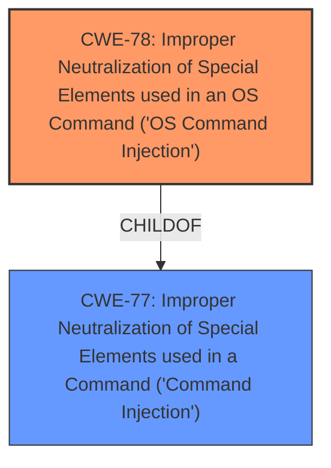

# Enhanced Analysis for CVE-2025-0528

# Summary
| CWE ID | CWE Name | Confidence | CWE Abstraction Level | CWE Vulnerability Mapping Label | CWE-Vulnerability Mapping Notes |
|---|---|---|---|---|---|
| CWE-78 | Improper Neutralization of Special Elements used in an OS Command ('OS Command Injection') | 1.0 | Base | Allowed | Primary CWE |

## Evidence and Confidence

*   **Confidence Score:** 1.0
*   **Evidence Strength:** HIGH

## Relationship Analysis
The primary relationship to consider is that CWE-78 is a more specific form of CWE-77. Since the vulnerability description explicitly mentions "OS command injection," using the more specific CWE-78 is the correct approach. The abstraction level of CWE-78 is Base, which is also preferred.



## Vulnerability Chain
The vulnerability chain starts with **improper neutralization** of special elements within the OS command, leading directly to **command injection**.

## Summary of Analysis
The vulnerability description clearly states the presence of a **command injection** vulnerability in the `/goform/telnet` component of Tenda AC8, AC10, and AC18 routers. The key phrase "command injection" strongly suggests CWE-78, which is "Improper Neutralization of Special Elements used in an OS Command ('OS Command Injection')." CWE-78 is a Base level CWE, which is a preferred level of abstraction. The retriever results also list CWE-78 as a possible match.

Relevant CWE Information:

# Enhanced Context (25 CWEs)
The following CWEs were identified as potentially relevant to this vulnerability:

## CWE-78: Improper Neutralization of Special Elements used in an OS Command ('OS Command Injection')
**Abstraction Level**: Base
**Similarity Score**: 0.76
**Source**: dense

**Description**:
The product constructs all or part of an OS command using externally-influenced input from an upstream component, but it does not neutralize or incorrectly neutralizes special elements that could modify the intended OS command when it is sent to a downstream component.

**Mapping Guidance**:
- Usage: Allowed
- Rationale: This CWE entry is at the Base level of abstraction, which is a preferred level of abstraction for mapping to the root causes of vulnerabilities.

The description of CWE-78 perfectly matches the vulnerability where the manipulation of `/goform/telnet` leads to **command injection**. Therefore, CWE-78 is the most appropriate and specific CWE for this vulnerability.

CWE-77 was considered, but it is a more general class of **command injection**. Since the vulnerability clearly involves OS commands, CWE-78 is a better fit.
CWE-89, CWE-79, CWE-434, CWE-74, CWE-1336, CWE-121, CWE-790 and CWE-73 were not selected as they are not directly related to the described vulnerability.


## CWE Relationship Analysis

Current CWEs represent these abstraction levels: .


### Vulnerability Chain Analysis

**Chain starting from CWE-89:**
- 89 (Improper Neutralization of Special Elements used in an SQL Command ('SQL Injection')) - ROOT


**Chain starting from CWE-121:**
- 121 (Stack-based Buffer Overflow) - ROOT


### CWE Relationship Diagram

```mermaid
graph TD
    classDef primary fill:#f96,stroke:#333,stroke-width:2px
    classDef secondary fill:#69f,stroke:#333
    classDef tertiary fill:#9e9,stroke:#333
```