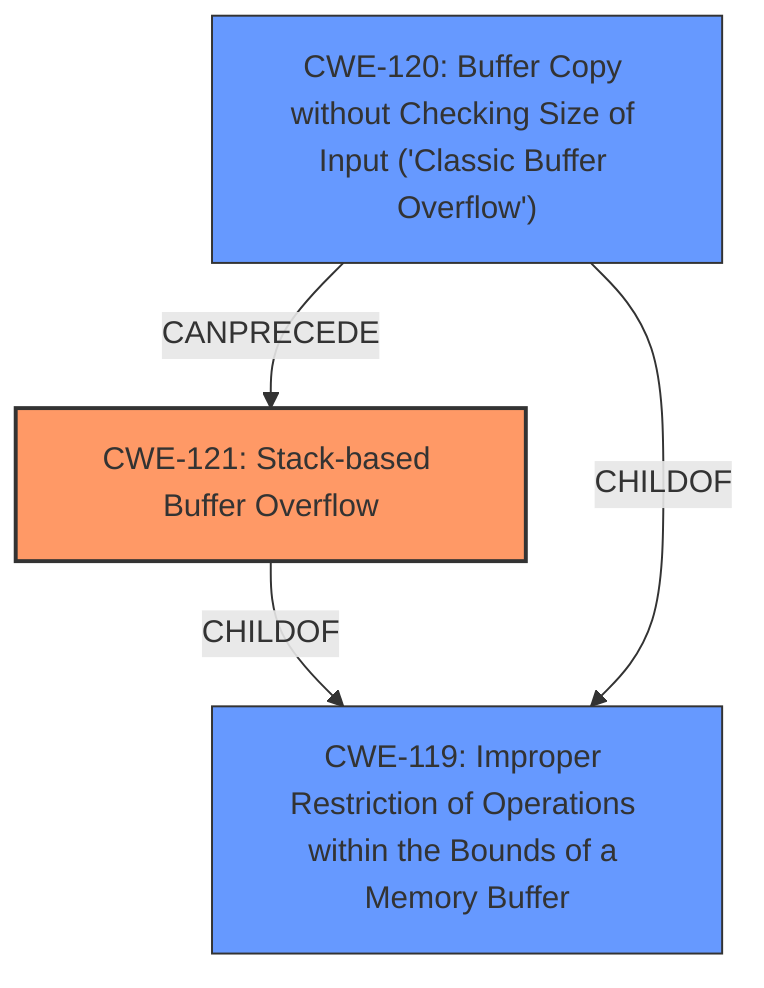

# Raw Analyzer Response for CVE-2025-0529

# Summary

| CWE ID  | CWE Name                                                               | Confidence | CWE Abstraction Level | CWE Vulnerability Mapping Label | CWE-Vulnerability Mapping Notes |
| ------- | ---------------------------------------------------------------------- | ---------- | --------------------- | ------------------------------- | ------------------------------- |
| CWE-121 | Stack-based Buffer Overflow                                            | 1          | Variant               | Primary CWE                     | Allowed                         |
| CWE-120 | Buffer Copy without Checking Size of Input ('Classic Buffer Overflow') | 0.7        | Base                  | Secondary Candidate             | Allowed-with-Review             |
| CWE-119 | Improper Restriction of Operations within the Bounds of a Memory Buffer | 0.6        | Class                 | Secondary Candidate             | Discouraged                     |

## Evidence and Confidence

*   **Confidence Score:** 0.9
*   **Evidence Strength:** HIGH

## Relationship Analysis

The primary CWE is CWE-121, Stack-based Buffer Overflow, which is a variant of CWE-119, Improper Restriction of Operations within the Bounds of a Memory Buffer. CWE-120, Buffer Copy without Checking Size of Input ('Classic Buffer Overflow'), is also related, as it can lead to a buffer overflow. The vulnerability description and the CVE Reference Links Content Summary strongly suggest a stack-based buffer overflow due to **improper input validation** using `scanf("%s", &uname)` without size limits.

## Vulnerability Chain

The vulnerability chain starts with **improper input validation** (specifically, using `scanf` without size limits). This leads to a **stack-based buffer overflow** when an attacker provides an overly long username. The impact is a program crash (segmentation fault) and the potential for arbitrary code execution.

## Summary of Analysis

The analysis is based on the vulnerability description and the CVE Reference Links Content Summary, which both point to a **stack-based buffer overflow** vulnerability in the Train Ticket Reservation System. The root cause is using `scanf` without specifying an input size limit when reading the username.

The graph relationships helped to understand the hierarchical relationship between CWE-121 (Stack-based Buffer Overflow) and its parent CWE-119 (Improper Restriction of Operations within the Bounds of a Memory Buffer). Although CWE-119 is more general, CWE-121 is a more specific and accurate description of the vulnerability. CWE-120 (Buffer Copy without Checking Size of Input) was also considered because it's a common cause of buffer overflows, but the primary issue is the lack of input validation using `scanf`.

The selected CWEs are at the optimal level of specificity. CWE-121 accurately describes the type of buffer overflow (stack-based) and the root cause (improper input validation), while CWE-119 provides a broader context.

Relevant CWE Information:

# Enhanced Context (25 CWEs)
The following CWEs were identified as potentially relevant to this vulnerability:

## CWE-252: Unchecked Return Value
**Abstraction Level**: Base
**Similarity Score**: 0.74
**Source**: dense

**Description**:
The product does not check the return value from a method or function, which can prevent it from detecting unexpected states and conditions.

**Mapping Guidance**:
- Usage: Allowed
- Rationale: This CWE entry is at the Base level of abstraction, which is a preferred level of abstraction for mapping to the root causes of vulnerabilities.

*Not Used*: The vulnerability is not directly related to unchecked return values. The primary issue is the lack of input validation.

## CWE-131: Incorrect Calculation of Buffer Size
**Abstraction Level**: Base
**Similarity Score**: 0.74
**Source**: dense

**Description**:
The product does not correctly calculate the size to be used when allocating a buffer, which could lead to a buffer overflow.

**Mapping Guidance**:
- Usage: Allowed
- Rationale: This CWE entry is at the Base level of abstraction, which is a preferred level of abstraction for mapping to the root causes of vulnerabilities.

*Not Used*: Although an incorrect buffer size calculation could lead to a buffer overflow, the vulnerability is more directly related to the lack of input validation.

## CWE-472: External Control of Assumed-Immutable Web Parameter
**Abstraction Level**: Base
**Similarity Score**: 0.74
**Source**: dense

**Description**:
The web application does not sufficiently verify inputs that are assumed to be immutable but are actually externally controllable, such as hidden form fields.

**Mapping Guidance**:
- Usage: Allowed
- Rationale: This CWE entry is at the Base level of abstraction, which is a preferred level of abstraction for mapping to the root causes of vulnerabilities.

*Not Used*: This CWE is specific to web applications and immutable parameters, which does not fit the description.

## CWE-193: Off-by-one Error
**Abstraction Level**: Base
**Similarity Score**: 0.73
**Source**: dense

**Description**:
A product calculates or uses an incorrect maximum or minimum value that is 1 more, or 1 less, than the correct value.

**Mapping Guidance**:
- Usage: Allowed
- Rationale: This CWE entry is at the Base level of abstraction, which is a preferred level of abstraction for mapping to the root causes of vulnerabilities.

*Not Used*: An off-by-one error is not the primary cause of the vulnerability.

## CWE-116: Improper Encoding or Escaping of Output
**Abstraction Level**: Class
**Similarity Score**: 0.73
**Source**: dense

**Description**:
The product prepares a structured message for communication with another component, but encoding or escaping of the data is either missing or done incorrectly. As a result, the intended structure of the message is not preserved.

**Mapping Guidance**:
- Usage: Allowed-with-Review
- Rationale: This CWE entry is a Class and might have Base-level children that would be more appropriate

*Not Used*: This CWE is about encoding/escaping issues, not buffer overflows.

## CWE-1286: Improper Validation of Syntactic Correctness of Input
**Abstraction Level**: Base
**Similarity Score**: 0.73
**Source**: dense

**Description**:
The product receives input that is expected to be well-formed - i.e., to comply with a certain syntax - but it does not validate or incorrectly validates that the input complies with the syntax.

**Mapping Guidance**:
- Usage: Allowed
- Rationale: This CWE entry is at the Base level of abstraction, which is a preferred level of abstraction for mapping to the root causes of vulnerabilities.

*Not Used*: While there is **improper validation**, the primary issue is the lack of size restriction, leading to a buffer overflow.

## CWE-497: Exposure of Sensitive System Information to an Unauthorized Control Sphere
**Abstraction Level**: Base
**Similarity Score**: 0.73
**Source**: dense

**Description**:
The product does not properly prevent sensitive system-level information from being accessed by unauthorized actors who do not have the same level of access to the underlying system as the product does.

**Mapping Guidance**:
- Usage: Allowed
- Rationale: This CWE entry is at the Base level of abstraction, which is a preferred level of abstraction for mapping to the root causes of vulnerabilities.

*Not Used*: This CWE is about information exposure, not buffer overflows.

## CWE-125: Out-of-bounds Read
**Abstraction Level**: Base
**Similarity Score**: 0.73
**Source**: dense

**Description**:
The product reads data past the end, or before the beginning, of the intended buffer.

**Mapping Guidance**:
- Usage: Allowed
- Rationale: This CWE entry is at the Base level of abstraction, which is a preferred level of abstraction for mapping to the root causes of vulnerabilities.

*Not Used*: The vulnerability involves writing past the end of a buffer, not reading.

## CWE-212: Improper Removal of Sensitive Information Before Storage or Transfer
**Abstraction Level**: Base
**Similarity Score**: 0.73
**Source**: dense

**Description**:
The product stores, transfers, or shares a resource that contains sensitive information, but it does not properly remove that information before the product makes the resource available to unauthorized actors.

**Mapping Guidance**:
- Usage: Allowed
- Rationale: This CWE entry is at the Base level of abstraction, which is a preferred level of abstraction for mapping to the root causes of vulnerabilities.

*Not Used