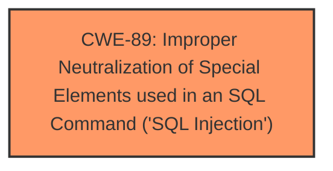

# Analysis for CVE-2025-0535

# Summary
| CWE ID | CWE Name | Confidence | CWE Abstraction Level | CWE Vulnerability Mapping Label | CWE-Vulnerability Mapping Notes |
|---|---|---|---|---|---|
| CWE-89 | Improper Neutralization of Special Elements used in an SQL Command ('SQL Injection') | 1.0 | Base | Allowed | Primary CWE |

## Evidence and Confidence

*   **Confidence Score:** 1.0
*   **Evidence Strength:** HIGH

## Relationship Analysis
The primary relationship considered was the direct match of the vulnerability description to the definition of CWE-89. No further parent or child relationships were needed.

## Vulnerability Chain
The vulnerability chain consists of a single element: the **improper neutralization** of special elements leading to **SQL Injection**.

## Summary of Analysis
The vulnerability description clearly states that the manipulation of the argument `uid` leads to **SQL Injection** in the file `/dashboard/admin/edit_mem_submit.php` of Codezips Gym Management System 1.0.

The "Vulnerability Description Key Phrases" section identifies **SQL Injection** as the **weakness**.

The retriever results list CWE-89, "Improper Neutralization of Special Elements used in an SQL Command ('SQL Injection')", as the top candidate with a score of 1.0. This CWE directly matches the vulnerability description.

Therefore, CWE-89 is the most appropriate classification.

Relevant CWE Information:
# Enhanced Context (25 CWEs)
The following CWEs were identified as potentially relevant to this vulnerability:

## CWE-89: Improper Neutralization of Special Elements used in an SQL Command ('SQL Injection')
**Abstraction Level**: Base
**Similarity Score**: 0.77
**Source**: dense

**Description**:
The product constructs all or part of an SQL command using externally-influenced input from an upstream component, but it does not neutralize or incorrectly neutralizes special elements that could modify the intended SQL command when it is sent to a downstream component. Without sufficient removal or quoting of SQL syntax in user-controllable inputs, the generated SQL query can cause those inputs to be interpreted as SQL instead of ordinary user data.

**Mapping Guidance**:
- Usage: Allowed
- Rationale: This CWE entry is at the Base level of abstraction, which is a preferred level of abstraction for mapping to the root causes of vulnerabilities.