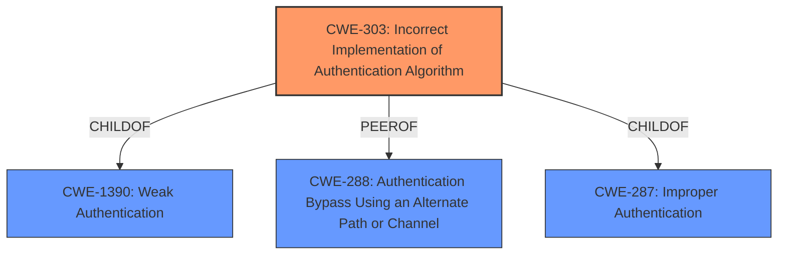

# Analysis for CVE-2025-0604

# Summary
| CWE ID    | CWE Name                                                          | Confidence | CWE Abstraction Level | CWE Vulnerability Mapping Label | CWE-Vulnerability Mapping Notes |
| --------- | ----------------------------------------------------------------- | ---------- | --------------------- | ------------------------------- | ------------------------------- |
| CWE-303   | Incorrect Implementation of Authentication Algorithm              | 0.9        | Base                  | Allowed                         | Primary CWE                     |
| CWE-288   | Authentication Bypass Using an Alternate Path or Channel           | 0.7        | Base                  | Allowed                         | Secondary Candidate             |
| CWE-287   | Improper Authentication                                           | 0.6        | Class                 | Discouraged                     | Secondary Candidate             |
| CWE-1390  | Weak Authentication                                               | 0.5        | Class                 | Allowed-with-Review             | Secondary Candidate             |

## Evidence and Confidence

*   **Confidence Score:** 0.8
*   **Evidence Strength:** HIGH

## Relationship Analysis

The primary CWE selected is CWE-303 (Incorrect Implementation of Authentication Algorithm), which is a Base level CWE. This choice is supported by the vulnerability description, which clearly indicates an error in the implementation of the authentication process, specifically the **missing LDAP bind**. CWE-303 is a child of CWE-1390 (Weak Authentication), indicating a hierarchical relationship. CWE-288 (Authentication Bypass Using an Alternate Path or Channel) is considered as a secondary CWE because the **missing LDAP bind** effectively creates an alternate path for authentication, bypassing the intended security measures. CWE-287 (Improper Authentication) and CWE-1390 are higher-level classes that could apply but are less specific than CWE-303.

## Vulnerability Chain

The vulnerability chain starts with the **incorrect implementation** of the password reset process (**missing LDAP bind**), leading to the ability for users with expired or disabled AD accounts to regain access.

1.  **Root Cause:** CWE-303 (Incorrect Implementation of Authentication Algorithm) - The core issue is the **failure to perform an LDAP bind** after a password reset.
2.  **Weakness:** The **missing validation step** creates an opportunity to bypass AD restrictions.
3.  **Impact:** Authentication bypass and unauthorized access.

## Summary of Analysis

The primary selection of CWE-303 is based on the root cause identified in the vulnerability description and CVE reference links. The description clearly states that the **system updates the password without performing an LDAP bind to validate the new credentials against AD**. This aligns directly with CWE-303, which addresses **incorrect implementation of authentication algorithms**. The supporting evidence from bugzilla.redhat.com confirms that the **root cause** is Keycloak not performing an LDAP bind after a password reset.

The other candidate CWEs were considered but deemed less accurate. CWE-287 (Improper Authentication) is a higher-level class and less specific than the implementation flaw. CWE-288 (Authentication Bypass Using an Alternate Path or Channel) is a valid secondary consideration, as the **missing LDAP bind** provides an alternate, unvalidated path. The selection of CWE-303 is at the optimal level of specificity, addressing the **root cause** of the vulnerability.

Relevant CWE Information:
# Enhanced Context (25 CWEs)
The following CWEs were identified as potentially relevant to this vulnerability:

## CWE-1390: Weak Authentication
**Abstraction Level**: Class
**Similarity Score**: 0.76
**Source**: dense

**Description**:
The product uses an authentication mechanism to restrict access to specific users or identities, but the mechanism does not sufficiently prove that the claimed identity is correct.

**Mapping Guidance**:
- Usage: Allowed-with-Review
- Rationale: This CWE entry is a Class and might have Base-level children that would be more appropriate

## CWE-303: Incorrect Implementation of Authentication Algorithm
**Abstraction Level**: Base
**Similarity Score**: 0.76
**Source**: dense

**Description**:
The requirements for the product dictate the use of an established authentication algorithm, but the implementation of the algorithm is incorrect.

**Mapping Guidance**:
- Usage: Allowed
- Rationale: This CWE entry is at the Base level of abstraction, which is a preferred level of abstraction for mapping to the root causes of vulnerabilities.

## CWE-288: Authentication Bypass Using an Alternate Path or Channel
**Abstraction Level**: Base
**Similarity Score**: 0.75
**Source**: dense

**Description**:
The product requires authentication, but the product has an alternate path or channel that does not require authentication.

**Mapping Guidance**:
- Usage: Allowed
- Rationale: This CWE entry is at the Base level of abstraction, which is a preferred level of abstraction for mapping to the root causes of vulnerabilities.

## CWE-1391: Use of Weak Credentials
**Abstraction Level**: Class
**Similarity Score**: 0.75
**Source**: dense

**Description**:
The product uses weak credentials (such as a default key or hard-coded password) that can be calculated, derived, reused, or guessed by an attacker.

**Mapping Guidance**:
- Usage: Allowed-with-Review
- Rationale: This CWE entry is a Class and might have Base-level children that would be more appropriate

## CWE-639: Authorization Bypass Through User-Controlled Key
**Abstraction Level**: Base
**Similarity Score**: 0.75
**Source**: dense

**Description**:
The system's authorization functionality does not prevent one user from gaining access to another user's data or record by modifying the key value identifying the data.

**Mapping Guidance**:
- Usage: Allowed
- Rationale: This CWE entry is at the Base level of abstraction, which is a preferred level of abstraction for mapping to the root causes of vulnerabilities.

## CWE-204: Observable Response Discrepancy
**Abstraction Level**: Base
**Similarity Score**: 0.74
**Source**: dense

**Description**:
The product provides different responses to incoming requests in a way that reveals internal state information to an unauthorized actor outside of the intended control sphere.

**Mapping Guidance**:
- Usage: Allowed
- Rationale: This CWE entry is at the Base level of abstraction, which is a preferred level of abstraction for mapping to the root causes of vulnerabilities.

## CWE-305: Authentication Bypass by Primary Weakness
**Abstraction Level**: Base
**Similarity Score**: 0.74
**Source**: dense

**Description**:
The authentication algorithm is sound, but the implemented mechanism can be bypassed as the result of a separate weakness that is primary to the authentication error.

**Mapping Guidance**:
- Usage: Allowed
- Rationale: This CWE entry is at the Base level of abstraction, which is a preferred level of abstraction for mapping to the root causes of vulnerabilities.

## CWE-807: Reliance on Untrusted Inputs in a Security Decision
**Abstraction Level**: Base
**Similarity Score**: 0.73
**Source**: dense

**Description**:
The product uses a protection mechanism that relies on the existence or values of an input, but the input can be modified by an untrusted actor in a way that bypasses the protection mechanism.

**Mapping Guidance**:
- Usage: Allowed
- Rationale: This CWE entry is at the Base level of abstraction, which is a preferred level of abstraction for mapping to the root causes of vulnerabilities.

## CWE-290: Authentication Bypass by Spoofing
**Abstraction Level**: Base
**Similarity Score**: 0.73
**Source**: dense

**Description**:
This attack-focused weakness is caused by incorrectly implemented authentication schemes that are subject to spoofing attacks.

**Mapping Guidance**:
- Usage: Allowed
- Rationale: This CWE entry is at the Base level of abstraction, which is a preferred level of abstraction for mapping to the root causes of vulnerabilities.

## CWE-472: External Control of Assumed-Immutable Web Parameter
**Abstraction Level**: Base
**Similarity Score**: 0.73
**Source**: dense

**Description**:
The web application does not sufficiently verify inputs that are assumed to be immutable but are actually externally controllable, such as hidden form fields.

**Mapping Guidance**:
- Usage: Allowed
- Rationale: This CWE entry is at the Base level of abstraction, which is a preferred level of abstraction for mapping to the root causes of vulnerabilities.

##