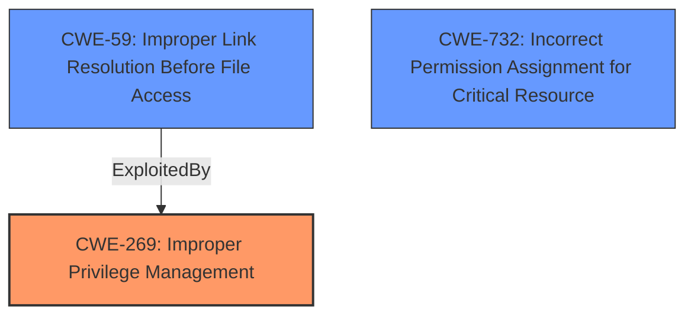

# Analysis Report for CVE-2025-0651

# Vulnerability Analysis Report: CVE-2025-0651

## Description

**Improper Privilege Management** vulnerability in Cloudflare WARP on Windows allows File Manipulation. User with a low system privileges can create a set of symlinks inside the C\\ProgramData\\Cloudflare\\warp-diag-partials folder. After triggering the Reset all settings option the WARP service will delete the files that the symlink was pointing to. Given the WARP service operates with System privileges this might lead to deleting files owned by the System user. This issue affects WARP before 2024.12.492.0.

## Vulnerability Description Key Phrases

- **Rootcause:** Improper Privilege Management
- **Impact:** ['File Manipulation', 'delete files']
- **Vector:** set of symlinks
- **Attacker:** User with a low system privileges
- **Product:** Cloudflare WARP
- **Version:** before 2024.12.492.0

## Analysis (with Relationship Data)

# Summary
| CWE ID   | CWE Name                                                           | Confidence | CWE Abstraction Level | CWE Vulnerability Mapping Label | CWE-Vulnerability Mapping Notes |
| :------- | :----------------------------------------------------------------- | :--------- | :-------------------- | :------------------------------ | :------------------------------ |
| CWE-269  | Improper Privilege Management                                      | 0.85       | Class                 | Primary CWE                     | Discouraged                   |
| CWE-59   | Improper Link Resolution Before File Access ('Link Following')    | 0.75       | Base                  | Secondary Candidate             | Allowed                       |
| CWE-732  | Incorrect Permission Assignment for Critical Resource            | 0.60       | Class                 | Secondary Candidate             | Allowed-with-Review           |

## Evidence and Confidence

*   **Confidence Score:** 0.80
*   **Evidence Strength:** MEDIUM

## Relationship Analysis

The primary weakness is CWE-269, **Improper Privilege Management**, which is a Class-level CWE. CWE-59, **Improper Link Resolution Before File Access ('Link Following')**, is a Base-level CWE and a potential consequence of the **improper privilege management**, where an attacker exploits the ability to create symlinks. The relationship here is that **improper privilege management** allows the attacker to create links that are then followed by a process with higher privileges, leading to file manipulation. CWE-732, **Incorrect Permission Assignment for Critical Resource**, could be considered because the WARP service's files are being modified. However, the root cause is more about the **improper management of privileges** that allows a low-privileged user to create the symlinks in the first place.



## Vulnerability Chain

The vulnerability chain begins with **Improper Privilege Management** (CWE-269). This allows a low-privileged user to create symbolic links. The WARP service, operating with System privileges, then follows these links and deletes the files they point to, leading to arbitrary file deletion.

CWE-269 (Improper Privilege Management) -> CWE-59 (Improper Link Resolution Before File Access) -> File Deletion

## Summary of Analysis

Initially, I considered CWE-59, **Improper Link Resolution Before File Access**, due to the symlink exploitation. However, the vulnerability description explicitly mentions "**Improper Privilege Management**" as the root cause. Therefore, CWE-269 is the most appropriate primary CWE.

The vulnerability description states: "**Improper Privilege Management** vulnerability in Cloudflare WARP on Windows allows File Manipulation. User with a low system privileges can create a set of symlinks inside the C\\ProgramData\\Cloudflare\\warp-diag-partials folder. After triggering the Reset all settings option the WARP service will delete the files that the symlink was pointing to. Given the WARP service operates with System privileges this might lead to deleting files owned by the System user. This issue affects WARP before 2024.12.492.0."

CWE-269, although discouraged, accurately reflects the **improper handling of privileges** that allows the low-privileged user to create the symlinks in a location that can be exploited by the system-level process. The other CWEs considered, such as CWE-59 and CWE-732, represent consequences of this **improper privilege management** rather than the root cause itself. CWE-59 is the mechanism being used to exploit the **improper privilege management**. CWE-732 is a possible but less direct consequence of the vulnerability. Therefore, I am choosing CWE-269 as the primary CWE, despite it being discouraged, because it is the most accurate representation of the **root cause** as described in the vulnerability report.

The abstraction level of CWE-269 as a Class is acceptable in this case because there isn't a more specific Base or Variant CWE that directly addresses the **improper privilege management** issue. The details of how the symlink is exploited are secondary to the initial **improper privilege management** that enables the attack.


## CWE Relationship Analysis

Current CWEs represent these abstraction levels: .


### Vulnerability Chain Analysis

**Chain starting from CWE-59:**
- 59 (Improper Link Resolution Before File Access ('Link Following')) - ROOT


**Chain starting from CWE-269:**
- 269 (Improper Privilege Management) - ROOT


### CWE Relationship Diagram

```mermaid
graph TD
    classDef primary fill:#f96,stroke:#333,stroke-width:2px
    classDef secondary fill:#69f,stroke:#333
    classDef tertiary fill:#9e9,stroke:#333
```


*Report generated on 2025-07-14 06:10:51*
