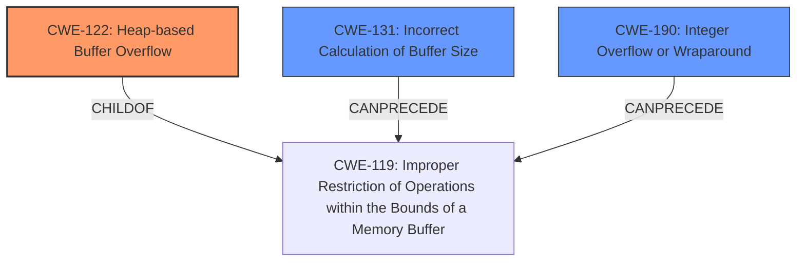

# Raw Analyzer Response for CVE-2025-0689

# Summary
| CWE ID | CWE Name | Confidence | CWE Abstraction Level | CWE Vulnerability Mapping Label | CWE-Vulnerability Mapping Notes |
|---|---|---|---|---|---|
| CWE-122 | Heap-based Buffer Overflow | 0.9 | Variant | Primary | Allowed |
| CWE-131 | Incorrect Calculation of Buffer Size | 0.7 | Base | Secondary | Allowed |
| CWE-190 | Integer Overflow or Wraparound | 0.6 | Base | Secondary | Allowed |

## Evidence and Confidence

*   **Confidence Score:** 0.8
*   **Evidence Strength:** MEDIUM

## Relationship Analysis
The primary weakness is a heap-based buffer overflow (CWE-122). This is caused by an incorrect calculation of the buffer size (CWE-131) or potentially an integer overflow (CWE-190) leading to the incorrect buffer size calculation. CWE-122 is a variant of the more general class CWE-119 (Improper Restriction of Operations within the Bounds of a Memory Buffer). CWE-131 can precede CWE-119. CWE-190 is a peer of CWE-128 (Wrap-around Error), which can also precede CWE-119.

## Vulnerability Chain
The vulnerability chain starts with the **incorrect calculation of the buffer size** (CWE-131) or an **integer overflow** (CWE-190) when determining the buffer size. This leads to a **heap-based buffer overflow** (CWE-122) when the code writes more data than the allocated buffer can hold. The impact is critical data corruption, arbitrary code execution, and bypassing secure boot protections.

## Summary of Analysis
The primary CWE is CWE-122 (Heap-based Buffer Overflow) because the vulnerability description explicitly mentions a **heap-based buffer overflow**. The description states that the "grubs UDF filesystem module utilizes user-controlled data length metadata to allocate its internal buffers" and "assumes the read size from the disk is always smaller than the allocated buffer size which is not guaranteed." This could happen because of an **incorrect calculation of the buffer size** (CWE-131) or an **integer overflow** (CWE-190) when calculating the size. Both CWE-131 and CWE-190 are added as secondary issues.

*   **CWE-122 (Heap-based Buffer Overflow):** The vulnerability description explicitly states that a **heap-based buffer overflow** occurs, making this the most direct and specific match. The "Weaknesses/vulnerabilities present" section in the CVE Reference Links Content Summary also confirms this. Confidence is high (0.9).
*   **CWE-131 (Incorrect Calculation of Buffer Size):** The description indicates that the size of the buffer is **incorrectly calculated**. This could lead to the buffer overflow. Confidence is medium (0.7).
*   **CWE-190 (Integer Overflow or Wraparound):** This is a potential cause for the incorrect buffer size calculation. If the user-controlled data length is large, it could result in an integer overflow. Confidence is medium (0.6).

CWE-119 (Improper Restriction of Operations within the Bounds of a Memory Buffer) was considered, but CWE-122 is a more specific variant.

CWE-120 (Buffer Copy without Checking Size of Input ('Classic Buffer Overflow')) was considered, but it is only appropriate for "Buffer Copy" operations, while this vulnerability occurs when reading data from disk.