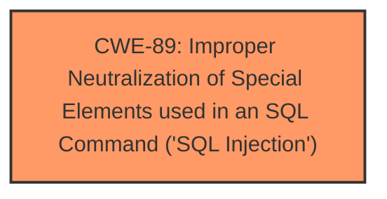

# Raw Analyzer Response for CVE-2025-0698

# Summary
| CWE ID | CWE Name | Confidence | CWE Abstraction Level | CWE Vulnerability Mapping Label | CWE-Vulnerability Mapping Notes |
|---|---|---|---|---|---|
| CWE-89 | Improper Neutralization of Special Elements used in an SQL Command ('SQL Injection') | 1.0 | Base | Primary | Allowed |

## Evidence and Confidence

*   **Confidence Score:** 1.0
*   **Evidence Strength:** HIGH

## Relationship Analysis
The primary identified CWE is CWE-89, which stands alone as the root cause in this vulnerability. There are no direct parent-child or chain relationships explicitly defined within the provided information that influence the classification. The focus remains on the direct SQL injection issue.

## Vulnerability Chain
The vulnerability chain consists of a single point:
1.  **Root Cause:** CWE-89 - Improper Neutralization of Special Elements used in an SQL Command ('SQL Injection') due to unsanitized input in the `sort` parameter.
    - This directly leads to the impact of potential data breaches.

## Summary of Analysis
The analysis is strongly based on the provided evidence, which includes explicit mention of **sql injection** vulnerability due to the manipulation of the `sort/order` argument in `admin/sys/menu/list`. The CVE Reference Links Content Summary confirms the **root cause** is the `sort` parameter in `src/main/java/io/github/dao/SysMenuDao.xml` not using a precompiled format which allowed attackers to directly query database information. The retriever results strongly suggest CWE-89 as the primary candidate. The graph relationships did not influence the decision. The selected CWE-89 is at the optimal base level of specificity for the identified vulnerability.

Relevant CWE Information:

# Enhanced Context (25 CWEs)
The following CWEs were identified as potentially relevant to this vulnerability:

## CWE-89: Improper Neutralization of Special Elements used in an SQL Command ('SQL Injection')
**Abstraction Level**: Base
**Similarity Score**: 0.75
**Source**: dense

**Description**:
The product constructs all or part of an SQL command using externally-influenced input from an upstream component, but it does not neutralize or incorrectly neutralizes special elements that could modify the intended SQL command when it is sent to a downstream component. Without sufficient removal or quoting of SQL syntax in user-controllable inputs, the generated SQL query can cause those inputs to be interpreted as SQL instead of ordinary user data.

**Mapping Guidance**:
- Usage: Allowed
- Rationale: This CWE entry is at the Base level of abstraction, which is a preferred level of abstraction for mapping to the root causes of vulnerabilities.

## CWE-89: Improper Neutralization of Special Elements used in an SQL Command ('SQL Injection')
**Abstraction Level**: Base
**Similarity Score**: 1017.42
**Source**: sparse

**Description**:
The product constructs all or part of an SQL command using externally-influenced input from an upstream component, but it does not neutralize or incorrectly neutralizes special elements that could modify the intended SQL command when it is sent to a downstream component. Without sufficient removal or quoting of SQL syntax in user-controllable inputs, the generated SQL query can cause those inputs to be interpreted as SQL instead of ordinary user data.

**Mapping Guidance**:
- Usage: Allowed
- Rationale: This CWE entry is at the Base level of abstraction, which is a preferred level of abstraction for mapping to the root causes of vulnerabilities.

### CWEs Considered But Not Used:

*   **CWE-79 (Improper Neutralization of Input During Web Page Generation ('Cross-site Scripting'))**: While neutralization issues are present, the core issue is SQL injection, not XSS.
*   **CWE-78 (Improper Neutralization of Special Elements used in an OS Command ('OS Command Injection'))**: This is not an OS command injection.
*   **CWE-113 (Improper Neutralization of CRLF Sequences in HTTP Headers ('HTTP Request/Response Splitting'))**: This is not a CRLF injection issue.
*   **CWE-434 (Unrestricted Upload of File with Dangerous Type)**: This is not an unrestricted file upload issue.
*   **CWE-306 (Missing Authentication for Critical Function)**: Although authentication might be a factor, the primary weakness is SQL Injection.
*   **CWE-73 (External Control of File Name or Path)**: This is not related to file path manipulation.
*   **CWE-494 (Download of Code Without Integrity Check)**: This is not related to code downloads.
*   **CWE-183 (Permissive List of Allowed Inputs)**: This is not about overly permissive input lists.
*   **CWE-1336 (Improper Neutralization of Special Elements Used in a Template Engine)**: This is not a template engine issue.
*   **CWE-117 (Improper Output Neutralization for Logs)**: This is not related to logging.
*   **CWE-116 (Improper Encoding or Escaping of Output)**: Although encoding issues can contribute to injection vulnerabilities, the primary weakness is the lack of proper neutralization of SQL special elements.
*   **CWE-93 (Improper Neutralization of CRLF Sequences ('CRLF Injection'))**: This is not a CRLF injection issue.
*   **CWE-790 (Improper Filtering of Special Elements)**: This is not related to filtering.
*   **CWE-78 (Improper Neutralization of Special Elements used in an OS Command ('OS Command Injection'))**: This is not OS command injection.