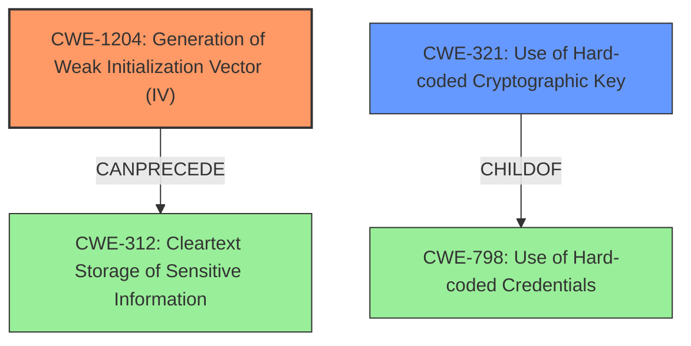

# Raw Analyzer Response for CVE-2025-0714

# Summary
| CWE ID | CWE Name | Confidence | CWE Abstraction Level | CWE Vulnerability Mapping Label | CWE-Vulnerability Mapping Notes |
|---|---|---|---|---|---|
| CWE-1204 | Generation of Weak Initialization Vector (IV) | 1.0 | Base | Allowed | Primary CWE. The IV consists of only zero bytes. |
| CWE-321 | Use of Hard-coded Cryptographic Key | 0.8 | Variant | Allowed | Secondary CWE. The master key used for encryption is derived from the user's password, making it predictable and essentially hard-coded for a given user. |

## Evidence and Confidence

*   **Confidence Score:** 0.9
*   **Evidence Strength:** HIGH

## Relationship Analysis
The primary weakness is the **generation of a weak Initialization Vector (IV)**, which is directly related to the cryptographic implementation. A secondary contributing factor is the **use of a key derived from the password**, effectively making it a hard-coded key for each user's stored passwords.

## Vulnerability Chain
The vulnerability chain starts with the **use of a weak Initialization Vector (IV)** and a **predictable master key**. This leads to the possibility of decrypting stored passwords, effectively resulting in sensitive information disclosure.

CWE-1204 (Generation of Weak Initialization Vector) -> CWE-321 (Use of Hard-coded Cryptographic Key) -> CWE-312 (Cleartext Storage of Sensitive Information)

## Summary of Analysis
The vulnerability in MobaXterm's password storage stems from using a weak Initialization Vector (IV) and a predictable key derived from the password. The **static IV and master key** is the root cause that leads to the weakness. This combination allows attackers with access to the encrypted passwords to decrypt the data.

CWE-1204 (Generation of Weak Initialization Vector) is chosen as the primary CWE because the use of an all-zero IV is a critical flaw in the cryptographic implementation. The retriever results also list this as the top candidate.

CWE-321 (Use of Hard-coded Cryptographic Key) is selected as a secondary CWE because the key is derived from the user's password, making it predictable and effectively hard-coded for a given user. Although it is derived from a password, if an attacker has access to the user's password, they will have the master key.

The evidence strongly supports these mappings, and the CWEs are at the appropriate level of specificity (Base and Variant).

**CWEs Considered But Not Used:**

*   CWE-329 (Generation of Predictable IV with CBC Mode): While the IV is predictable, the vulnerability description doesn't specifically mention CBC mode. Therefore, CWE-1204 is a more general and accurate fit.
*   CWE-798 (Use of Hard-coded Credentials): The key is derived from the password, it is not technically hardcoded into the software.
*   CWE-312 (Cleartext Storage of Sensitive Information): This is the impact of the vulnerability, not the root cause.
*   CWE-257 (Storing Passwords in a Recoverable Format): This is a more general description of the impact, and less precise than the selected CWEs.