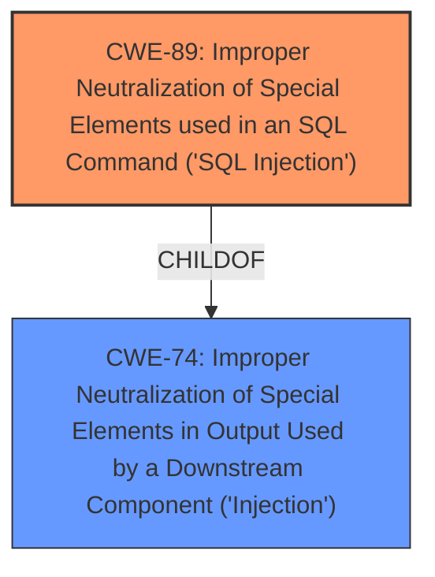

# Analysis Report for CVE-2025-0723

# Vulnerability Analysis Report: CVE-2025-0723

## Description

The ProfileGrid User Profiles, Groups and Communities plugin for WordPress is vulnerable to blind and time-based SQL Injections via the rid and search parameters in all versions up to, and including, 5.9.4.7 due to **insufficient escaping on the user supplied parameter and lack of sufficient preparation on the existing SQL query**. This makes it possible for authenticated attackers, with Subscriber-level access and above, to append additional SQL queries into already existing queries that can be used to extract sensitive information from the database.

## Vulnerability Description Key Phrases

- **Rootcause:** ['insufficient escaping on the user supplied parameter and lack of sufficient preparation on the existing SQL query', 'insufficient escaping on user supplied parameter and lack of sufficient preparation on existing SQL query']
- **Weakness:** SQL injection
- **Impact:** ['extract sensitive information from the database', 'extract sensitive information from database', 'blind and time-based SQL injections']
- **Attacker:** authenticated attackers
- **Product:** ProfileGrid User Profiles Groups and Communities plugin for WordPress
- **Version:** all versions up to and including 5.9.4.7
- **Component:** rid and search parameters

## Analysis (with Relationship Data)

# Summary

| CWE ID  | CWE Name                                                                   | Confidence | CWE Abstraction Level | CWE Vulnerability Mapping Label | CWE-Vulnerability Mapping Notes |
| :-------- | :------------------------------------------------------------------------- | :--------- | :---------------------- | :------------------------------ | :------------------------------ |
| CWE-89  | Improper Neutralization of Special Elements used in an SQL Command ('**SQL Injection**') | 1          | Base                    | Primary                       | Allowed                       |

## Evidence and Confidence

*   **Confidence Score:** 1
*   **Evidence Strength:** HIGH

## Relationship Analysis

The primary CWE is CWE-89, which is a base-level CWE, making it a good fit. CWE-89 is a child of CWE-74 (Improper Neutralization of Special Elements in Output Used by a Downstream Component ('Injection')). While CWE-74 is a class-level CWE and related, CWE-89 is more specific and directly addresses the **SQL injection** vulnerability described.



## Vulnerability Chain

The vulnerability chain starts with **insufficient escaping on the user supplied parameter and lack of sufficient preparation on the existing SQL query**. This leads to **SQL Injection**, which allows authenticated attackers to **extract sensitive information from the database**.

1.  **Root Cause:** **Insufficient escaping** and **lack of sufficient preparation** in SQL query.
2.  **Weakness:** CWE-89 (Improper Neutralization of Special Elements used in an SQL Command ('**SQL Injection**'))
3.  **Impact:** Ability to **extract sensitive information from the database**.

## Summary of Analysis

The primary vulnerability is **SQL Injection** (CWE-89) due to **insufficient escaping** and **lack of sufficient preparation** on the existing SQL query. The vulnerability description explicitly states this, making CWE-89 the most appropriate choice.

The analysis is based on the provided evidence, specifically: "The ProfileGrid User Profiles, Groups and Communities plugin for WordPress is vulnerable to blind and time-based SQL Injections via the rid and search parameters in all versions up to, and including, 5.9.4.7 due to **insufficient escaping on the user supplied parameter and lack of sufficient preparation on the existing SQL query**."

CWE-89 is at the optimal level of specificity because it directly addresses the **SQL Injection** vulnerability.

Relevant CWE Information:
*   **CWE-89: Improper Neutralization of Special Elements used in an SQL Command ('SQL Injection')** - The product constructs all or part of an SQL command using externally-influenced input from an upstream component, but it does not neutralize or incorrectly neutralizes special elements that could modify the intended SQL command when it is sent to a downstream component. This aligns perfectly with the vulnerability description.


## CWE Relationship Analysis

Current CWEs represent these abstraction levels: .


### Vulnerability Chain Analysis

**Chain starting from CWE-89:**
- 89 (Improper Neutralization of Special Elements used in an SQL Command ('SQL Injection')) - ROOT


**Chain starting from CWE-74:**
- 74 (Improper Neutralization of Special Elements in Output Used by a Downstream Component ('Injection')) - ROOT


### CWE Relationship Diagram

```mermaid
graph TD
    classDef primary fill:#f96,stroke:#333,stroke-width:2px
    classDef secondary fill:#69f,stroke:#333
    classDef tertiary fill:#9e9,stroke:#333
```


*Report generated on 2025-07-14 06:16:46*
