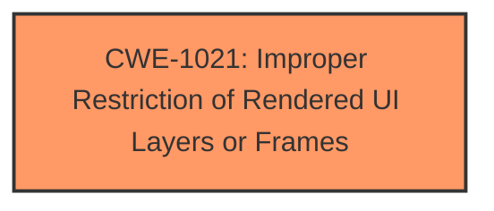

# Analysis for CVE-2025-0729

# Summary
| CWE ID | CWE Name | Confidence | CWE Abstraction Level | CWE Vulnerability Mapping Label | CWE-Vulnerability Mapping Notes |
|---|---|---|---|---|---|
| CWE-1021 | Improper Restriction of Rendered UI Layers or Frames | 1.0 | Base | Allowed | Primary CWE |

## Evidence and Confidence

*   **Confidence Score:** 1.0
*   **Evidence Strength:** HIGH

## Relationship Analysis
The primary CWE is CWE-1021, which is a Base level CWE. No other relationships influenced the decision.

## Vulnerability Chain
The vulnerability chain consists of a single element: **clickjacking** due to an improper restriction of rendered UI layers or frames.

## Summary of Analysis
The vulnerability description clearly indicates a **clickjacking** issue in TP-Link TL-SG108E. The Retriever Results identify CWE-1021: Improper Restriction of Rendered UI Layers or Frames as the top candidate with a score of 1.0 based on alternate terms. This CWE directly addresses the root cause of **clickjacking** by highlighting the improper restriction of rendered UI layers or frames.

Relevant CWE Information:

# Enhanced Context (25 CWEs)
The following CWEs were identified as potentially relevant to this vulnerability:

## CWE-1021: Improper Restriction of Rendered UI Layers or Frames
**Abstraction Level**: base
**Similarity Score**: 2.40
**Source**: graph

**Description**:
CWE-1021: Improper Restriction of Rendered UI Layers or Frames

**Mapping Guidance**:
- Usage: Allowed
- Rationale: This CWE entry is at the Base level of abstraction, which is a preferred level of abstraction for mapping to the root causes of vulnerabilities.

**Relationships**:
- CHILDOF -> CWE-451
- CHILDOF -> CWE-610
- CHILDOF -> CWE-441
- PARENTOF -> CWE-1021
- PARENTOF -> CWE-1021

# Analysis of Other CWEs
CWE-79, CWE-89, CWE-78, CWE-80, CWE-1336 were considered but not selected, because the vulnerability description specifically points to **clickjacking**, which is directly related to the improper handling of UI layers or frames, as described in CWE-1021.