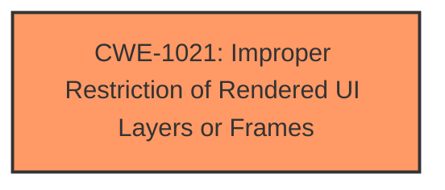

# Analysis Report for CVE-2025-0729

# Vulnerability Analysis Report: CVE-2025-0729

## Description

A vulnerability was found in TP-Link TL-SG108E 1.0.0 Build 20201208 Rel. 40304. It has been rated as problematic. This issue affects some unknown processing. The manipulation leads to **clickjacking**. The attack may be initiated remotely. Upgrading to version 1.0.0 Build 20250124 Rel. 54920(Beta) is able to address this issue. It is recommended to upgrade the affected component. The vendor was contacted early. They reacted very professional and provided a pre-fix version for their customers.

## Vulnerability Description Key Phrases

- **Weakness:** clickjacking
- **Product:** TP-Link TL-SG108E
- **Version:** 1.0.0 Build 20201208 Rel. 40304

## Analysis (with Relationship Data)

# Summary
| CWE ID | CWE Name | Confidence | CWE Abstraction Level | CWE Vulnerability Mapping Label | CWE-Vulnerability Mapping Notes |
|---|---|---|---|---|---|
| CWE-1021 | Improper Restriction of Rendered UI Layers or Frames | 1.0 | Base | Allowed | Primary CWE |

## Evidence and Confidence

*   **Confidence Score:** 1.0
*   **Evidence Strength:** HIGH

## Relationship Analysis
The primary CWE is CWE-1021, which is a Base level CWE. No other relationships influenced the decision.



## Vulnerability Chain
The vulnerability chain consists of a single element: **clickjacking** due to an improper restriction of rendered UI layers or frames.

## Summary of Analysis
The vulnerability description clearly indicates a **clickjacking** issue in TP-Link TL-SG108E. The Retriever Results identify CWE-1021: Improper Restriction of Rendered UI Layers or Frames as the top candidate with a score of 1.0 based on alternate terms. This CWE directly addresses the root cause of **clickjacking** by highlighting the improper restriction of rendered UI layers or frames.

Relevant CWE Information:

# Enhanced Context (25 CWEs)
The following CWEs were identified as potentially relevant to this vulnerability:

## CWE-1021: Improper Restriction of Rendered UI Layers or Frames
**Abstraction Level**: base
**Similarity Score**: 2.40
**Source**: graph

**Description**:
CWE-1021: Improper Restriction of Rendered UI Layers or Frames

**Mapping Guidance**:
- Usage: Allowed
- Rationale: This CWE entry is at the Base level of abstraction, which is a preferred level of abstraction for mapping to the root causes of vulnerabilities.

**Relationships**:
- CHILDOF -> CWE-451
- CHILDOF -> CWE-610
- CHILDOF -> CWE-441
- PARENTOF -> CWE-1021
- PARENTOF -> CWE-1021

# Analysis of Other CWEs
CWE-79, CWE-89, CWE-78, CWE-80, CWE-1336 were considered but not selected, because the vulnerability description specifically points to **clickjacking**, which is directly related to the improper handling of UI layers or frames, as described in CWE-1021.


## CWE Relationship Analysis

Current CWEs represent these abstraction levels: .


### Vulnerability Chain Analysis

**Chain starting from CWE-89:**
- 89 (Improper Neutralization of Special Elements used in an SQL Command ('SQL Injection')) - ROOT


**Chain starting from CWE-610:**
- 610 (Externally Controlled Reference to a Resource in Another Sphere) - ROOT


### CWE Relationship Diagram

```mermaid
graph TD
    classDef primary fill:#f96,stroke:#333,stroke-width:2px
    classDef secondary fill:#69f,stroke:#333
    classDef tertiary fill:#9e9,stroke:#333
```


*Report generated on 2025-07-14 06:17:18*
