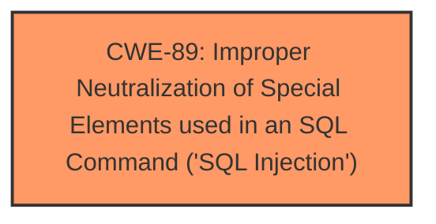

# Analysis for CVE-2025-0793

# Summary
| CWE ID | CWE Name | Confidence | CWE Abstraction Level | CWE Vulnerability Mapping Label | CWE-Vulnerability Mapping Notes |
|---|---|---|---|---|---|
| CWE-89 | Improper Neutralization of Special Elements used in an SQL Command ('SQL Injection') | 1.0 | Base | Primary | Allowed |

## Evidence and Confidence

*   **Confidence Score:** 1.0
*   **Evidence Strength:** HIGH

## Relationship Analysis
The primary relationship that influenced the CWE selection is the direct match of the vulnerability description to the CWE-89 description. While other CWEs were considered, none had the same direct applicability. CWE-89 is a Base level CWE, representing a specific type of injection, and is therefore the most appropriate level of abstraction.

## Vulnerability Chain
The vulnerability chain is simple:
1.  Improper handling of user-supplied input to `/todoDetail.jsp` through the `flowId` parameter
2.  The **improper neutralization** leads to the execution of arbitrary SQL commands due to **SQL injection**.

The **root cause** is the **improper neutralization**, directly leading to the **SQL Injection** vulnerability.

## Summary of Analysis
The primary CWE selected is CWE-89, which directly addresses the identified **SQL injection** vulnerability. This selection is based on the explicit mention of **"sql injection"** in the vulnerability description and the high confidence score (1.0) from the retriever results. The evidence is strong and directly supports the mapping.

The vulnerability description states: "The manipulation of the argument flowId leads to **sql injection**." This directly matches the definition of CWE-89: "The product constructs all or part of an SQL command using externally-influenced input from an upstream component, but it does not neutralize or incorrectly neutralizes special elements that could modify the intended SQL command when it is sent to a downstream component."

I considered other CWEs, particularly those related to **improper neutralization** and **injection**, but these were either too general (e.g., CWE-74) or not specific to SQL (e.g., CWE-79, CWE-917, CWE-1336). Therefore, CWE-89 is the most accurate and specific representation of the vulnerability.