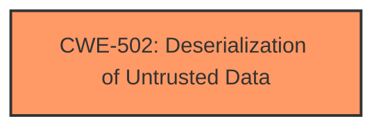

# Analysis for CVE-2025-0841

# Summary
| CWE ID | CWE Name | Confidence | CWE Abstraction Level | CWE Vulnerability Mapping Label | CWE-Vulnerability Mapping Notes |
|---|---|---|---|---|---|
| CWE-502 | Deserialization of Untrusted Data | 1.0 | Base | Primary | Allowed |

## Evidence and Confidence

*   **Confidence Score:** 1.0
*   **Evidence Strength:** HIGH

## Relationship Analysis
The primary CWE selected is CWE-502, which is a base-level CWE, offering a good balance between specificity and broad applicability. There are no direct parent-child relationships significantly impacting the selection, as the vulnerability description clearly points to **deserialization** as the root cause. The provided information does not provide enough insight to find any CanPrecede or CanFollow relationships.



## Vulnerability Chain
The vulnerability chain starts with the **deserialization** of untrusted data and can lead to remote code execution.
  - CWE-502 (Root Cause): Deserialization of Untrusted Data
  - Impact: Remote Code Execution, Arbitrary File Write (as detailed in the CVE Reference Links Content Summary)

## Summary of Analysis
The primary weakness identified in the vulnerability description and CVE reference is **deserialization** of untrusted data, making CWE-502 the most appropriate classification.

The following is quoted from the CVE Reference Links Content Summary:
```
Root cause of vulnerability: Deserialization of Untrusted Data in multiple OpenCart modules named `aridius_XYZ`. The vulnerability is a result of the `unserialize` function being used on data from an unauthenticated POST request, allowing for PHP Object Injection.
```
This statement is explicit.

The retriever results also lists CWE-502 as a possible match:
```
CWE-502: Deserialization of Untrusted Data
Abstraction Level: Base
Similarity Score: 754.54
```

The provided evidence clearly supports the selection of CWE-502 as the primary CWE. The CWE is at the base level of abstraction, which is the preferred level.

Other CWEs Considered but Not Used:

*   CWE-89 (Improper Neutralization of Special Elements used in an SQL Command ('SQL Injection')): While SQL injection is a common vulnerability, the description focuses on **deserialization**, not SQL injection.
*   CWE-79 (Improper Neutralization of Input During Web Page Generation ('Cross-site Scripting')): Similar to SQL injection, XSS is not the primary issue described.
*   CWE-434 (Unrestricted Upload of File with Dangerous Type): While the exploit might involve uploading a file, the core weakness is **deserialization** of that file.
*   CWE-1336 (Improper Neutralization of Special Elements Used in a Template Engine): Not relevant, as the issue is not related to template engine usage.