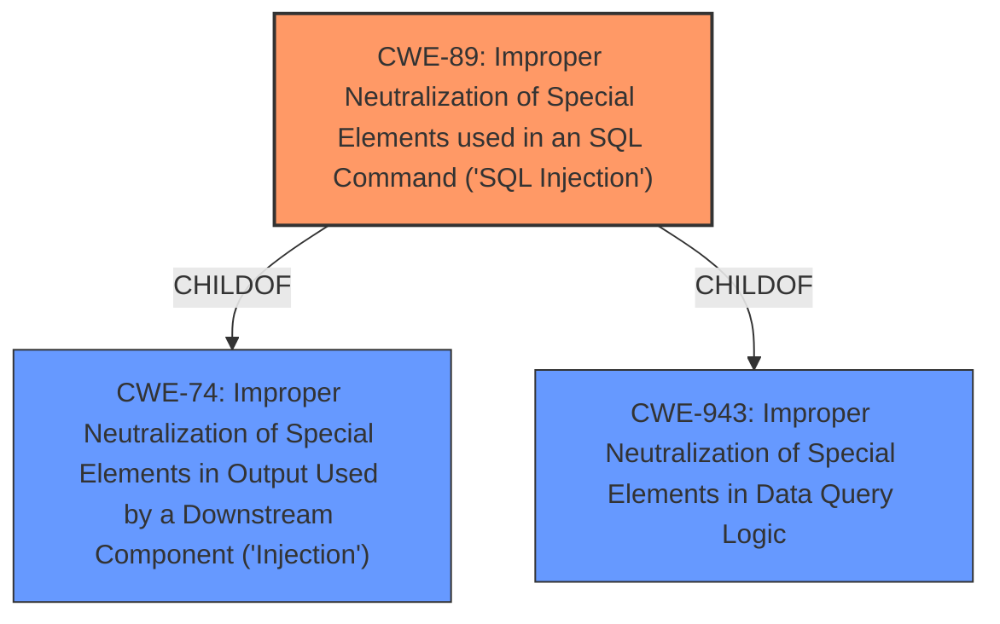

# Analysis for CVE-2025-0853

# Summary
| CWE ID | CWE Name | Confidence | CWE Abstraction Level | CWE Vulnerability Mapping Label | CWE-Vulnerability Mapping Notes |
|---|---|---|---|---|---|
| CWE-89 | Improper Neutralization of Special Elements used in an SQL Command ('SQL Injection') | 1.0 | Base | Allowed | Primary CWE: Root cause is **insufficient escaping on the user supplied parameter and lack of sufficient preparation on the existing SQL query** leading to SQL Injection |

## Evidence and Confidence

*   **Confidence Score:** 1.0
*   **Evidence Strength:** HIGH

## Relationship Analysis
The primary CWE is CWE-89, which falls under the higher-level category CWE-74 (Improper Neutralization of Special Elements in Output Used by a Downstream Component ('Injection')). While CWE-74 represents a broader class of injection vulnerabilities, CWE-89 provides a more specific classification for SQL injection. There aren't any other chain relationships.

## Vulnerability Chain
The vulnerability chain starts with the **insufficient escaping on the user supplied parameter and lack of sufficient preparation on the existing SQL query** (CWE-89) which allows an attacker to inject malicious SQL commands. The impact is the ability to extract sensitive information from the database and append additional SQL queries.

## Summary of Analysis
The vulnerability description clearly indicates an SQL injection vulnerability due to **insufficient escaping on the user supplied parameter and lack of sufficient preparation on the existing SQL query**. The vulnerability occurs in the PGS Core plugin for WordPress, where the 'event' parameter in the save_header_builder function is vulnerable. This allows unauthenticated attackers to inject malicious SQL queries.

The primary CWE selected is CWE-89 (Improper Neutralization of Special Elements used in an SQL Command ('SQL Injection')), because the root cause is **insufficient escaping on the user supplied parameter and lack of sufficient preparation on the existing SQL query** which allows the attacker to inject malicious SQL commands.

The evidence for this is explicitly stated in the "Vulnerability Description Key Phrases" section: "**rootcause:** **insufficient escaping on the user supplied parameter and lack of sufficient preparation on the existing SQL query**" and "**weakness:** **SQL injection**".

The retriever results also supports this by listing CWE-89 as the top match.

Other CWEs were considered but not selected:

*   CWE-116 (Improper Encoding or Escaping of Output): While related to escaping, CWE-89 is more specific to SQL injection, making it a better fit.
*   CWE-90 (Improper Neutralization of Special Elements used in an LDAP Query ('LDAP Injection')): This is specific to LDAP injection, not SQL injection.
*   CWE-352 (Cross-Site Request Forgery (CSRF)): This is a different type of vulnerability and not applicable here.
*   CWE-790 (Improper Filtering of Special Elements): This is less specific than CWE-89.
*   CWE-502 (Deserialization of Untrusted Data): This is a different type of vulnerability and not applicable here.
*   CWE-943 (Improper Neutralization of Special Elements in Data Query Logic): This is a more general class, and CWE-89 is more specific to the SQL context.
*   CWE-434 (Unrestricted Upload of File with Dangerous Type): This is a different type of vulnerability and not applicable here.
*   CWE-96 (Improper Neutralization of Directives in Statically Saved Code ('Static Code Injection')): This is a different type of injection, not SQL.
*   CWE-613 (Insufficient Session Expiration): This is a different type of vulnerability and not applicable here.