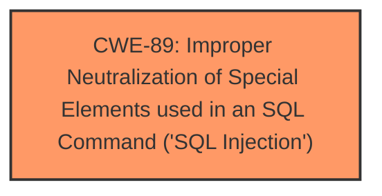

# Analysis for CVE-2025-0882

# Summary
| CWE ID | CWE Name | Confidence | CWE Abstraction Level | CWE Vulnerability Mapping Label | CWE-Vulnerability Mapping Notes |
|---|---|---|---|---|---|
| CWE-89 | Improper Neutralization of Special Elements used in an SQL Command ('SQL Injection') | 1.0 | Base | Primary | Allowed |

## Evidence and Confidence

*   **Confidence Score:** 1.0
*   **Evidence Strength:** HIGH

## Relationship Analysis
The primary identified CWE, CWE-89 [Improper Neutralization of Special Elements used in an SQL Command ('SQL Injection')], stands as a base-level weakness. There are no identified parent-child or chain relationships.

## Vulnerability Chain
The vulnerability chain consists of a single point, CWE-89 [Improper Neutralization of Special Elements used in an SQL Command ('SQL Injection')]. The **weakness** exists in the `/user/addnewmember.php` component, where the `user` argument is susceptible to manipulation leading to **SQL injection**.

## Summary of Analysis
The analysis is based on the vulnerability description, which explicitly states the presence of **SQL injection** due to the manipulation of the `user` argument in the `/user/addnewmember.php` file. The key phrase "manipulation of user argument" coupled with the explicit mention of "**SQL injection, sql injection**" strongly supports the selection of CWE-89 [Improper Neutralization of Special Elements used in an SQL Command ('SQL Injection')].

The retriever results also strongly suggest CWE-89, with a score of 1.0.

CWE-79 [Improper Neutralization of Input During Web Page Generation ('Cross-site Scripting')], CWE-434 [Unrestricted Upload of File with Dangerous Type], and CWE-1336 [Improper Neutralization of Special Elements Used in a Template Engine] were considered but deemed less relevant as the vulnerability description specifically highlights **SQL injection**, not XSS, file upload issues, or template engine vulnerabilities.

The choice of CWE-89 [Improper Neutralization of Special Elements used in an SQL Command ('SQL Injection')] is at the optimal level of specificity, as it directly addresses the **SQL injection** vulnerability described.

Relevant CWE Information:
*   CWE-89 [Improper Neutralization of Special Elements used in an SQL Command ('SQL Injection')]: The product constructs all or part of an SQL command using externally-influenced input from an upstream component, but it does not neutralize or incorrectly neutralizes special elements that could modify the intended SQL command when it is sent to a downstream component. The provided description aligns perfectly with this **weakness**.