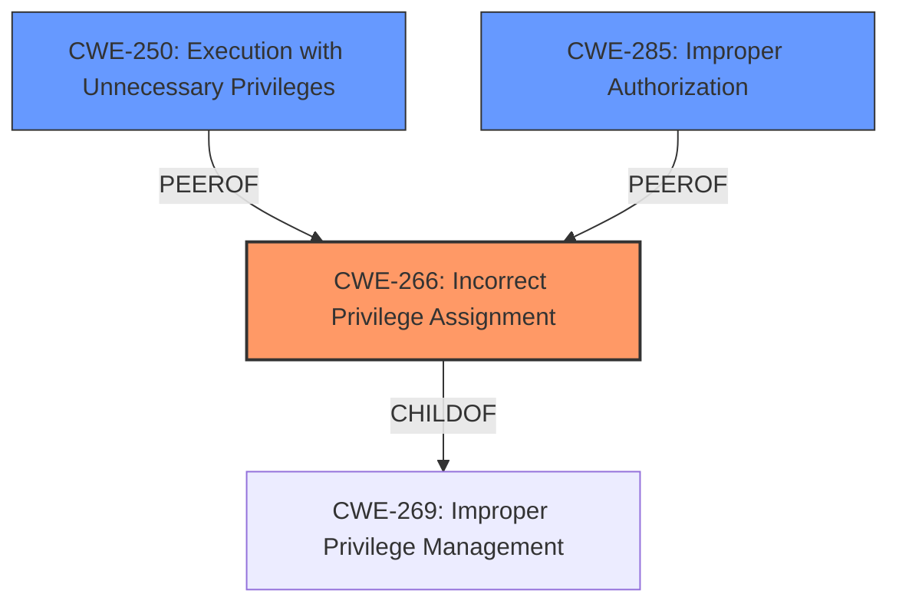

# Raw Analyzer Response for CVE-2025-0893

# Summary
| CWE ID   | CWE Name                                                        | Confidence | CWE Abstraction Level | CWE Vulnerability Mapping Label | CWE-Vulnerability Mapping Notes |
| -------- | --------------------------------------------------------------- | ---------- | --------------------- | ------------------------------- | ------------------------------- |
| CWE-266 | Incorrect Privilege Assignment                                  | 0.80       | Base                  | Primary CWE                   | Allowed                       |
| CWE-250 | Execution with Unnecessary Privileges                            | 0.60       | Base                  | Secondary Candidate             | Allowed                       |
| CWE-285 | Improper Authorization                                          | 0.50       | Class                 | Secondary Candidate             | Discouraged                       |

## Evidence and Confidence

*   **Confidence Score:** 0.70
*   **Evidence Strength:** MEDIUM

## Relationship Analysis
The primary relationship influencing the selection was the hierarchical relationship between CWE-269 (Improper Privilege Management) and its more specific children, particularly CWE-266 (Incorrect Privilege Assignment). The guidance emphasizes that CWE-269 is often misused and that a more specific CWE should be chosen when possible. The vulnerability description points to a misconfigured privilege, making CWE-266 a better fit. CWE-250 was considered as running with elevated privileges and CWE-285 was considered as an authorization issue.

## Vulnerability Chain
The chain of events for this vulnerability is:

1.  **Root Cause:** **Incorrect Privilege Assignment** (CWE-266) - The system incorrectly assigns privileges to an actor.
2.  **Weakness:** **Privilege Escalation** - An attacker gains elevated access to resources.

## Summary of Analysis
The primary weakness is a **Privilege Escalation vulnerability** in Symantec Diagnostic Tool (SymDiag) prior to 3.0.79. The analysis strongly leans towards **CWE-266 Incorrect Privilege Assignment** as the root cause, based on the description and the CWE mapping guidance provided. The guidance explicitly advises against using the more general CWE-269 and suggests CWE-266 when a role is misassigned. The CVE content summary supports this, as the vulnerability leads to an attacker gaining elevated access, suggesting a problem with how privileges were initially assigned. The retriever results also list CWE-266 as a good candidate. CWE-250 was considered because the **privilege escalation** could be caused by the tool running with unnecessary privileges, but there's no direct evidence of that. CWE-285 was also considered as a possibility. However, the problem is more related to the initial assignment of the privilege rather than the authorization check itself. Therefore, CWE-266 is the most specific and appropriate CWE for this vulnerability.

Relevant CWE Information:

# Enhanced Context (25 CWEs)
The following CWEs were identified as potentially relevant to this vulnerability:

## CWE-266: Incorrect Privilege Assignment
**Abstraction Level**: Base
**Similarity Score**: 0.79
**Source**: dense

**Description**:
A product incorrectly assigns a privilege to a particular actor, creating an unintended sphere of control for that actor.

**Mapping Guidance**:
- Usage: Allowed
- Rationale: This CWE entry is at the Base level of abstraction, which is a preferred level of abstraction for mapping to the root causes of vulnerabilities.

## CWE-250: Execution with Unnecessary Privileges
**Abstraction Level**: Base
**Similarity Score**: 0.093

**Description**:
The software component runs with more privileges than it needs to perform a specific task.

**Mapping Guidance**:
- Usage: Allowed
- Rationale: This CWE entry is at the Base level of abstraction, which is a preferred level of abstraction for mapping to the root causes of vulnerabilities.

## CWE-285: Improper Authorization
**Abstraction Level**: Class
**Similarity Score**: 1595.90
**Source**: sparse

**Description**:
The product does not perform or incorrectly performs an authorization check when an actor attempts to access a resource or perform an action.

**Mapping Guidance**:
- Usage: Discouraged
- Rationale: CWE-285 is high-level and lower-level CWEs can frequently be used instead. It is a level-1 Class (i.e., a child of a Pillar).