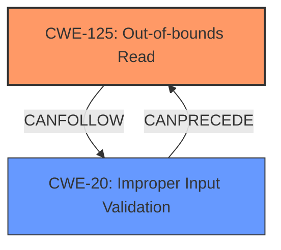

# Enhanced Analysis for CVE-2025-0901

# Summary
| CWE ID  | CWE Name  | Confidence | CWE Abstraction Level | CWE Vulnerability Mapping Label | CWE-Vulnerability Mapping Notes |
|---|---|---|---|---|---|
| CWE-125 | Out-of-bounds Read | 1.0 | Base |  Primary | Allowed |
| CWE-20 | Improper Input Validation | 0.9 | Class | Secondary | Allowed |

## Evidence and Confidence

*   **Confidence Score:** 0.95
*   **Evidence Strength:** HIGH

## Relationship Analysis
The primary relationship is that **CWE-125 (Out-of-bounds Read)** is often caused by **CWE-20 (Improper Input Validation)**. The product **lacks proper validation of user-supplied data** which leads to a **read past the end of an allocated buffer**.



## Vulnerability Chain
The vulnerability chain starts with **CWE-20 (Improper Input Validation)**, where the product does not validate user-supplied data. This leads to **CWE-125 (Out-of-bounds Read)**, where the product reads data past the end of an allocated buffer. Finally, this can result in arbitrary code execution.

## Summary of Analysis
The vulnerability description clearly states that the issue is a "**Out-Of-Bounds Read**" due to the "**lack of proper validation of user-supplied data**, which can result in a **read past the end of an allocated buffer**".

The **ROOTCAUSE** is "**lack of proper validation of user-supplied data**" which maps to **CWE-20 (Improper Input Validation)**. The **WEAKNESS** is "**read past the end of an allocated buffer**", which directly maps to **CWE-125 (Out-of-bounds Read)**.

**CWE-125 (Out-of-bounds Read)** is the most specific CWE that describes the vulnerability, and it is at the Base level of abstraction, which is the preferred level. **CWE-20 (Improper Input Validation)** is included because it is the root cause of the vulnerability and explains why the out-of-bounds read occurred.

The retriever results also list **CWE-787 (Out-of-bounds Write)** as a potential candidate, but the vulnerability description explicitly mentions a read operation, not a write operation. Therefore, **CWE-787 (Out-of-bounds Write)** is not appropriate.

**CWE-119 (Improper Restriction of Operations within the Bounds of a Memory Buffer)** is too general and discouraged, as it's better to use lower-level CWEs when available.

Based on the evidence and the CWE specifications, the primary CWE is **CWE-125 (Out-of-bounds Read)**, and the secondary CWE is **CWE-20 (Improper Input Validation)**.


## CWE Relationship Analysis

Current CWEs represent these abstraction levels: .


### Vulnerability Chain Analysis

**Chain starting from CWE-119:**
- 119 (Improper Restriction of Operations within the Bounds of a Memory Buffer) - ROOT


**Chain starting from CWE-787:**
- 787 (Out-of-bounds Write) - ROOT


### CWE Relationship Diagram

```mermaid
graph TD
    classDef primary fill:#f96,stroke:#333,stroke-width:2px
    classDef secondary fill:#69f,stroke:#333
    classDef tertiary fill:#9e9,stroke:#333
```