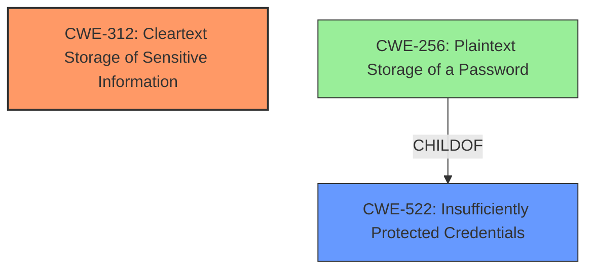

# Raw Analyzer Response for CVE-2025-0941

# Summary
| CWE ID | CWE Name | Confidence | CWE Abstraction Level | CWE Vulnerability Mapping Label | CWE-Vulnerability Mapping Notes |
|---|---|---|---|---|---|
| CWE-312 | Cleartext Storage of Sensitive Information | 0.9 | Base | Primary | Allowed |
| CWE-522 | Insufficiently Protected Credentials | 0.6 | Class | Secondary Candidate | Allowed-with-Review |

## Evidence and Confidence

*   **Confidence Score:** 0.9
*   **Evidence Strength:** HIGH

## Relationship Analysis
The primary CWE is CWE-312, a Base level CWE. CWE-522 is a Class level CWE and a parent of CWE-256 (Plaintext Storage of a Password). CWE-312 is a more direct match to the vulnerability description because it explicitly mentions sensitive information stored in cleartext. While credentials fall under the scope of CWE-522, the description doesn't explicitly state that the stored information are credentials, but the vulnerability description does mention "credentials in plain text". Since CWE-312 is more specific and the vulnerability description mentions "plain text", it's a better fit than the more general CWE-522.

## Vulnerability Chain
The vulnerability chain starts with the **Cleartext Storage of Sensitive Information (CWE-312)**. This **weakness** could potentially lead to exposure of the sensitive information to unauthorized actors.

## Summary of Analysis
The initial assessment identified CWE-312 as the primary weakness due to the explicit mention of "plain text" storage of credentials. The vulnerability description directly states that the MET ONE 3400+ instrument "temporarily store credentials in plain text within the system." This aligns perfectly with the definition of CWE-312, which describes the storage of sensitive information in cleartext.

CWE-522 (Insufficiently Protected Credentials) was also considered, given that credentials are involved. However, since the core issue is the lack of encryption (i.e., storing in plain text), CWE-312 is a more precise representation of the root cause. CWE-522 is a class level CWE, while CWE-312 is a base level CWE.

*Vulnerability Description Key Phrases*:
- **product:** MET ONE 3400+
- **version:** software v1.0.41

I am overriding the retriever results that had CWE-522 ranked higher than CWE-312 and instead ranking CWE-312 as the primary CWE.

Relevant CWE Information:

# Enhanced Context (25 CWEs)
The following CWEs were identified as potentially relevant to this vulnerability:

## CWE-312: Cleartext Storage of Sensitive Information
**Abstraction Level**: Base
**Similarity Score**: 0.76
**Source**: dense

**Description**:
The product stores sensitive information in cleartext within a resource that might be accessible to another control sphere.

**Mapping Guidance**:
- Usage: Allowed
- Rationale: This CWE entry is at the Base level of abstraction, which is a preferred level of abstraction for mapping to the root causes of vulnerabilities.

## CWE-522: Insufficiently Protected Credentials
**Abstraction Level**: Class
**Similarity Score**: 0.74
**Source**: dense

**Description**:
The product transmits or stores authentication credentials, but it uses an insecure method that is susceptible to unauthorized interception and/or retrieval.

**Mapping Guidance**:
- Usage: Allowed-with-Review
- Rationale: This CWE entry is a Class and might have Base-level children that would be more appropriate

## CWE-312: Cleartext Storage of Sensitive Information
**Abstraction Level**: Base
**Similarity Score**: 354.40
**Source**: sparse

**Description**:
The product stores sensitive information in cleartext within a resource that might be accessible to another control sphere.

**Mapping Guidance**:
- Usage: Allowed
- Rationale: This CWE entry is at the Base level of abstraction, which is a preferred level of abstraction for mapping to the root causes of vulnerabilities.