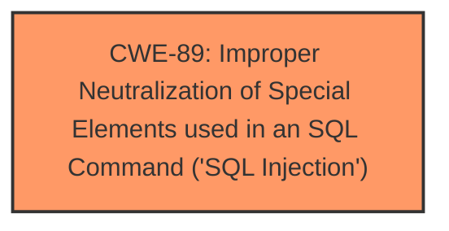

# Analysis for CVE-2025-0946

# Summary
| CWE ID | CWE Name | Confidence | CWE Abstraction Level | CWE Vulnerability Mapping Label | CWE-Vulnerability Mapping Notes |
|---|---|---|---|---|---|
| CWE-89 | Improper Neutralization of Special Elements used in an SQL Command ('SQL Injection') | 1.0 | Base | Allowed | Primary CWE |

## Evidence and Confidence

*   **Confidence Score:** 1.0
*   **Evidence Strength:** HIGH

## Relationship Analysis
The primary relationship is that CWE-89, the **SQL Injection** [CWE-89: Improper Neutralization of Special Elements used in an SQL Command ('SQL Injection')], is a base-level CWE which is suitable for direct mapping. There is no need to go to a higher level of abstraction.

## Vulnerability Chain
The chain of root cause and weaknesses for the Vulnerability Description is:
1.  **Root Cause**: **SQL injection** [CWE-89: Improper Neutralization of Special Elements used in an SQL Command ('SQL Injection')] due to **improper neutralization** of input.
2.  **Impact**: Unauthorized database access, sensitive data leakage, data tampering, comprehensive system control, and even service interruption.

## Summary of Analysis
The vulnerability description clearly states that the **weakness** is **SQL Injection**. The retriever results confirm that CWE-89 is the best match. The root cause is the **improper neutralization** of input, which leads to the **SQL Injection** [CWE-89: Improper Neutralization of Special Elements used in an SQL Command ('SQL Injection')] vulnerability.

The supporting evidence is:
*   "Affected by this vulnerability is an unknown functionality of the file templatedelete.php. The manipulation of the argument id leads to **sql injection**."
*   "The reason for this issue is that an attacker injects malicious code from the parameter "id" or "expid" or "incid" or "typeid" or "staffid" and uses it directly in SQL queries without proper sanitization or validation."

The graph relationships influenced the final selection by confirming that the base-level CWE-89 is the most appropriate.

The selected CWE is at the optimal level of specificity because it directly describes the **SQL Injection** vulnerability, which is the **root cause** of the issue.

Relevant CWE Information:

# Enhanced Context (25 CWEs)
The following CWEs were identified as potentially relevant to this vulnerability:

## CWE-89: Improper Neutralization of Special Elements used in an SQL Command ('SQL Injection')
**Abstraction Level**: Base
**Similarity Score**: 0.78
**Source**: dense

**Description**:
The product constructs all or part of an SQL command using externally-influenced input from an upstream component, but it does not neutralize or incorrectly neutralizes special elements that could modify the intended SQL command when it is sent to a downstream component. Without sufficient removal or quoting of SQL syntax in user-controllable inputs, the generated SQL query can cause those inputs to be interpreted as SQL instead of ordinary user data.

**Mapping Guidance**:
- Usage: Allowed
- Rationale: This CWE entry is at the Base level of abstraction, which is a preferred level of abstraction for mapping to the root causes of vulnerabilities.

## CWE-74: Improper Neutralization of Special Elements in Output Used by a Downstream Component ('Injection')
The product constructs all or part of a command, data structure, or record using externally-influenced input from an upstream component, but it does not neutralize or incorrectly neutralizes special elements that could modify how it is parsed or interpreted when it is sent to a downstream component.
This is too general, because it is talking about any kind of injection.

## CWE-425: Direct Request ('Forced Browsing')
The web application does not adequately enforce appropriate authorization on all restricted URLs, scripts, or files.
This is not relevant because the issue is with **SQL injection**, not authorization.

## CWE-96: Improper Neutralization of Directives in Statically Saved Code ('Static Code Injection')
The product receives input from an upstream component, but it does not neutralize or incorrectly neutralizes code syntax before inserting the input into an executable resource, such as a library, configuration file, or template.
This is not relevant because the issue is with **SQL injection**, not static code injection.

## CWE-80: Improper Neutralization of Script-Related HTML Tags in a Web Page (Basic XSS)
The product receives input from an upstream component, but it does not neutralize or incorrectly neutralizes special characters such as "<", ">", and "&" that could be interpreted as web-scripting elements when they are sent to a downstream component that processes web pages.
This is not relevant because the issue is with **SQL injection**, not cross-site scripting.

## CWE-434: Unrestricted Upload of File with Dangerous Type
The product allows the upload or transfer of dangerous file types that are automatically processed within its environment.
This is not relevant because the issue is with **SQL injection**, not unrestricted file upload.

## CWE-472: External Control of Assumed-Immutable Web Parameter
The web application does not sufficiently verify inputs that are assumed to be immutable but are actually externally controllable, such as hidden form fields.
This is not relevant because the issue is with **SQL injection**, not external control of assumed-immutable web parameter.

## CWE-116: Improper Encoding or Escaping of Output
The product prepares a structured message for communication with another component, but encoding or escaping of the data is either missing or done incorrectly. As a result, the intended structure of the message is not preserved.
This is too general, because it is talking about any kind of encoding/escaping output.

## CWE-79: Improper Neutralization of Input During Web Page Generation ('Cross-site Scripting')
The product does not neutralize or incorrectly neutralizes user-controllable input before it is placed in output that is used as a web page that is served to other users.
This is not relevant because the issue is with **SQL injection**, not cross-site scripting.

## CWE-184: Incomplete List of Disallowed Inputs
The product implements a protection mechanism that relies on a list of inputs (or properties of inputs) that are not allowed by policy or otherwise require other action to neutralize before additional processing takes place, but the list is incomplete.
This is not relevant because the issue is with **SQL injection**, not an incomplete list of disallowed inputs.

## CWE-1336: Improper Neutralization of Special Elements Used in a Template Engine
The product uses a template engine to insert or process externally-influenced input, but it does not neutralize or incorrectly neutralizes special elements or syntax that can be interpreted as template expressions or other code directives when processed by the engine.
This is not relevant because the issue is with **SQL injection**, not a template engine.

## CWE-73: External Control of File Name or Path
This is not relevant because the issue is with **SQL injection**, not external control of file name or path.

## CWE-93: Improper Neutralization of CRLF Sequences ('CRLF Injection')
This is not relevant because the issue is with **SQL injection**, not CRLF Injection.

## CWE-117: Improper Output Neutralization for Logs
This is not relevant because the issue is with **SQL injection**, not output neutralization for logs.

## CWE-94: Improper Control of Generation of Code ('Code Injection')
This is not relevant because the issue is with **SQL injection**, not code injection.

## CWE-78: Improper Neutralization of Special Elements used in an OS Command ('OS Command Injection')
This is not relevant because the issue is with **SQL injection**, not OS Command Injection.

## CWE-494: Download of Code Without Integrity Check
This is not relevant because the issue is with **SQL injection**, not download of code without integrity check.