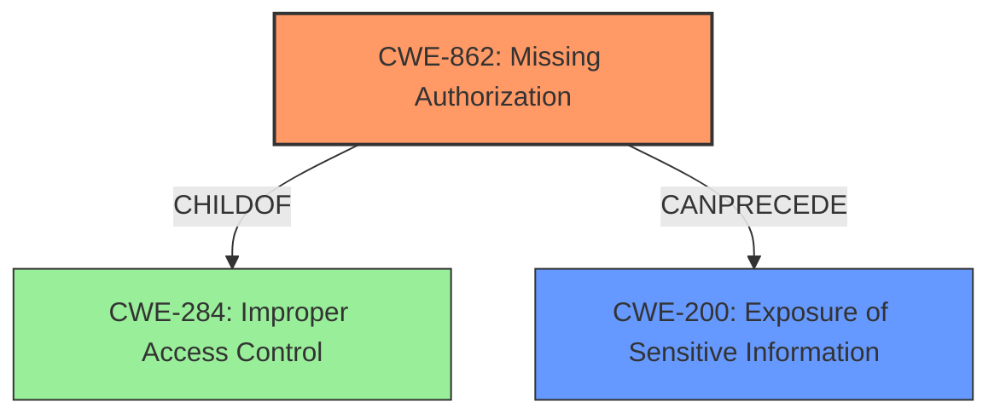

# Enhanced Analysis for CVE-2025-0968

# Summary
| CWE ID | CWE Name | Confidence | CWE Abstraction Level | CWE Vulnerability Mapping Label | CWE-Vulnerability Mapping Notes |
|---|---|---|---|---|---|
| CWE-862 | Missing Authorization | 1.0 | Class | Allowed-with-Review | Primary CWE: The vulnerability description explicitly states "**missing capability checks**" which directly corresponds to the definition of Missing Authorization. |
| CWE-200 | Exposure of Sensitive Information | 0.8 | Class | Allowed | Secondary CWE: The **weakness** is described as "**Sensitive Information Exposure**" and the impact is the ability to view private content. While the root cause is the missing authorization, the direct consequence is information exposure. |

## Evidence and Confidence

*   **Confidence Score:** 0.9
*   **Evidence Strength:** HIGH

## Relationship Analysis
The primary relationship influencing the decision is the parent-child relationship between CWE-284 (Improper Access Control), CWE-862 (Missing Authorization), and CWE-863 (Incorrect Authorization). Since the vulnerability description explicitly mentions "**missing capability checks**", CWE-862 is more appropriate than the more general CWE-284. CWE-863 is not appropriate because the vulnerability is due to a **missing** check, not an incorrect one. CWE-200 (Exposure of Sensitive Information) represents the impact of the missing authorization, forming a chain relationship.



## Vulnerability Chain
The vulnerability chain starts with the **missing capability checks** (CWE-862), which leads to the **Sensitive Information Exposure** (CWE-200). The unauthenticated attacker can then view sensitive information such as posts, pages, and templates, including drafts, trashed, and private items.

## Summary of Analysis
The initial assessment identified CWE-862 as the primary root cause due to the explicit mention of "**missing capability checks**" in the vulnerability description. This is further supported by the description of the get_megamenu_content() function lacking authorization checks, allowing unauthenticated attackers to bypass access controls. The secondary weakness, CWE-200, is a direct result of the **missing authorization**, leading to information exposure. The relationship analysis clarifies that CWE-862 is a specific type of improper access control (CWE-284) and that the missing authorization can lead to information exposure. The selected CWEs are at the optimal level of specificity, with CWE-862 being a Class-level CWE that accurately represents the **missing authorization** and CWE-200 representing the resulting impact.

Relevant CWE Information:

*   **CWE-862 (Missing Authorization):** This CWE accurately describes the root cause where the application **fails to perform an authorization check** before granting access to a resource.
*   **CWE-200 (Exposure of Sensitive Information):** This CWE accurately describes the resulting impact where sensitive information is exposed due to the **missing authorization**.

The evidence from the vulnerability description strongly supports this assessment.


## CWE Relationship Analysis

Current CWEs represent these abstraction levels: .


### Vulnerability Chain Analysis

**Chain starting from CWE-284:**
- 284 (Improper Access Control) - ROOT


**Chain starting from CWE-863:**
- 863 (Incorrect Authorization) - ROOT


### CWE Relationship Diagram

```mermaid
graph TD
    classDef primary fill:#f96,stroke:#333,stroke-width:2px
    classDef secondary fill:#69f,stroke:#333
    classDef tertiary fill:#9e9,stroke:#333
```