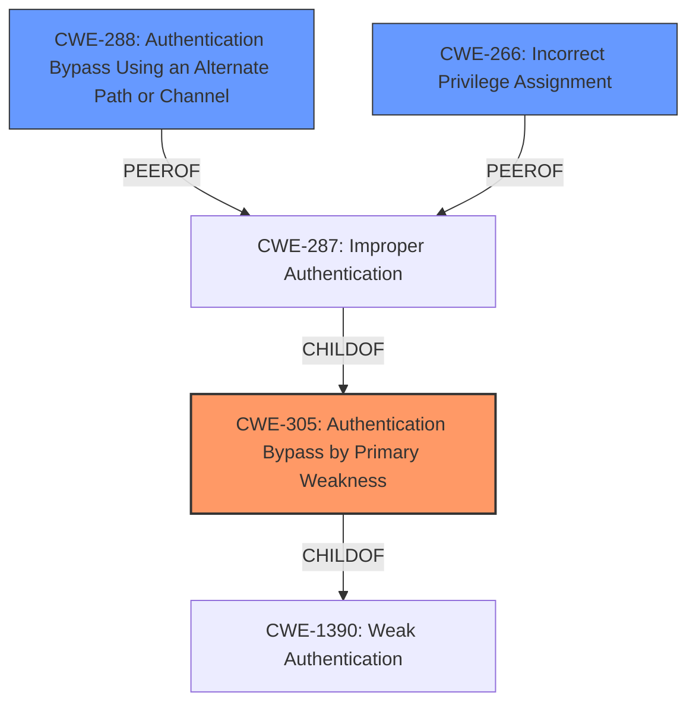

# Raw Analyzer Response for CVE-2025-1003

# Summary
| CWE ID | CWE Name | Confidence | CWE Abstraction Level | CWE Vulnerability Mapping Label | CWE-Vulnerability Mapping Notes |
|---|---|---|---|---|---|
| CWE-305 | Authentication Bypass by Primary Weakness | 0.8 | Base |  Primary CWE | Allowed |
| CWE-266 | Incorrect Privilege Assignment | 0.5 | Base | Secondary Candidate | Allowed |
| CWE-288 | Authentication Bypass Using an Alternate Path or Channel | 0.4 | Base | Secondary Candidate | Allowed |

## Evidence and Confidence

*   **Confidence Score:** 0.7
*   **Evidence Strength:** MEDIUM

## Relationship Analysis
The primary relationship that influenced the decision was the guidance given for Authentication vs Authorization vs Access Control and Privileges vs Permissions. 
- CWE-305 (Authentication Bypass by Primary Weakness) is selected as the primary cause.
- CWE-266 (Incorrect Privilege Assignment) is considered because the impact includes "escalation of privilege", but there is no direct evidence.
- CWE-288 (Authentication Bypass Using an Alternate Path or Channel) is considered because the vulnerability includes "authentication bypass".

## Vulnerability Chain
The vulnerability chain starts with the **authentication bypass** (**ROOT CAUSE**) which then leads to **escalation of privilege** (**IMPACT**).
- **CWE-305 (Authentication Bypass by Primary Weakness)** is the root cause, due to an **authentication bypass**.
- The impact is **escalation of privilege**.

## Summary of Analysis
The initial assessment focused on the keywords "authentication bypass" and "escalation of privilege" present in the vulnerability description. The presence of "authentication bypass" strongly suggests an issue related to authentication, which led to considering CWE-305 (Authentication Bypass by Primary Weakness).

The guidance provided clearly distinguishes between authentication and authorization, stating that authentication issues are typically mapped to CWE-306 or its children, and authorization issues to CWE-862 or its children. Since the vulnerability involves **authentication bypass**, CWE-305 is a more suitable choice than authorization-related CWEs. The guidance also indicated that the phrase "unauthorized access" is not sufficient and the evidence does not contain that phrase. It does contain "**authentication bypass**".

The evidence is based on the vulnerability description: "HP Anyware Agent for Linux which might allow for **authentication bypass** which may result in **escalation of privilege**".

The selected CWEs are at the optimal level of specificity because CWE-305 is a Base level CWE, which is preferred.

Relevant CWE Information:

# Enhanced Context (25 CWEs)
The following CWEs were identified as potentially relevant to this vulnerability:

## CWE-266: Incorrect Privilege Assignment
**Abstraction Level**: Base
**Similarity Score**: 0.75
**Source**: dense

**Description**:
A product incorrectly assigns a privilege to a particular actor, creating an unintended sphere of control for that actor.

**Mapping Guidance**:
- Usage: Allowed
- Rationale: This CWE entry is at the Base level of abstraction, which is a preferred level of abstraction for mapping to the root causes of vulnerabilities.

**Why it was considered:** The vulnerability description mentions "escalation of privilege". This could mean that the privileges were incorrectly assigned.
**Why it was not chosen as primary:** There is no evidence that the privileges were incorrectly assigned. The vulnerability description states that there is an **authentication bypass** which leads to **escalation of privilege**, so the authentication must be fixed first.

## CWE-288: Authentication Bypass Using an Alternate Path or Channel
**Abstraction Level**: base
**Similarity Score**: 2.47
**Source**: graph

**Description**:
CWE-288: Authentication Bypass Using an Alternate Path or Channel

**Mapping Guidance**:
- Usage: Allowed
- Rationale: This CWE entry is at the Base level of abstraction, which is a preferred level of abstraction for mapping to the root causes of vulnerabilities.

**Why it was considered:** The vulnerability description mentions "authentication bypass".
**Why it was not chosen as primary:** CWE-288 is more about using an alternate path. CWE-305 is about the primary weakness which is more fitting.

## CWE-305: Authentication Bypass by Primary Weakness
**Abstraction Level**: base
**Similarity Score**: 2.40
**Source**: graph

**Description**:
CWE-305: Authentication Bypass by Primary Weakness

**Mapping Guidance**:
- Usage: Allowed
- Rationale: This CWE entry is at the Base level of abstraction, which is a preferred level of abstraction for mapping to the root causes of vulnerabilities.

**Relationships**:
- CHILDOF -> CWE-1390
- PARENTOF -> CWE-305

**Why it was chosen:** The vulnerability description mentions "**authentication bypass**".
**Justification:** Authentication bypass is a primary weakness.

## CWE-287: Improper Authentication
**Abstraction Level**: Class
**Similarity Score**: 0.064

**Description**: The product does not adequately authenticate users, which allows for unauthorized access and potential compromise.

**Mapping Guidance**:
- Usage: Discouraged

**Relationships**:
- CHILDOF -> CWE-284
- CHILDOF -> CWE-306

**Why it was not chosen:** The vulnerability description mentions "**authentication bypass**" and this is too generic.