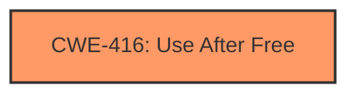

# Enhanced Analysis for CVE-2025-1006

# Summary
| CWE ID | CWE Name | Confidence | CWE Abstraction Level | CWE Vulnerability Mapping Label | CWE-Vulnerability Mapping Notes |
|---|---|---|---|---|---|
| CWE-416 | Use After Free | 1.0 | Variant | Primary | Allowed |

## Evidence and Confidence

*   **Confidence Score:** 1.0
*   **Evidence Strength:** HIGH

## Relationship Analysis
The primary relationship influencing the decision is the direct match of "**use after free**" to CWE-416. The CWE-416 is a variant, the most specific level.



## Vulnerability Chain
The vulnerability chain is straightforward:
1.  **Root Cause:** **Use after free** (CWE-416)
2.  **Impact:** Potential heap corruption

## Summary of Analysis
The vulnerability description clearly states a "**use after free**" vulnerability. The "CVE Reference Links Content Summary" section also confirms "**Root cause of vulnerability: Use after free**".

CWE-416 perfectly aligns with the provided information. It's a Variant-level CWE, which is preferred for root cause mapping.

The decision is based on direct evidence from the vulnerability description and supporting information. The confidence level is high due to the explicit mention of "use after free."

Relevant CWE Information:

# Enhanced Context (25 CWEs)
The following CWEs were identified as potentially relevant to this vulnerability:

## CWE-416: Use After Free
**Abstraction Level**: Variant
**Similarity Score**: 0.80
**Source**: dense

**Description**:
The product reuses or references memory after it has been freed. At some point afterward, the memory may be allocated again and saved in another pointer, while the original pointer references a location somewhere within the new allocation. Any operations using the original pointer are no longer valid because the memory "belongs" to the code that operates on the new pointer.

**Mapping Guidance**:
- Usage: Allowed
- Rationale: This CWE entry is at the Variant level of abstraction, which is a preferred level of abstraction for mapping to the root causes of vulnerabilities.


## CWE Relationship Analysis

Current CWEs represent these abstraction levels: .


### Vulnerability Chain Analysis

**Chain starting from CWE-416:**
- 416 (Use After Free) - ROOT


### CWE Relationship Diagram

```mermaid
graph TD
    classDef primary fill:#f96,stroke:#333,stroke-width:2px
    classDef secondary fill:#69f,stroke:#333
    classDef tertiary fill:#9e9,stroke:#333
```