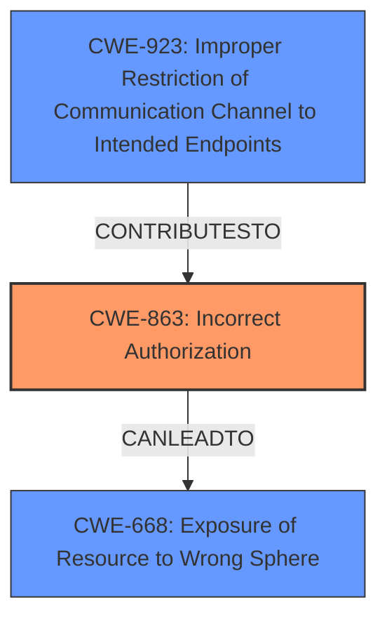

# Analysis Report for CVE-2025-1007

# Vulnerability Analysis Report: CVE-2025-1007

## Description

In OpenVSX version v0.9.0 to v0.20.0, the /user/namespace/{namespace}/details API allows a user to edit all namespace details, even if the user is not a namespace Owner or Contributor. The details include name, description, website, support link and social media links. The same issues existed in /user/namespace/{namespace}/details/logo and allowed a user to change the logo.

## Vulnerability Description Key Phrases

- **Component:** /user/namespace/{namespace}/details, /user/namespace/{namespace}/details/logo
- **Product:** OpenVSX
- **Impact:** edit namespace details
- **Attacker:** user
- **Version:** v0.9.0 to v0.20.0

## Analysis (with Relationship Data)

# Summary
| CWE ID | CWE Name | Confidence | CWE Abstraction Level | CWE Vulnerability Mapping Label | CWE-Vulnerability Mapping Notes |
|---|---|---|---|---|---|
| CWE-863 | Incorrect Authorization | 0.9 | Class | Primary | Allowed-with-Review |
| CWE-923 | Improper Restriction of Communication Channel to Intended Endpoints | 0.7 | Class | Secondary | Allowed-with-Review |
| CWE-668 | Exposure of Resource to Wrong Sphere | 0.5 | Class | Secondary | Discouraged |

## Evidence and Confidence

*   **Confidence Score:** 0.8
*   **Evidence Strength:** HIGH

## Relationship Analysis
The primary weakness is **CWE-863 [Incorrect Authorization]**, which is a Class-level CWE. **CWE-923 [Improper Restriction of Communication Channel to Intended Endpoints]** is a related Class-level CWE that highlights how the communication channel was not properly restricted, leading to the authorization issue. **CWE-668 [Exposure of Resource to Wrong Sphere]** is also a Class-level CWE, representing the broad impact of the authorization failure. The relationships show that **CWE-863 [Incorrect Authorization]** can lead to **CWE-668 [Exposure of Resource to Wrong Sphere]** and that **CWE-923 [Improper Restriction of Communication Channel to Intended Endpoints]** contributed to the **Incorrect Authorization**.



## Vulnerability Chain
The vulnerability chain starts with **CWE-863 [Incorrect Authorization]**, where the application fails to properly authorize users before allowing them to edit namespace details. This leads to **CWE-668 [Exposure of Resource to Wrong Sphere]** because unauthorized users can modify sensitive namespace information.  **CWE-923 [Improper Restriction of Communication Channel to Intended Endpoints]** is relevant, as the API endpoint did not properly restrict access based on user roles, contributing to the authorization failure.

## Summary of Analysis
The analysis is primarily based on the provided CVE Reference Links Content Summary, which states: "The `/user/namespace/{namespace}/details` API allows users to edit namespace details without proper authorization checks. Users can modify information even if they are not the namespace owner or a member." This directly supports the selection of **CWE-863 [Incorrect Authorization]** as the primary weakness. The retriever results also listed **CWE-863 [Incorrect Authorization]** and **CWE-923 [Improper Restriction of Communication Channel to Intended Endpoints]** as high-scoring candidates. The graph relationships and vulnerability chain further solidify the selection of these CWEs. While the retriever results listed **CWE-668 [Exposure of Resource to Wrong Sphere]**, it's a more general consequence, making **CWE-863 [Incorrect Authorization]** and **CWE-923 [Improper Restriction of Communication Channel to Intended Endpoints]** more specific and appropriate for identifying the root cause.

Relevant CWE Information:

*   **CWE-863 [Incorrect Authorization]**: The product performs an authorization check when an actor attempts to access a resource or perform an action, but it does not correctly perform the check. This aligns with the vulnerability description, where users could edit namespace details without being the owner or contributor.
*   **CWE-923 [Improper Restriction of Communication Channel to Intended Endpoints]**: The product establishes a communication channel to (or from) an endpoint for privileged or protected operations, but it does not properly ensure that it is communicating with the correct endpoint. In this case, the API endpoint `/user/namespace/{namespace}/details` allowed unauthorized access, failing to restrict the communication channel to authorized users.
*   **CWE-668 [Exposure of Resource to Wrong Sphere]**: The product exposes a resource to the wrong control sphere, providing unintended actors with inappropriate access to the resource. This is the impact of the vulnerability where namespace details were exposed to unauthorized users for modification.

CWEs considered but not used:

*   CWE-285: Improper Authorization - Discouraged because it is high-level, and **CWE-863 [Incorrect Authorization]** is more specific.
*   CWE-639: Authorization Bypass Through User-Controlled Key - Not directly applicable because the vulnerability doesn't explicitly involve user-controlled keys.
*   CWE-346: Origin Validation Error - Not directly relevant as the vulnerability is related to authorization, not origin validation.
*   CWE-497: Exposure of Sensitive System Information to an Unauthorized Control Sphere - Not directly applicable as the exposure is related to namespace details, not system information.
*   CWE-201: Insertion of Sensitive Information Into Sent Data - Not directly relevant as the vulnerability focus is not insertion of information.


## CWE Relationship Analysis

Current CWEs represent these abstraction levels: .


### Vulnerability Chain Analysis

**Chain starting from CWE-863:**
- 863 (Incorrect Authorization) - ROOT


**Chain starting from CWE-346:**
- 346 (Origin Validation Error) - ROOT


### CWE Relationship Diagram

```mermaid
graph TD
    classDef primary fill:#f96,stroke:#333,stroke-width:2px
    classDef secondary fill:#69f,stroke:#333
    classDef tertiary fill:#9e9,stroke:#333
```


*Report generated on 2025-07-14 06:43:52*
