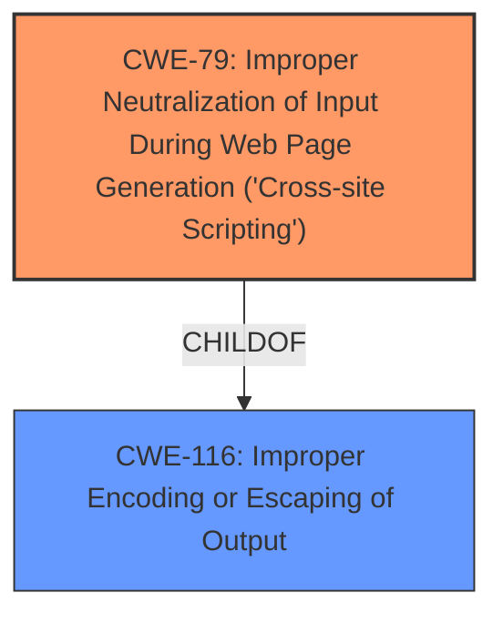

# Analysis Report for CVE-2025-1033

# Vulnerability Analysis Report: CVE-2025-1033

## Description

The Badgearoo WordPress plugin through 1.0.14 **does not sanitise and escape some of its settings**, which could allow high privilege users such as admin to perform Stored Cross-Site Scripting attacks even when the unfiltered_html capability is disallowed (for example in multisite setup).

## Vulnerability Description Key Phrases

- **Rootcause:** does not sanitise and escape some of its settings
- **Weakness:** cross-site scripting
- **Impact:** Stored Cross-Site Scripting attacks
- **Attacker:** high privilege users such as admin
- **Product:** Badgearoo WordPress plugin
- **Version:** through 1.0.14

## Analysis (with Relationship Data)

# Summary

| CWE ID  | CWE Name                                                                    | Confidence | CWE Abstraction Level | CWE Vulnerability Mapping Label | CWE-Vulnerability Mapping Notes |
| :-------- | :-------------------------------------------------------------------------- | :--------- | :-------------------- | :------------------------------ | :------------------------------ |
| CWE-79    | Improper Neutralization of Input During Web Page Generation ('Cross-site Scripting') | 1.0        | Base                  | Primary CWE                   | Allowed                       |

## Evidence and Confidence

*   **Confidence Score:** 1.0
*   **Evidence Strength:** HIGH

## Relationship Analysis

The primary identified weakness is CWE-79 [Improper Neutralization of Input During Web Page Generation ('Cross-site Scripting')]. This CWE is a Base level weakness, offering a specific description of the vulnerability. The retriever results and vulnerability description clearly indicate that the plugin does not properly sanitize or escape user-controlled input, leading to XSS.



## Vulnerability Chain

The vulnerability chain starts with the **failure to sanitize and escape** settings in the Badgearoo WordPress plugin, specifically related to user-provided input. This **root cause** directly leads to the injection of malicious scripts, which are then executed in the context of other users' browsers, resulting in a Stored Cross-Site Scripting (XSS) attack.

## Summary of Analysis

The analysis strongly supports the selection of CWE-79 [Improper Neutralization of Input During Web Page Generation ('Cross-site Scripting')] as the primary CWE. The vulnerability description explicitly states that the plugin "does not sanitise and escape some of its settings," directly aligning with the CWE's definition. The evidence from CVE-2025-1033 analysis further confirms this by highlighting "Insufficient input validation/sanitization" as a key weakness. The high confidence score is based on this direct evidence and the alignment with the CWE description.

The retriever results also support this selection, with CWE-79 being among the top matches. While other CWEs like CWE-352 [Cross-Site Request Forgery (CSRF)] and CWE-863 [Incorrect Authorization] were considered, they do not accurately represent the core issue of improper input handling that leads to the XSS vulnerability.
CWE-116 [Improper Encoding or Escaping of Output] is a parent of CWE-79 and could be considered as a secondary option. However, the vulnerability description specifically mentions the lack of sanitization and escaping in the context of web page generation, making CWE-79 the more precise choice.

The final selection of CWE-79 is at the optimal level of specificity, as it directly addresses the weakness of improper input neutralization during web page generation, which is the root cause of the Stored Cross-Site Scripting vulnerability.


## CWE Relationship Analysis

Current CWEs represent these abstraction levels: .


### Vulnerability Chain Analysis

**Chain starting from CWE-352:**
- 352 (Cross-Site Request Forgery (CSRF)) - ROOT


**Chain starting from CWE-79:**
- 79 (Improper Neutralization of Input During Web Page Generation ('Cross-site Scripting')) - ROOT


### CWE Relationship Diagram

```mermaid
graph TD
    classDef primary fill:#f96,stroke:#333,stroke-width:2px
    classDef secondary fill:#69f,stroke:#333
    classDef tertiary fill:#9e9,stroke:#333
```


*Report generated on 2025-07-14 06:45:26*
