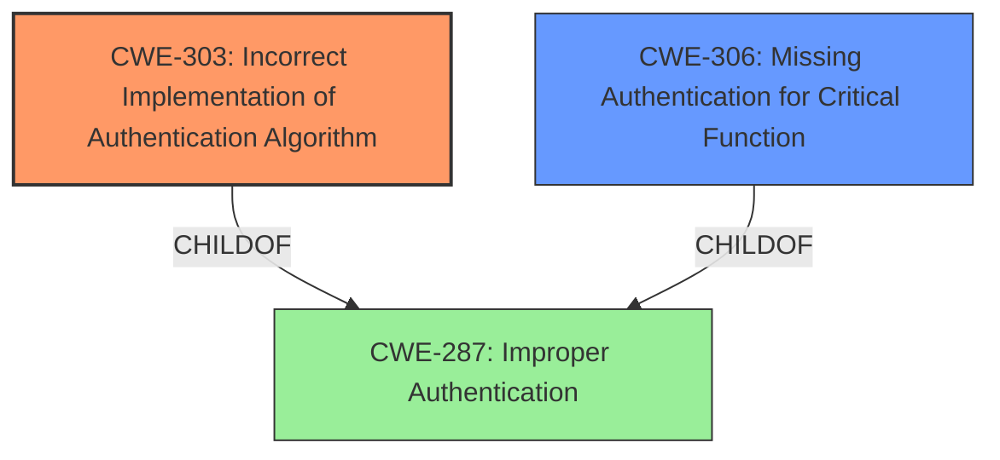

# Analysis Report for CVE-2025-1044

# Vulnerability Analysis Report: CVE-2025-1044

## Description

Logsign Unified SecOps Platform Authentication Bypass Vulnerability. This vulnerability allows remote attackers to bypass authentication on affected installations of Logsign Unified SecOps Platform. Authentication is not required to exploit this vulnerability. The specific flaw exists within the web service, which listens on TCP port 443 by default. The issue results from the **lack of proper implementation of the authentication algorithm**. An attacker can leverage this vulnerability to bypass authentication on the system. Was ZDI-CAN-25336.

## Vulnerability Description Key Phrases

- **Rootcause:** lack of proper implementation of the authentication algorithm
- **Impact:** Authentication Bypass
- **Attacker:** remote attackers
- **Product:** Logsign Unified SecOps Platform
- **Component:** web service

## Analysis (with Relationship Data)

# Summary

| CWE ID  | CWE Name                                                       | Confidence | CWE Abstraction Level | CWE Vulnerability Mapping Label | CWE-Vulnerability Mapping Notes |
| :-------- | :------------------------------------------------------------- | :--------- | :---------------------- | :------------------------------ | :------------------------------ |
| CWE-303   | Incorrect Implementation of Authentication Algorithm         | 0.9        | Base                    | Primary CWE                     | Allowed                       |
| CWE-306   | Missing Authentication for Critical Function                 | 0.7        | Base                    | Secondary Candidate             | Allowed                       |
| CWE-287   | Improper Authentication                                      | 0.5        | Class                   | Secondary Candidate             | Discouraged                   |

## Evidence and Confidence

*   **Confidence Score:** 0.8
*   **Evidence Strength:** HIGH

## Relationship Analysis

The primary CWE is CWE-303, which indicates an incorrect implementation of the authentication algorithm. CWE-306 (Missing Authentication for Critical Function) is considered as a possible alternative, but CWE-303 is more specific because the description states that the vulnerability lies in the **lack of proper implementation of the authentication algorithm**, rather than the complete absence of authentication. CWE-287 is a more general class that encompasses both of these, but it's less specific and therefore less appropriate.



## Vulnerability Chain

The vulnerability chain starts with the **incorrect implementation of the authentication algorithm** (CWE-303), which leads to the ability to bypass authentication. The impact is that remote attackers can bypass authentication on the system.

## Summary of Analysis

The primary vulnerability is CWE-303, **Incorrect Implementation of Authentication Algorithm**, because the **rootcause** is the **lack of proper implementation of the authentication algorithm**. The vulnerability description explicitly states: "The issue results from the **lack of proper implementation of the authentication algorithm**". This maps directly to CWE-303.

CWE-306, **Missing Authentication for Critical Function**, was considered, but it is not the best fit because authentication was intended, but implemented incorrectly.
CWE-287, **Improper Authentication**, is a more general class and less specific.

The selected CWEs are at the optimal level of specificity because CWE-303 directly addresses the **rootcause** of the vulnerability.

Relevant CWE Information:

# Enhanced Context (25 CWEs)
The following CWEs were identified as potentially relevant to this vulnerability:

## CWE-303: Incorrect Implementation of Authentication Algorithm
**Abstraction Level**: Base
**Similarity Score**: 0.76
**Source**: dense

**Description**:
The requirements for the product dictate the use of an established authentication algorithm, but the implementation of the algorithm is incorrect.

**Mapping Guidance**:
- Usage: Allowed
- Rationale: This CWE entry is at the Base level of abstraction, which is a preferred level of abstraction for mapping to the root causes of vulnerabilities.


## CWE Relationship Analysis

Current CWEs represent these abstraction levels: .


### Vulnerability Chain Analysis

**Chain starting from CWE-306:**
- 306 (Missing Authentication for Critical Function) - ROOT


**Chain starting from CWE-287:**
- 287 (Improper Authentication) - ROOT


### CWE Relationship Diagram

```mermaid
graph TD
    classDef primary fill:#f96,stroke:#333,stroke-width:2px
    classDef secondary fill:#69f,stroke:#333
    classDef tertiary fill:#9e9,stroke:#333
```


*Report generated on 2025-07-14 06:46:15*
