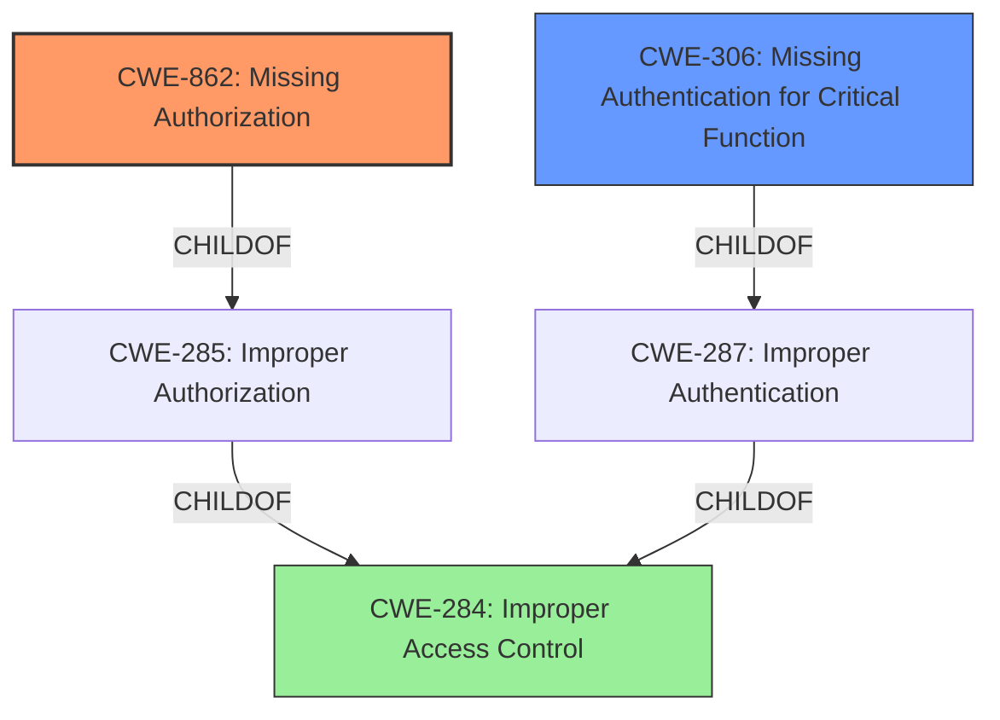

# Raw Analyzer Response for CVE-2025-1078

# Summary
| CWE ID  | CWE Name                                                                       | Confidence | CWE Abstraction Level | CWE Vulnerability Mapping Label | CWE-Vulnerability Mapping Notes |
| :-------- | :----------------------------------------------------------------------------- | :---------- | :---------------------- | :------------------------------ | :------------------------------ |
| CWE-862   | Missing Authorization                                                          | 1          | Base                    | Primary                         | Allowed                       |
| CWE-306   | Missing Authentication for Critical Function                               | 0.7         | Base                    | Secondary                        | Allowed                       |
| CWE-284   | Improper Access Control                                                        | 0.5         | Pillar                  | Secondary                        | Discouraged                     |

## Evidence and Confidence

*   **Confidence Score:** 0.8
*   **Evidence Strength:** HIGH

## Relationship Analysis

The primary relationship influencing the CWE selection is the parent-child relationship between CWE-287 (Improper Authentication), CWE-285 (Improper Authorization), and CWE-284 (Improper Access Control). CWE-862 (Missing Authorization) and CWE-306 (Missing Authentication for Critical Function) are children of these higher-level classifications. The vulnerability description indicates a **missing authorization** check, making CWE-862 the most specific and appropriate choice. However, since the `shouldAcceptNewConnection` method unconditionally returns YES, effectively bypassing any authentication as well. Therefore, CWE-306 is also considered. CWE-284 is considered a more general case.

## Vulnerability Chain

The vulnerability chain starts with the **missing authorization** check in the `shouldAcceptNewConnection` method (CWE-862), leading to an attacker gaining unrestricted access to SMC and power management methods. This allows the attacker to damage hardware, drain system resources, read sensitive information, and corrupt critical system settings.

## Summary of Analysis

The initial assessment focused on the **improper authorization** reported in the vulnerability description and the retriever results. After reviewing the CVE reference links content summary, it became clear that the `shouldAcceptNewConnection` method unconditionally returns YES, allowing any XPC client to connect without verification. This indicates that there is a **missing authorization** check (CWE-862).

The graph relationships influenced the final selection by providing context on the hierarchical relationships between access control-related CWEs. This helped in selecting the most specific CWE that accurately represents the vulnerability.

The selected CWEs are at the optimal level of specificity because they accurately represent the root cause of the vulnerability (CWE-862) and the lack of authentication (CWE-306). CWE-862 is a base-level CWE, which is preferred for mapping root causes.

Relevant CWE Information:

*   Vulnerability Description Key Phrases: "**rootcause: improper authorization**"
*   CVE Reference Links Content Summary: "The `shouldAcceptNewConnection` method unconditionally returns YES, allowing any XPC client to connect without verification."

CWEs Considered but Not Used:

*   CWE-285 (Improper Authorization): This is a class-level CWE and is less specific than CWE-862. The vulnerability description indicates a **missing authorization** check, making CWE-862 a more accurate representation of the weakness.
*   CWE-863 (Incorrect Authorization): This CWE applies when an authorization check is performed, but it is done incorrectly. In this case, there is no authorization check, making CWE-862 a more appropriate choice.
*   CWE-284 (Improper Access Control): This is a pillar-level CWE and is too general. The vulnerability description specifically mentions **improper authorization**, making CWE-862 a more accurate representation of the weakness.
*   CWE-79, CWE-89, CWE-78, CWE-113: These CWEs relate to injection vulnerabilities, which are not present in the vulnerability description.
*   CWE-345, CWE-494: These CWEs relate to data authenticity and integrity, which are not the focus of the vulnerability.
*   CWE-472, CWE-41, CWE-267, CWE-807, CWE-138, CWE-303, CWE-754: These CWEs do not align well with the specific details of the vulnerability description.
*   CWE-705: Incorrect Control Flow Scoping is not directly related to the authorization bypass issue.
*   CWE-125: Out-of-bounds Read is not relevant as the issue is with access control, not memory access.
*   CWE-939: Improper Authorization in Handler for Custom URL Scheme is too specific and doesn't directly apply to the described XPC service vulnerability.

---

**CWE-862: Missing Authorization**

*   **Technical Explanation:** The vulnerability exists because the `shouldAcceptNewConnection` method in the XPC service unconditionally returns YES, meaning that there is no check to verify if the connecting client is authorized to access the service. This **missing authorization** allows any XPC client to connect without proper validation.
*   **Security Implications:** An attacker can gain unrestricted access to the exposed SMC and power management methods, potentially leading to hardware damage, resource draining, information disclosure, and system corruption.
*   **Relationship Analysis:** This is a base-level CWE that is a child of CWE-285 (Improper Authorization).
*   **Mapping Guidance:** The official MITRE mapping guidance recommends using base-level CWEs when possible. CWE-862 is a base-level CWE that accurately represents the weakness.
*   **Evidence:** CVE Reference Links Content Summary: "The `shouldAcceptNewConnection` method unconditionally returns YES, allowing any XPC client to connect without verification."
*   **Confidence:** 1

**CWE-306: Missing Authentication for Critical Function**

*   **Technical Explanation:** The `shouldAcceptNewConnection` method's failure to perform any client verification means there's effectively **missing authentication**. While the primary issue is authorization after connection, the complete lack of a challenge-response mechanism or identity validation qualifies for CWE-306.
*   **Security Implications:** Without authentication, any process can connect to the XPC service and invoke privileged operations. This bypasses any intended security measures.
*   **Relationship Analysis:** This is a base-level CWE that is a child of CWE-287 (Improper Authentication).
*   **Mapping Guidance:** Allowed. Base level of abstraction, suitable for root cause.
*   **Evidence:** CVE Reference Links Content Summary: "allowing any XPC client to connect without verification."
*   **Confidence:** 0.7

**CWE-284: Improper Access Control**

*   **Technical Explanation:** CWE-284 is a high-level category for access control issues. While technically applicable (as the root cause is an access control flaw), it's less specific than CWE-862 and CWE-306. The issue is not merely access control, but a specific lack of authorization and authentication.
*   **Security Implications:** Broadly, the lack of access control allows unauthorized access to sensitive functions.
*   **Relationship Analysis:** This is a pillar-level CWE, parent of CWE-285 (Improper Authorization) and CWE-287 (Improper Authentication).
*   **Mapping Guidance:** Discouraged when more specific CWEs like CWE-862 or CWE-306 are applicable.
*   **Evidence:** The issue is an access control problem.
*   **Confidence:** 0.5