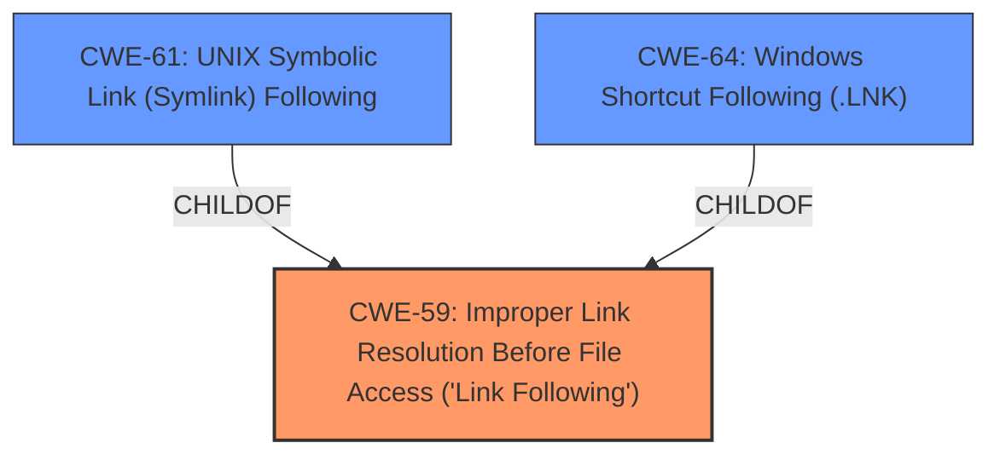

# Analysis Report for CVE-2025-1079

# Vulnerability Analysis Report: CVE-2025-1079

## Description

Client RCE on macOS and Linux via **improper symbolic link resolution** in Google Web Designers preview feature

## Vulnerability Description Key Phrases

- **Rootcause:** improper symbolic link resolution
- **Impact:** RCE
- **Product:** Google Web Designers
- **Component:** preview feature

## Analysis (with Relationship Data)

# Summary
| CWE ID | CWE Name | Confidence | CWE Abstraction Level | CWE Vulnerability Mapping Label | CWE-Vulnerability Mapping Notes |
|---|---|---|---|---|---|
| CWE-59 | Improper Link Resolution Before File Access ('Link Following') | 1.0 | Base | Allowed | Primary CWE. The **improper symbolic link resolution** is the root cause of the vulnerability. |
| CWE-61 | UNIX Symbolic Link (Symlink) Following | 0.7 | Compound | Allowed | Secondary candidate. This is a more specific case of CWE-59. |
| CWE-64 | Windows Shortcut Following (.LNK) | 0.5 | Variant | Allowed | Secondary candidate. This is a more specific case of CWE-59, but less likely since Windows is not affected. |

## Evidence and Confidence

*   **Confidence Score:** 0.9
*   **Evidence Strength:** HIGH

## Relationship Analysis
The primary CWE is CWE-59, which describes the **improper link resolution** vulnerability. CWE-61 and CWE-64 are more specific types of link following vulnerabilities. CWE-61 is specific to UNIX symbolic links, and CWE-64 is specific to Windows shortcuts. Since the vulnerability affects both macOS and Linux, CWE-61 is a reasonable secondary candidate, but CWE-64 is less likely. CWE-59 is the more general and appropriate root cause.



## Vulnerability Chain
The vulnerability chain starts with the **improper symbolic link resolution (CWE-59)**, which allows an attacker to create malicious symbolic links. When the Google Web Designer copies files into a directory containing these links, it follows them, potentially overwriting files on the victim's system, leading to remote code execution.

## Summary of Analysis
The analysis is based on the provided evidence, specifically the **Vulnerability Description Key Phrases** and the **CVE Reference Links Content Summary**. The key phrase "improper symbolic link resolution" directly points to CWE-59. The summary confirms that the application **does not properly** sanitize or validate symbolic links before following them. The graph relationships show that CWE-61 and CWE-64 are more specific types of CWE-59. CWE-59 is selected because it is the root cause and at the appropriate level of specificity.

Relevant CWE Information:

# Enhanced Context (25 CWEs)
The following CWEs were identified as potentially relevant to this vulnerability:

## CWE-59: Improper Link Resolution Before File Access ('Link Following')
**Abstraction Level**: Base
**Similarity Score**: 0.79
**Source**: dense

**Description**:
The product attempts to access a file based on the filename, but it **does not properly prevent** that filename from identifying a link or shortcut that resolves to an unintended resource.

**Mapping Guidance**:
- Usage: Allowed
- Rationale: This CWE entry is at the Base level of abstraction, which is a preferred level of abstraction for mapping to the root causes of vulnerabilities.

## CWE-61: UNIX Symbolic Link (Symlink) Following
**Abstraction Level**: Compound
**Similarity Score**: 0.75
**Source**: dense

**Description**:
The product, when opening a file or directory, **does not sufficiently account for** when the file is a symbolic link that resolves to a target outside of the intended control sphere. This could allow an attacker to cause the product to operate on unauthorized files.

**Mapping Guidance**:
- Usage: Allowed
- Rationale: This is a well-known Composite of multiple weaknesses that must all occur simultaneously, although it is attack-oriented in nature.

## CWE-64: Windows Shortcut Following (.LNK)
**Abstraction Level**: Variant
**Similarity Score**: 1103.98
**Source**: sparse

**Description**:
The product, when opening a file or directory, **does not sufficiently handle** when the file is a Windows shortcut (.LNK) whose target is outside of the intended control sphere. This could allow an attacker to cause the product to operate on unauthorized files.

**Mapping Guidance**:
- Usage: Allowed
- Rationale: This CWE entry is at the Variant level of abstraction, which is a preferred level of abstraction for mapping to the root causes of vulnerabilities.

CWEs considered but not used:

*   CWE-22: Improper Limitation of a Pathname to a Restricted Directory ('Path Traversal') - While path traversal might be involved, the core issue is the **improper handling of symbolic links**, not the traversal itself.
*   CWE-73: External Control of File Name or Path - While the file name or path is controlled externally, the vulnerability arises specifically from the **improper resolution of symbolic links**, making CWE-59 a more accurate fit.
* CWE-41, CWE-1386, CWE-386, CWE-1021, CWE-184, CWE-451, CWE-497, CWE-425, CWE-668, CWE-755, CWE-116, CWE-923: These CWEs were considered but deemed less relevant because they do not directly address the root cause of **improper symbolic link resolution** or are too abstract.


## CWE Relationship Analysis

Current CWEs represent these abstraction levels: .


### Vulnerability Chain Analysis

**Chain starting from CWE-116:**
- 116 (Improper Encoding or Escaping of Output) - ROOT


**Chain starting from CWE-22:**
- 22 (Improper Limitation of a Pathname to a Restricted Directory ('Path Traversal')) - ROOT


### CWE Relationship Diagram

```mermaid
graph TD
    classDef primary fill:#f96,stroke:#333,stroke-width:2px
    classDef secondary fill:#69f,stroke:#333
    classDef tertiary fill:#9e9,stroke:#333
```


*Report generated on 2025-07-14 06:47:55*
