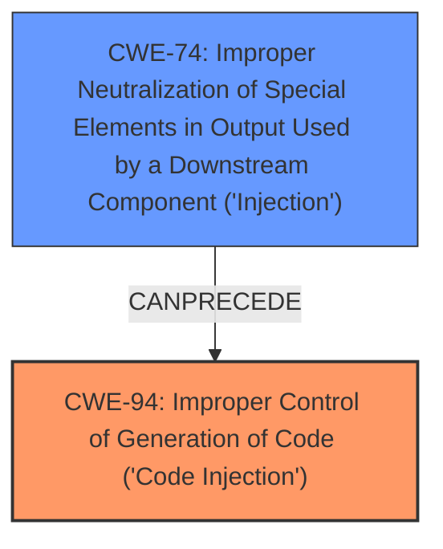

# Analysis for CVE-2025-1097

# Summary
| CWE ID | CWE Name | Confidence | CWE Abstraction Level | CWE Vulnerability Mapping Label | CWE-Vulnerability Mapping Notes |
|---|---|---|---|---|---|
| CWE-94 | Improper Control of Generation of Code ('Code Injection') | 0.8 | Base | Allowed-with-Review | Primary CWE. The ingress-nginx controller **improperly controls the generation of code**, leading to **arbitrary code execution**. |
| CWE-74 | Improper Neutralization of Special Elements in Output Used by a Downstream Component ('Injection') | 0.7 | Class | Discouraged | Secondary CWE. The `auth-tls-match-cn` Ingress annotation is not properly sanitized, allowing for configuration injection. |

## Evidence and Confidence

*   **Confidence Score:** 0.8
*   **Evidence Strength:** MEDIUM

## Relationship Analysis
The primary relationship impacting the decision is the chain of events: **improper control of code generation** (CWE-94) due to **improper neutralization of special elements** (CWE-74), leading to **arbitrary code execution**. CWE-94 is the root cause, and CWE-74 contributes to the vulnerability by allowing the injection of malicious code or commands. CWE-94 is a Base level CWE while CWE-74 is a Class. The selection of CWE-94 as the primary CWE is based on the fact that it directly addresses the code injection aspect.

## Vulnerability Chain
The vulnerability chain starts with **improper neutralization of special elements** (CWE-74) in the `auth-tls-match-cn` Ingress annotation. This leads to **improper control of code generation** (CWE-94), which then results in **arbitrary code execution** and **disclosure of Secrets**.

## Summary of Analysis
The initial analysis considered several CWEs from the Retriever Results, particularly those related to permissions and authentication. However, the core of the vulnerability lies in the ability to inject configuration into nginx via the `auth-tls-match-cn` annotation, leading to arbitrary code execution.

The primary CWE, CWE-94 [Improper Control of Generation of Code ('Code Injection')], accurately captures the root cause of the vulnerability, which is the **improper control of code generation**. The ingress-nginx controller **improperly controls the generation of code**, leading to **arbitrary code execution**. This is supported by the vulnerability description, which states that the `auth-tls-match-cn` Ingress annotation can be used to inject configuration into nginx, leading to arbitrary code execution.

The secondary CWE, CWE-74 [Improper Neutralization of Special Elements in Output Used by a Downstream Component ('Injection')], is relevant because the `auth-tls-match-cn` Ingress annotation is not properly sanitized, allowing for configuration injection. This is supported by the CVE Reference Links Content Summary, which states that the `auth-tls-match-cn` Ingress annotation in ingress-nginx is not properly sanitized, allowing for configuration injection.

The relationship analysis indicates that CWE-74 can precede CWE-94, as the improper neutralization of special elements allows for the injection of malicious code or commands that can then be executed.

The selection of CWE-94 as the primary CWE and CWE-74 as the secondary CWE is based on the evidence provided in the vulnerability description and the CVE Reference Links Content Summary, as well as the relationship analysis. The selected CWEs are at the optimal level of specificity, as they accurately capture the root cause and contributing factors of the vulnerability.

The retriever results listed many authentication and authorization related CWEs. These were deemed not a fit as they did not directly address the **improper configuration** leading to **arbitrary code execution**.