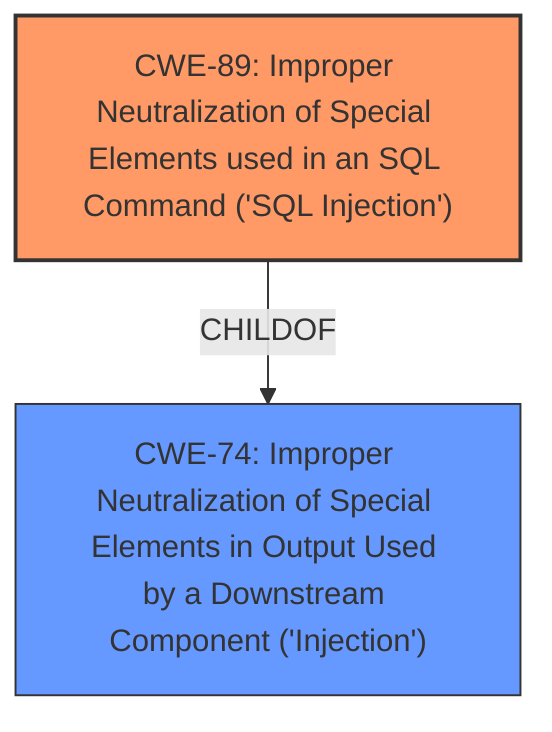

# Analysis Report for CVE-2025-1117

# Vulnerability Analysis Report: CVE-2025-1117

## Description

A vulnerability, which was classified as critical, was found in CoinRemitter 0.0.1/0.0.2 on OpenCart. This affects an unknown part. The manipulation of the argument coin leads to **sql injection**. It is possible to initiate the attack remotely. The exploit has been disclosed to the public and may be used. Upgrading to version 0.0.3 is able to address this issue. It is recommended to upgrade the affected component.

## Vulnerability Description Key Phrases

- **Weakness:** sql injection
- **Vector:** manipulation of the argument coin
- **Product:** CoinRemitter
- **Version:** 0.0.1/0.0.2

## Analysis (with Relationship Data)

# Summary
| CWE ID | CWE Name | Confidence | CWE Abstraction Level | CWE Vulnerability Mapping Label | CWE-Vulnerability Mapping Notes |
|---|---|---|---|---|---|
| CWE-89 | Improper Neutralization of Special Elements used in an SQL Command ('SQL Injection') | 1.0 | Base | Allowed | Primary CWE. The vulnerability is caused by **SQL injection**. |

## Evidence and Confidence

*   **Confidence Score:** 1.0
*   **Evidence Strength:** HIGH

## Relationship Analysis
The primary relationship that influenced the decision was the ChildOf relationship of CWE-89 to CWE-74 (Improper Neutralization of Special Elements in Output Used by a Downstream Component ('Injection')). While CWE-74 is a more general class, CWE-89 is a specific type of injection, making it a more precise fit for the described vulnerability.



## Vulnerability Chain
The chain of events is as follows:
1.  **Root Cause:** **SQL Injection** due to **improper neutralization** of the 'coin' argument.
2.  **Impact:** Allows remote attackers to manipulate SQL queries, potentially leading to data breaches, credential theft, and financial loss.

## Summary of Analysis
The primary vulnerability is **SQL injection** (CWE-89) due to the **improper neutralization** of the 'coin' argument. The "CVE Reference Links Content Summary" confirms this, stating "OpenCart's database API lacks prepared statements or parameterized inputs, leaving the module vulnerable to SQL injection" and "Failure to properly validate and sanitize user input before constructing SQL queries". The retriever results also strongly suggest CWE-89 as the top candidate. The description clearly states "The manipulation of the argument coin leads to **sql injection**". This confirms CWE-89 as the root cause.

The other CWEs were considered, but were not as specific. CWE-79 (Cross-Site Scripting) was considered because it also involves **improper neutralization** of input, but the vulnerability specifically involves **SQL injection**, making CWE-89 a more appropriate choice. CWE-74 is a more generic "Injection" class and is therefore not as specific as CWE-89.

Relevant CWE Information:

# Enhanced Context (25 CWEs)
The following CWEs were identified as potentially relevant to this vulnerability:

## CWE-89: Improper Neutralization of Special Elements used in an SQL Command ('SQL Injection')
**Abstraction Level**: Base
**Similarity Score**: 0.75
**Source**: dense

**Description**:
The product constructs all or part of an SQL command using externally-influenced input from an upstream component, but it does not neutralize or incorrectly neutralizes special elements that could modify the intended SQL command when it is sent to a downstream component. Without sufficient removal or quoting of SQL syntax in user-controllable inputs, the generated SQL query can cause those inputs to be interpreted as SQL instead of ordinary user data.

**Mapping Guidance**:
- Usage: Allowed
- Rationale: This CWE entry is at the Base level of abstraction, which is a preferred level of abstraction for mapping to the root causes of vulnerabilities.


## CWE Relationship Analysis

Current CWEs represent these abstraction levels: .


### Vulnerability Chain Analysis

**Chain starting from CWE-89:**
- 89 (Improper Neutralization of Special Elements used in an SQL Command ('SQL Injection')) - ROOT


**Chain starting from CWE-79:**
- 79 (Improper Neutralization of Input During Web Page Generation ('Cross-site Scripting')) - ROOT


### CWE Relationship Diagram

```mermaid
graph TD
    classDef primary fill:#f96,stroke:#333,stroke-width:2px
    classDef secondary fill:#69f,stroke:#333
    classDef tertiary fill:#9e9,stroke:#333
```


*Report generated on 2025-07-14 06:51:36*
