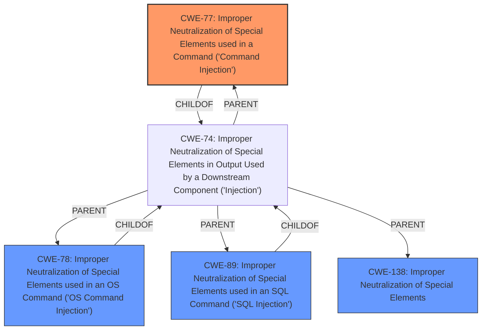

# Analysis Report for CVE-2025-1137

# Vulnerability Analysis Report: CVE-2025-1137

## Description

IBM Storage Scale 5.2.2.0 and 5.2.2.1, under certain configurations, could allow an authenticated user to execute privileged commands due to **improper input neutralization**.

## Vulnerability Description Key Phrases

- **Rootcause:** improper input neutralization
- **Impact:** execute privileged commands
- **Attacker:** authenticated user
- **Product:** IBM Storage Scale
- **Version:** 5.2.2.0 and 5.2.2.1

## Analysis (with Relationship Data)

# Summary
| CWE ID | CWE Name | Confidence | CWE Abstraction Level | CWE Vulnerability Mapping Label | CWE-Vulnerability Mapping Notes |
|---|---|---|---|---|---|
| **CWE-77** | **Improper Neutralization of Special Elements used in a Command ('Command Injection')** | 0.75 | Class | Allowed-with-Review | Primary CWE. The vulnerability description states "**improper input neutralization**" which could lead to command execution. |
| CWE-78 | Improper Neutralization of Special Elements used in an OS Command ('OS Command Injection') | 0.5 | Base | Allowed | Secondary candidate. More specific than CWE-77, but not enough information to confirm OS command injection. |
| CWE-89 | Improper Neutralization of Special Elements used in an SQL Command ('SQL Injection') | 0.25 | Base | Allowed | Secondary candidate. SQL Injection is possible, but there is not enough information to confirm. |
| CWE-138 | Improper Neutralization of Special Elements | 0.25 | Class | Discouraged | Secondary candidate. Too general, but the vulnerability description states "**improper input neutralization**". |

## Evidence and Confidence

*   **Confidence Score:** 0.7
*   **Evidence Strength:** MEDIUM

## Relationship Analysis
The primary relationship that influenced the decision was the hierarchical relationship between CWE-74 (Improper Neutralization of Special Elements in Output Used by a Downstream Component ('Injection')) and its children, including CWE-77 (Improper Neutralization of Special Elements used in a Command ('Command Injection')), CWE-78 (Improper Neutralization of Special Elements used in an OS Command ('OS Command Injection')), and CWE-89 (Improper Neutralization of Special Elements used in an SQL Command ('SQL Injection')). Since the vulnerability description mentions "**improper input neutralization**" leading to the ability to "execute privileged commands", CWE-77 was chosen as the primary CWE because it directly relates to command injection, although more details are needed to confirm if it is OS command injection or some other type of command injection. Other CWEs like CWE-138 (Improper Neutralization of Special Elements) are too high-level.



## Vulnerability Chain
The vulnerability chain starts with the **improper input neutralization** (CWE-77), which allows an authenticated user to then execute privileged commands. The chain is:

1.  **Improper Input Neutralization** (CWE-77) - Root cause due to lack of proper input sanitization.
2.  Execution of Privileged Commands - Impact of the vulnerability

## Summary of Analysis
The initial analysis identified CWE-77 as the most likely candidate due to the description mentioning "**improper input neutralization**" leading to the execution of privileged commands. The Retriever Results also suggested CWE-77 and other related CWEs.

The graph relationships further solidified this choice, as it showed the relationship between CWE-74 and its children, including CWE-77, CWE-78, and CWE-89. While CWE-74 is a broader category, the specific context of command execution pointed towards CWE-77 as the most appropriate choice.

The selection of CWE-77 is at the optimal level of specificity because it directly addresses the command injection aspect of the vulnerability. However, more information is needed to determine if it is specifically CWE-78 (OS Command Injection) or some other form of command injection.

Relevant CWE Information:

# Enhanced Context (25 CWEs)
The following CWEs were identified as potentially relevant to this vulnerability:

## CWE-1391: Use of Weak Credentials
**Abstraction Level**: Class
**Similarity Score**: 0.75
**Source**: dense

**Description**:
The product uses weak credentials (such as a default key or hard-coded password) that can be calculated, derived, reused, or guessed by an attacker.

**Mapping Guidance**:
- Usage: Allowed-with-Review
- Rationale: This CWE entry is a Class and might have Base-level children that would be more appropriate

## CWE-74: Improper Neutralization of Special Elements in Output Used by a Downstream Component ('Injection')
**Abstraction Level**: Class
**Similarity Score**: 0.74
**Source**: dense

**Description**:
The product constructs all or part of a command, data structure, or record using externally-influenced input from an upstream component, but it does not neutralize or incorrectly neutralizes special elements that could modify how it is parsed or interpreted when it is sent to a downstream component.

**Mapping Guidance**:
- Usage: Discouraged
- Rationale: CWE-74 is high-level and often misused when lower-level weaknesses are more appropriate.

## CWE-497: Exposure of Sensitive System Information to an Unauthorized Control Sphere
**Abstraction Level**: Base
**Similarity Score**: 0.74
**Source**: dense

**Description**:
The product does not properly prevent sensitive system-level information from being accessed by unauthorized actors who do not have the same level of access to the underlying system as the product does.

**Mapping Guidance**:
- Usage: Allowed
- Rationale: This CWE entry is at the Base level of abstraction, which is a preferred level of abstraction for mapping to the root causes of vulnerabilities.

## CWE-269: Improper Privilege Management
**Abstraction Level**: Class
**Similarity Score**: 0.74
**Source**: dense

**Description**:
The product does not properly assign, modify, track, or check privileges for an actor, creating an unintended sphere of control for that actor.

**Mapping Guidance**:
- Usage: Discouraged
- Rationale: CWE-269 is commonly misused. It can be conflated with "privilege escalation," which is a technical impact that is listed in many low-information vulnerability reports [REF-1287]. It is not useful for trend analysis.

## CWE-807: Reliance on Untrusted Inputs in a Security Decision
**Abstraction Level**: Base
**Similarity Score**: 0.74
**Source**: dense

**Description**:
The product uses a protection mechanism that relies on the existence or values of an input, but the input can be modified by an untrusted actor in a way that bypasses the protection mechanism.

**Mapping Guidance**:
- Usage: Allowed
- Rationale: This CWE entry is at the Base level of abstraction, which is a preferred level of abstraction for mapping to the root causes of vulnerabilities.

## CWE-266: Incorrect Privilege Assignment
**Abstraction Level**: Base
**Similarity Score**: 0.74
**Source**: dense

**Description**:
A product incorrectly assigns a privilege to a particular actor, creating an unintended sphere of control for that actor.

**Mapping Guidance**:
- Usage: Allowed
- Rationale: This CWE entry is at the Base level of abstraction, which is a preferred level of abstraction for mapping to the root causes of vulnerabilities.

## CWE-274: Improper Handling of Insufficient Privileges
**Abstraction Level**: Base
**Similarity Score**: 0.73
**Source**: dense

**Description**:
The product does not handle or incorrectly handles when it has insufficient privileges to perform an operation, leading to resultant weaknesses.

**Mapping Guidance**:
- Usage: Discouraged
- Rationale: This CWE entry could be deprecated in a future version of CWE.

## CWE-280: Improper Handling of Insufficient Permissions or Privileges
**Abstraction Level**: Base
**Similarity Score**: 0.73
**Source**: dense

**Description**:
The product does not handle or incorrectly handles when it has insufficient privileges to access resources or functionality as specified by their permissions. This may cause it to follow unexpected code paths that may leave the product in an invalid state.

**Mapping Guidance**:
- Usage: Allowed
- Rationale: This CWE entry is at the Base level of abstraction, which is a preferred level of abstraction for mapping to the root causes of vulnerabilities.

##


## CWE Relationship Analysis

Current CWEs represent these abstraction levels: .


### Vulnerability Chain Analysis

**Chain starting from CWE-274:**
- 274 (Improper Handling of Insufficient Privileges) - ROOT


**Chain starting from CWE-89:**
- 89 (Improper Neutralization of Special Elements used in an SQL Command ('SQL Injection')) - ROOT


### CWE Relationship Diagram

```mermaid
graph TD
    classDef primary fill:#f96,stroke:#333,stroke-width:2px
    classDef secondary fill:#69f,stroke:#333
    classDef tertiary fill:#9e9,stroke:#333
```


*Report generated on 2025-07-14 06:52:34*
