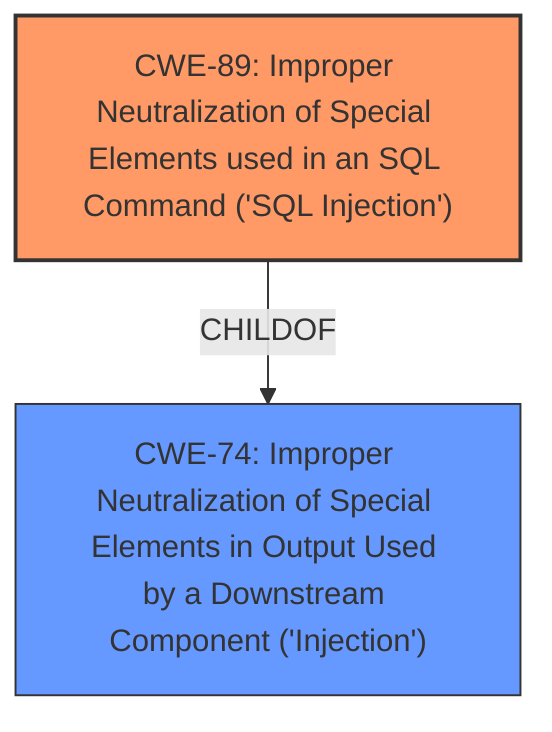

# Analysis Report for CVE-2025-1185

# Vulnerability Analysis Report: CVE-2025-1185

## Description

A vulnerability was found in pihome-shc PiHome 2.0. It has been classified as critical. This affects an unknown part of the file /ajax.php?Ajax=GetModal_Sensor_Graph. The manipulation leads to **sql injection**. It is possible to initiate the attack remotely. The exploit has been disclosed to the public and may be used.

## Vulnerability Description Key Phrases

- **Weakness:** sql injection
- **Product:** pihome-shc PiHome
- **Version:** 2
- **Component:** /ajax.php?Ajax=GetModal_Sensor_Graph

## Analysis (with Relationship Data)

# Summary

| CWE ID | CWE Name | Confidence | CWE Abstraction Level | CWE Vulnerability Mapping Label | CWE-Vulnerability Mapping Notes |
|---|---|---|---|---|---|
| CWE-89 | Improper Neutralization of Special Elements used in an SQL Command ('SQL Injection') | 1.0 | Base | Allowed | Primary CWE |

## Evidence and Confidence

*   **Confidence Score:** 1.0
*   **Evidence Strength:** HIGH

## Relationship Analysis
The primary relationship of interest is the parent-child relationship between CWE-74 (Improper Neutralization of Special Elements in Output Used by a Downstream Component ('Injection')) and CWE-89. CWE-89 is a specific type of injection, focusing on SQL commands. Since the description explicitly states "sql injection", the more specific CWE-89 is selected. The other relationships, such as those involving CWE-78 (OS Command Injection), CWE-79 (Cross-site Scripting), and CWE-93 (CRLF Injection), are not relevant because the vulnerability is explicitly identified as SQL injection, not a different type of injection.



## Vulnerability Chain
The vulnerability chain starts with **improper neutralization** of special elements within an SQL command. This leads to the ability to inject malicious SQL code, potentially resulting in unauthorized data access, modification, or deletion.

## Summary of Analysis
The vulnerability description explicitly states "**sql injection**". The retriever results also strongly suggest CWE-89 as the primary candidate, with a score of 1.0. The description aligns directly with the definition of CWE-89, which involves the improper neutralization of special elements used in an SQL command. This allows an attacker to manipulate SQL queries, leading to potential data breaches or other malicious activities. Therefore, CWE-89 is selected as the most appropriate CWE.

The evidence from the vulnerability description key phrases includes "**weakness:** **sql injection**", directly supporting the selection of CWE-89.

I considered other CWEs such as CWE-79 (Cross-site Scripting), CWE-78 (OS Command Injection), and CWE-73 (External Control of File Name or Path), but these were not selected because the vulnerability is specifically identified as SQL injection.
CWE-74 (Improper Neutralization of Special Elements in Output Used by a Downstream Component ('Injection')) was considered, as it's a parent of CWE-89, but the description is specific enough to warrant the selection of the base CWE-89.
#
Relevant CWE Information:


## CWE Relationship Analysis

Current CWEs represent these abstraction levels: .


### Vulnerability Chain Analysis

**Chain starting from CWE-89:**
- 89 (Improper Neutralization of Special Elements used in an SQL Command ('SQL Injection')) - ROOT


**Chain starting from CWE-93:**
- 93 (Improper Neutralization of CRLF Sequences ('CRLF Injection')) - ROOT


### CWE Relationship Diagram

```mermaid
graph TD
    classDef primary fill:#f96,stroke:#333,stroke-width:2px
    classDef secondary fill:#69f,stroke:#333
    classDef tertiary fill:#9e9,stroke:#333
```


*Report generated on 2025-07-14 07:01:08*
