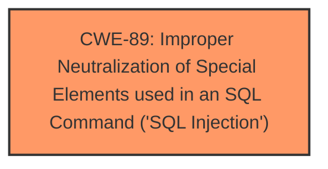

# Analysis for CVE-2025-1199

# Summary
| CWE ID | CWE Name | Confidence | CWE Abstraction Level | CWE Vulnerability Mapping Label | CWE-Vulnerability Mapping Notes |
|---|---|---|---|---|---|
| CWE-89 | Improper Neutralization of Special Elements used in an SQL Command ('SQL Injection') | 1.0 | Base | Primary | Allowed |

## Evidence and Confidence

*   **Confidence Score:** 1.0
*   **Evidence Strength:** HIGH

## Relationship Analysis
The primary identified CWE is CWE-89 which is a Base level CWE. There are no parent or child relationships that influence the choice of CWE-89.

## Vulnerability Chain
The vulnerability chain consists of:
1.  **Root Cause:** **SQL injection** (**Improper Neutralization of Special Elements used in an SQL Command ('SQL Injection')** - CWE-89). The application fails to properly sanitize user input, allowing an attacker to inject malicious SQL code.
2.  **Impact:** Execution of arbitrary SQL commands, potentially leading to data breaches, modification, or deletion.

## Summary of Analysis
The vulnerability description explicitly states that the **weakness** is **SQL injection** due to the manipulation of the 'id' argument. This aligns directly with CWE-89 (Improper Neutralization of Special Elements used in an SQL Command ('SQL Injection')). The retriever results also strongly suggest CWE-89 as the primary candidate.

The evidence for CWE-89 is strong, and it is the most specific and appropriate CWE for this vulnerability.

CWE-79, CWE-434, CWE-96, CWE-1336, CWE-425, CWE-472, CWE-74, CWE-95, CWE-116, CWE-73, CWE-117, CWE-306, CWE-94, CWE-184, and CWE-494 were considered but are not applicable because the vulnerability is explicitly related to **SQL injection**.