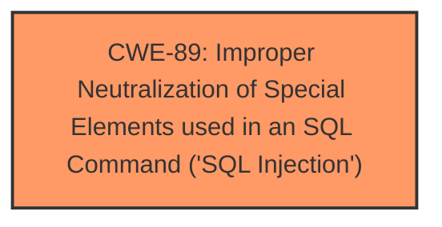

# Raw Analyzer Response for CVE-2025-1201

# Summary
| CWE ID | CWE Name | Confidence | CWE Abstraction Level | CWE Vulnerability Mapping Label | CWE-Vulnerability Mapping Notes |
|---|---|---|---|---|---|
| CWE-89 | Improper Neutralization of Special Elements used in an SQL Command ('SQL Injection') | 1.0 | Base | Primary | Allowed |

## Evidence and Confidence

*   **Confidence Score:** 1.0
*   **Evidence Strength:** HIGH

## Relationship Analysis
The primary relationship is the direct match of the vulnerability description to the CWE-89 definition. No other relationships influenced the decision due to the clear identification of SQL injection as the root cause.

## Vulnerability Chain
The vulnerability chain consists of:
1.  **Root Cause:** CWE-89 - Improper Neutralization of Special Elements used in an SQL Command ('SQL Injection')

## Summary of Analysis
The vulnerability description clearly states that the manipulation of the file `/admin/app/profile_crud.php` leads to **SQL injection**. The description specifies that the attack can be initiated remotely and that multiple parameters are affected. This aligns perfectly with the definition of CWE-89, which describes the failure to neutralize special elements in an SQL command, leading to unintended execution of SQL code.

The evidence from the vulnerability description is direct and unambiguous, pointing to SQL injection as the root cause.

The Retriever Results also strongly support CWE-89 as the primary candidate, with a score of 1.0.

Other CWEs such as CWE-79 (Cross-site Scripting), CWE-434 (Unrestricted Upload of File with Dangerous Type), and CWE-1336 (Improper Neutralization of Special Elements Used in a Template Engine) were considered but rejected because the vulnerability description explicitly mentions **SQL injection**, making CWE-89 the most accurate and specific classification.