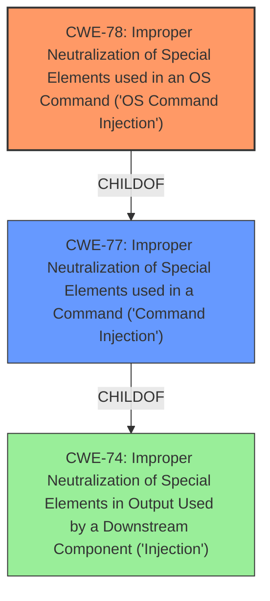

# Enhanced Analysis for CVE-2025-1229

# Summary
| CWE ID | CWE Name | Confidence | CWE Abstraction Level | CWE Vulnerability Mapping Label | CWE-Vulnerability Mapping Notes |
|---|---|---|---|---|---|
| CWE-78 | Improper Neutralization of Special Elements used in an OS Command ('OS Command Injection') | 1.0 | Base | Primary | Allowed |
| CWE-74 | Improper Neutralization of Special Elements in Output Used by a Downstream Component ('Injection') | 0.7 | Class | Secondary Candidate | Discouraged, but considered due to the broader context of injection |

## Evidence and Confidence

*   **Confidence Score:** 1.0
*   **Evidence Strength:** HIGH

## Relationship Analysis
The primary relationship influencing the decision is that CWE-78 is a child of CWE-77 (Improper Neutralization of Special Elements used in a Command ('Command Injection')), which itself is a child of CWE-74 (Improper Neutralization of Special Elements in Output Used by a Downstream Component ('Injection')). However, CWE-78 is a more specific Base level CWE, focusing on OS commands, making it a better fit than the more general CWE-77.



## Vulnerability Chain
The vulnerability chain starts with **improper neutralization** of input, leading to OS **command injection**, which results in arbitrary OS command execution.

1.  Improper Input Validation/Neutralization (**ROOTCAUSE**)
2.  OS Command Injection (CWE-78)
3.  Remote Code Execution (Impact)

## Summary of Analysis
The initial analysis focused on identifying the root cause of the vulnerability. The vulnerability description explicitly states "**command injection**" and the CVE Reference Links Content Summary highlights "improper sanitization of user input" and "the ability to concatenate commands using '&' enables arbitrary command execution". This strongly points towards CWE-78, Improper Neutralization of Special Elements used in an OS Command ('OS Command Injection'), as the primary weakness.

The retriever results also support this, with CWE-78 being a top candidate. While CWE-77 is also a valid consideration, CWE-78 is more specific to OS commands, aligning better with the vulnerability description.

CWE-74 was also considered because it is a parent of CWE-77 and CWE-78 and covers the general case of injection. However, it is a Class-level CWE and is discouraged when a more specific Base-level CWE is available.

The final decision is based on the clear evidence of OS command injection due to improper neutralization of input, making CWE-78 the most appropriate and specific classification.

Relevant CWE Information:
* The vulnerability description states the **weakness** is **command injection**.
* CVE Reference Links Content Summary states the **root cause** of the vulnerability is due to "improper sanitization of user input".
* CVE Reference Links Content Summary states "Command Injection: The ability to concatenate commands using '&' enables arbitrary command execution on the system."


## CWE Relationship Analysis

Current CWEs represent these abstraction levels: .


### Vulnerability Chain Analysis

**Chain starting from CWE-77:**
- 77 (Improper Neutralization of Special Elements used in a Command ('Command Injection')) - ROOT


**Chain starting from CWE-74:**
- 74 (Improper Neutralization of Special Elements in Output Used by a Downstream Component ('Injection')) - ROOT


### CWE Relationship Diagram

```mermaid
graph TD
    classDef primary fill:#f96,stroke:#333,stroke-width:2px
    classDef secondary fill:#69f,stroke:#333
    classDef tertiary fill:#9e9,stroke:#333
```