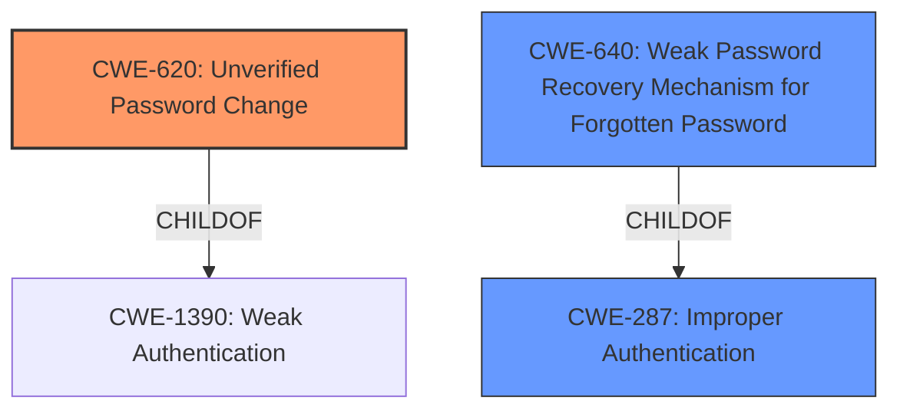

# Enhanced Analysis for CVE-2025-1231

# Summary
| CWE ID | CWE Name | Confidence | CWE Abstraction Level | CWE Vulnerability Mapping Label | CWE-Vulnerability Mapping Notes |
|---|---|---|---|---|---|
| **CWE-620** | Unverified Password Change | 0.9 | Base | Primary | Allowed |
| CWE-640 | Weak Password Recovery Mechanism for Forgotten Password | 0.7 | Base | Secondary Candidate | Allowed-with-Review |
| CWE-287 | Improper Authentication | 0.5 | Class | Secondary Candidate | Discouraged |

## Evidence and Confidence

*   **Confidence Score:** 0.9
*   **Evidence Strength:** HIGH

## Relationship Analysis
The primary CWE selected is CWE-620 (Unverified Password Change), which is a Base level CWE. The retriever results also suggested considering CWE-640 (Weak Password Recovery Mechanism for Forgotten Password) and CWE-287 (Improper Authentication). CWE-620 is a child of CWE-1390 (Weak Authentication), and CWE-287 is a parent of CWE-640. The selection of CWE-620 is favored because the vulnerability specifically involves the improper handling of password reset functionality, making it more precise than the broader CWE-287.



## Vulnerability Chain
The vulnerability chain begins with an **improper password reset** in the PAM Module (CWE-620). This leads to a crash in the password reset functionality, ultimately allowing an authenticated user to reuse the oracle user password after check-in. The root cause is the **improper password reset**, and the impact is the ability to reuse the password.

## Summary of Analysis
The analysis is based on the provided vulnerability description and CVE reference. The key evidence is the phrase "**Improper password reset in PAM Module**" which strongly suggests a problem with how password resets are handled. The relationship analysis highlights that CWE-620 is a specific type of authentication issue, and its selection is justified by the description of the vulnerability. The other candidate CWEs, such as CWE-640 and CWE-287, are less specific. CWE-620 is at the optimal level of specificity because it directly addresses the **improper password reset** functionality issue.

Relevant CWE Information:

# Enhanced Context (25 CWEs)
The following CWEs were identified as potentially relevant to this vulnerability:

## CWE-620: Unverified Password Change
**Abstraction Level**: Base
**Similarity Score**: 0.75
**Source**: dense

**Description**:
When setting a new password for a user, the product does not require knowledge of the original password, or using another form of authentication.

**Mapping Guidance**:
- Usage: Allowed
- Rationale: This CWE entry is at the Base level of abstraction, which is a preferred level of abstraction for mapping to the root causes of vulnerabilities.

**Why it was selected:** This CWE directly matches the **improper password reset** issue described in the vulnerability. It's at the base level of abstraction, which is ideal.

## CWE-640: Weak Password Recovery Mechanism for Forgotten Password
**Abstraction Level**: Base
**Similarity Score**: 0.72
**Source**: dense

**Description**:
The product contains a mechanism for users to recover or change their passwords without knowing the original password, but the mechanism is weak.

**Mapping Guidance**:
- Usage: Allowed-with-Review
- Rationale: This entry appears to be frequently misused for any weakness related to password changes, even though the name focuses on "Password Recovery" for a "forgotten" password.

**Why it was considered:** While the vulnerability involves a password reset, it's not explicitly related to a "forgotten password" scenario, making this CWE less accurate than CWE-620.

## CWE-287: Improper Authentication
**Abstraction Level**: Class
**Similarity Score**: 0.73
**Source**: dense

**Description**:
When an actor claims to have a given identity, the product does not prove or insufficiently proves that the claim is correct.

**Mapping Guidance**:
- Usage: Discouraged
- Rationale: This CWE entry might be misused when lower-level CWE entries are likely to be applicable. It is a level-1 Class (i.e., a child of a Pillar).

**Why it was considered:** This is a broader class of authentication issues. While relevant, it's less specific than CWE-620, which directly describes the **improper password reset** problem. Other more specific options were available, making this CWE less favored.

## CWE-916: Use of Password Hash With Insufficient Computational Effort
**Abstraction Level**: Base
**Similarity Score**: 0.75
**Source**: dense

**Description**:
The product generates a hash for a password, but it uses a scheme that does not provide a sufficient level of computational effort that would make password cracking attacks infeasible or expensive.

**Mapping Guidance**:
- Usage: Allowed
- Rationale: This CWE entry is at the Base level of abstraction, which is a preferred level of abstraction for mapping to the root causes of vulnerabilities.

**Why it was not selected:** The description doesn't indicate any issue with the hashing algorithm used for passwords. The focus is on the reset mechanism itself.

## CWE-1391: Use of Weak Credentials
**Abstraction Level**: Class
**Similarity Score**: 0.74
**Source**: dense

**Description**:
The product uses weak credentials (such as a default key or hard-coded password) that can be calculated, derived, reused, or guessed by an attacker.

**Mapping Guidance**:
- Usage: Allowed-with-Review
- Rationale: This CWE entry is a Class and might have Base-level children that would be more appropriate

**Why it was not selected:** The vulnerability does not indicate the use of weak credentials. The problem lies within the password reset functionality.

## CWE-288: Authentication Bypass Using an Alternate Path or Channel
**Abstraction Level**: Base
**Similarity Score**: 0.73
**Source**: dense

**Description**:
The product requires authentication, but the product has an alternate path or channel that does not require authentication.

**Mapping Guidance**:
- Usage: Allowed
- Rationale: This CWE entry is at the Base level of abstraction, which is a preferred level of abstraction for mapping to the root causes of vulnerabilities.

**Why it was not selected:** The vulnerability doesn't describe an alternate path or channel to bypass authentication. The issue is with the password reset mechanism after authentication.

## CWE-303: Incorrect Implementation of Authentication Algorithm
**Abstraction Level**: Base
**Similarity Score**: 0.73
**Source**: dense

**Description**:
The requirements for the product dictate the use of an established authentication algorithm, but the implementation of the algorithm is incorrect.

**Mapping Guidance**:
- Usage: Allowed
- Rationale: This CWE entry is at the Base level of abstraction, which is a preferred level of abstraction for mapping to the root causes of vulnerabilities.

**Why it was not selected:** The vulnerability does not focus on the authentication algorithm implementation. It is related to the password reset.

## CWE-257: Storing Passwords in a Recoverable Format
**Abstraction Level**: Base
**Similarity Score**: 0.71
**Source**: dense

**Description**:
The storage of passwords in a recoverable format makes them subject to password reuse attacks by malicious users. In fact, it should be noted that recoverable encrypted passwords provide no significant benefit over plaintext passwords since they are subject not only to reuse by malicious attackers but also by malicious insiders. If a system administrator can recover a password directly, or use a brute force search on the available information, the administrator can use the password on other accounts.

**Why it was not selected:** The vulnerability is not related to storing passwords in a recoverable format.

## CWE-798: Use of Hard-coded Credentials
**Abstraction Level**: Base
**Similarity Score**: 0.71
**Source**: dense

**Description**:
The product contains hard-coded credentials, such as a password or cryptographic key.

**Why it was not selected:** The vulnerability doesn't involve the use of hard-coded credentials.

## CWE-256: Plaintext Storage of a Password
**Abstraction Level**: Base
**Similarity Score**: 0.71
**Source**: dense

**Description**:
Storing a password in plaintext may result in a system compromise.

**Why it was not selected:** The vulnerability doesn't state anything about passwords stored in


## CWE Relationship Analysis

Current CWEs represent these abstraction levels: .


### Vulnerability Chain Analysis

**Chain starting from CWE-1390:**
- 1390 (Weak Authentication) - ROOT


**Chain starting from CWE-640:**
- 640 (Weak Password Recovery Mechanism for Forgotten Password) - ROOT


### CWE Relationship Diagram

```mermaid
graph TD
    classDef primary fill:#f96,stroke:#333,stroke-width:2px
    classDef secondary fill:#69f,stroke:#333
    classDef tertiary fill:#9e9,stroke:#333
```