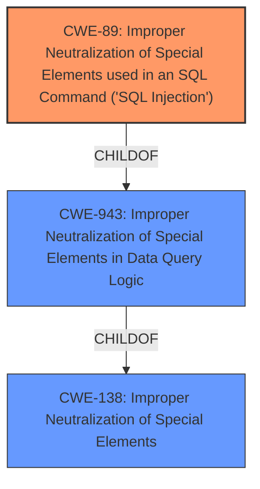

# Analysis Report for CVE-2025-1264

# Vulnerability Analysis Report: CVE-2025-1264

## Description

The Broken Link Checker by AIOSEO Easily Fix/Monitor Internal and External links plugin for WordPress is vulnerable to SQL Injection via the orderBy parameter in all versions up to, and including, 1.2.3 due to **insufficient escaping on the user supplied parameter and lack of sufficient preparation on the existing SQL query**. This makes it possible for authenticated attackers, with Contributor-level access and above, to append additional SQL queries into already existing queries that can be used to extract sensitive information from the database.

## Vulnerability Description Key Phrases

- **Rootcause:** insufficient escaping on the user supplied parameter and lack of sufficient preparation on the existing SQL query
- **Weakness:** improper parameter escaping, SQL injection
- **Product:** Broken Link Checker by AIOSEO
- **Impact:** extract sensitive information from the database
- **Attacker:** authenticated attackers
- **Version:** all versions up to and including 1.2.3

## Analysis (with Relationship Data)

# Summary
| CWE ID | CWE Name | Confidence | CWE Abstraction Level | CWE Vulnerability Mapping Label | CWE-Vulnerability Mapping Notes |
|---|---|---|---|---|---|
| CWE-89 | Improper Neutralization of Special Elements used in an SQL Command ('SQL Injection') | 1.0 | Base | Primary | Allowed |

## Evidence and Confidence

*   **Confidence Score:** 1.0
*   **Evidence Strength:** HIGH

## Relationship Analysis
The primary relationship impacting the decision is that CWE-89 is a Base level CWE, providing a specific description of the **improper neutralization** issue. Several other CWEs are related to **improper neutralization**, but CWE-89 is the most specific and appropriate given the vulnerability description which is about SQL Injection.



## Vulnerability Chain
The vulnerability chain starts with **insufficient escaping on the user supplied parameter and lack of sufficient preparation on the existing SQL query** leading to **Improper Neutralization of Special Elements used in an SQL Command ('SQL Injection')** and finally leading to the impact of extracting sensitive information from the database.
  - **Root Cause:** **insufficient escaping on the user supplied parameter and lack of sufficient preparation on the existing SQL query**
  - **Weakness:** CWE-89 Improper Neutralization of Special Elements used in an SQL Command ('SQL Injection')
  - **Impact:** Extract sensitive information from the database

## Summary of Analysis
The vulnerability description clearly indicates that the root cause is **insufficient escaping on the user supplied parameter and lack of sufficient preparation on the existing SQL query**, which directly leads to SQL Injection. This aligns perfectly with CWE-89, which describes **improper neutralization** of special elements used in an SQL command. The retriever results also list CWE-89 as the top candidate with a score of 1.0.

The key phrase from the description is: "**insufficient escaping on the user supplied parameter and lack of sufficient preparation on the existing SQL query**". This clearly points to the root cause being the **improper neutralization** of special elements, making CWE-89 the most accurate and specific classification.

Other CWEs like CWE-943 (Improper Neutralization of Special Elements in Data Query Logic) and CWE-138 (Improper Neutralization of Special Elements) were considered but not chosen because they are higher-level classes and less specific than CWE-89.

Relevant CWE Information:
# Enhanced Context (25 CWEs)
The following CWEs were identified as potentially relevant to this vulnerability:

## CWE-89: Improper Neutralization of Special Elements used in an SQL Command ('SQL Injection')
**Abstraction Level**: Base
**Similarity Score**: 1.000
**Source**: alternate_terms

**Description**:
The product constructs all or part of an SQL command using externally-influenced input from an upstream component, but it does not neutralize or incorrectly neutralizes special elements that could modify the intended SQL command when it is sent to a downstream component. Without sufficient removal or quoting of SQL syntax in user-controllable inputs, the generated SQL query can cause those inputs to be interpreted as SQL instead of ordinary user data.

**Mapping Guidance**:
- Usage: Allowed
- Rationale: This CWE entry is at the Base level of abstraction, which is a preferred level of abstraction for mapping to the root causes of vulnerabilities.


## CWE Relationship Analysis

Current CWEs represent these abstraction levels: .


### Vulnerability Chain Analysis

**Chain starting from CWE-89:**
- 89 (Improper Neutralization of Special Elements used in an SQL Command ('SQL Injection')) - ROOT


**Chain starting from CWE-943:**
- 943 (Improper Neutralization of Special Elements in Data Query Logic) - ROOT


### CWE Relationship Diagram

```mermaid
graph TD
    classDef primary fill:#f96,stroke:#333,stroke-width:2px
    classDef secondary fill:#69f,stroke:#333
    classDef tertiary fill:#9e9,stroke:#333
```


*Report generated on 2025-07-14 07:09:11*
