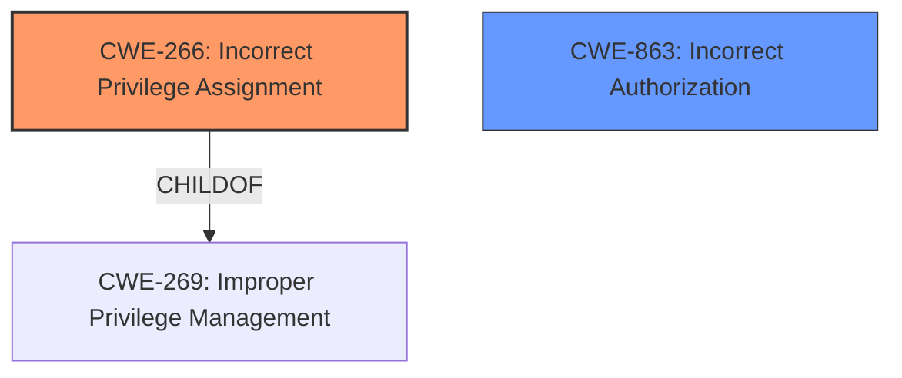

# Enhanced Analysis for CVE-2025-1295

# Summary
| CWE ID | CWE Name | Confidence | CWE Abstraction Level | CWE Vulnerability Mapping Label | CWE-Vulnerability Mapping Notes |
|---|---|---|---|---|---|
| CWE-266 | Incorrect Privilege Assignment | 0.9 | Base | Allowed | Primary CWE |
| CWE-863 | Incorrect Authorization | 0.7 | Class | Allowed-with-Review | Secondary Candidate |

## Evidence and Confidence

*   **Confidence Score:** 0.8
*   **Evidence Strength:** HIGH

## Relationship Analysis
The primary CWE selected is CWE-266, which is a Base level CWE and is related to privilege management. It falls under the broader category of Improper Privilege Management (CWE-269), but is more specific. CWE-863, Incorrect Authorization, is a Class level CWE and could be a related weakness, where the privilege assignment logic is flawed. The vulnerability involves a misconfiguration or a flaw in the privilege assignment process, making CWE-266 the more direct and appropriate classification.



## Vulnerability Chain
The vulnerability chain starts with **allowing arbitrary user meta updates**, which leads to the ability for authenticated attackers with Subscriber-level access to update their role to Administrator, resulting in privilege escalation.

CWE-266 (Incorrect Privilege Assignment) is the root cause, as it describes the **incorrect** assignment of privileges due to the **arbitrary user meta updates**. The impact is privilege escalation.

## Summary of Analysis
The primary assessment is based on the explicit statement in the vulnerability description: "**allowing arbitrary user meta updates**". This directly corresponds to **incorrectly assigning privileges**, as the attacker can modify their user metadata to gain administrator privileges.

The graph relationships support this, as CWE-266 is a specific type of privilege management issue, and the guidance specifically mentions "misconfigured roles" as a possible cause.

The selected CWE, CWE-266, is at the optimal level of specificity because it directly addresses the **root cause** of the vulnerability, rather than a more general category like "Improper Access Control".

Relevant CWE Information:

# Enhanced Context (25 CWEs)
The following CWEs were identified as potentially relevant to this vulnerability:

## CWE-266: Incorrect Privilege Assignment
**Abstraction Level**: Base
**Similarity Score**: 0.80
**Source**: dense

**Description**:
A product **incorrectly assigns a privilege** to a particular actor, creating an unintended sphere of control for that actor.

**Mapping Guidance**:
- Usage: Allowed
- Rationale: This CWE entry is at the Base level of abstraction, which is a preferred level of abstraction for mapping to the root causes of vulnerabilities.

**Technical Explanation for CWE-266:**
The vulnerability in Templines Elementor Helper Core plugin allows authenticated attackers to update their user role to Administrator due to **allowing arbitrary user meta updates**. This aligns with the CWE-266 description, as the plugin **incorrectly assigns privileges** by allowing unauthorized modification of user roles. The security implication is privilege escalation, allowing attackers to perform administrative actions.

**Technical Explanation for CWE-863:**
CWE-863 (Incorrect Authorization) is considered because the arbitrary user meta updates effectively bypass or circumvent the intended authorization mechanisms. However, the root cause is the **incorrect assignment** of privilege, rather than a flaw in the authorization check itself. The authorization check logic might not be designed to prevent modification of user roles via user meta updates. Thus, the primary issue is the initial **incorrect assignment** of privilege via user meta updates.

CWEs Considered but Not Used:

*   CWE-862 (Missing Authorization): While authorization is impacted, it is not entirely missing. The system has authorization, but it's circumvented by allowing arbitrary meta updates.
*   CWE-269 (Improper Privilege Management): This is a higher-level category, and CWE-266 is a more specific representation of the vulnerability.
*   CWE-285 (Improper Authorization): Similar to CWE-863, the authorization process is not functioning as intended, but the root cause is the **incorrect assignment** of privileges, not a flaw in the authorization check logic itself.


## CWE Relationship Analysis

Current CWEs represent these abstraction levels: .


### Vulnerability Chain Analysis

**Chain starting from CWE-863:**
- 863 (Incorrect Authorization) - ROOT


**Chain starting from CWE-862:**
- 862 (Missing Authorization) - ROOT


### CWE Relationship Diagram

```mermaid
graph TD
    classDef primary fill:#f96,stroke:#333,stroke-width:2px
    classDef secondary fill:#69f,stroke:#333
    classDef tertiary fill:#9e9,stroke:#333
```