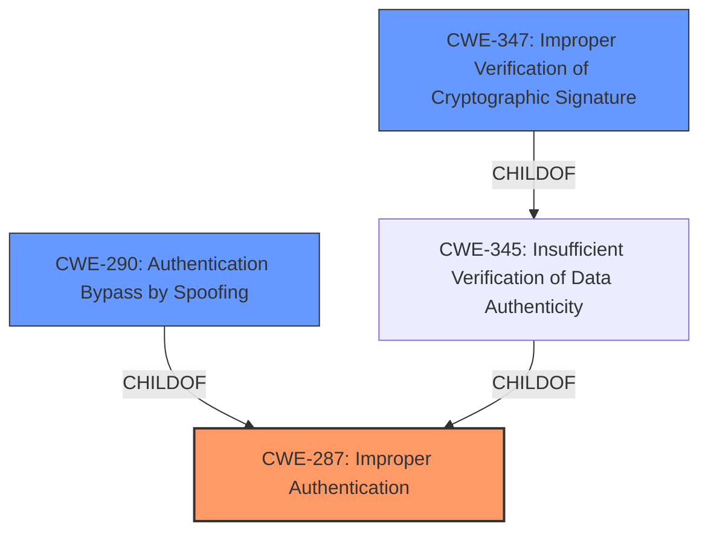

# Analysis Report for CVE-2025-1298

# Vulnerability Analysis Report: CVE-2025-1298

## Description

**Logic vulnerability** in the mobile application (com.transsion.carlcare) may lead to the risk of account takeover.

## Vulnerability Description Key Phrases

- **Rootcause:** Logic vulnerability
- **Impact:** risk of account takeover
- **Product:** mobile application (com.transsion.carlcare)

## Analysis (with Relationship Data)

# Summary
| CWE ID  | CWE Name                                                    | Confidence | CWE Abstraction Level | CWE Vulnerability Mapping Label | CWE-Vulnerability Mapping Notes |
| :-------- | :---------------------------------------------------------- | :--------- | :-------------------- | :------------------------------ | :------------------------------ |
| CWE-287   | Improper Authentication                                     | 0.7        | Class                 | Primary                         | Discouraged                     |
| CWE-290   | Authentication Bypass by Spoofing                           | 0.4        | Base                  | Secondary                       | Allowed                         |
| CWE-347   | Improper Verification of Cryptographic Signature            | 0.3        | Base                  | Secondary                       | Allowed                         |

## Evidence and Confidence

*   **Confidence Score:** 0.7
*   **Evidence Strength:** LOW

## Relationship Analysis
The primary selection is CWE-287 [Improper Authentication], which is a class-level CWE. While it is discouraged to map to class-level CWEs, the lack of specific root cause information makes it difficult to choose a more specific base or variant CWE. Several child CWEs exist under CWE-287, such as CWE-290 [Authentication Bypass by Spoofing], which were considered. However, without more detail, I am unable to determine if the **logic vulnerability** results in spoofing, or some other authentication bypass mechanism. CWE-347 [Improper Verification of Cryptographic Signature] is also a child of CWE-345 [Insufficient Verification of Data Authenticity], which could be related to the **logic vulnerability**.



## Vulnerability Chain
The vulnerability chain starts with a **logic vulnerability** in the mobile application, leading to **improper authentication**, and ultimately resulting in the **risk of account takeover**.

`Logic Vulnerability` -> `CWE-287` -> `Account Takeover`

## Summary of Analysis
The vulnerability description indicates a **logic vulnerability** that leads to a **risk of account takeover**. The limited information makes it challenging to pinpoint the exact root cause.

The primary CWE selected is CWE-287 [Improper Authentication], a class-level CWE, because it is the most relevant based on the available information: a **logic vulnerability** leading to **account takeover** indicates a fundamental flaw in the authentication process. While the MITRE mapping guidance discourages mapping to class-level CWEs, the absence of specific details about the vulnerability's root cause makes it difficult to choose a more specific base or variant CWE.

CWE-290 [Authentication Bypass by Spoofing] and CWE-347 [Improper Verification of Cryptographic Signature] were considered as potential secondary CWEs, but there's not enough evidence to confirm whether the **logic vulnerability** involves spoofing or cryptographic signature issues. The final assessment is based on the evidence provided. More information would be needed to select a more specific CWE.

Relevant CWE Information:


## CWE Relationship Analysis

Current CWEs represent these abstraction levels: .


### Vulnerability Chain Analysis

**Chain starting from CWE-290:**
- 290 (Authentication Bypass by Spoofing) - ROOT


**Chain starting from CWE-287:**
- 287 (Improper Authentication) - ROOT


### CWE Relationship Diagram

```mermaid
graph TD
    classDef primary fill:#f96,stroke:#333,stroke-width:2px
    classDef secondary fill:#69f,stroke:#333
    classDef tertiary fill:#9e9,stroke:#333
```


*Report generated on 2025-07-14 07:10:24*
