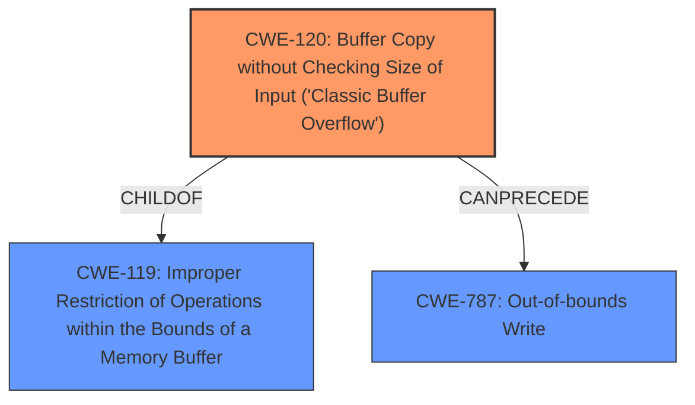

# Analysis Report for CVE-2025-1365

# Vulnerability Analysis Report: CVE-2025-1365

## Description

A vulnerability, which was classified as critical, was found in GNU elfutils 0.192. This affects the function process_symtab of the file readelf.c of the component eu-readelf. The manipulation of the argument D/a leads to **buffer overflow**. Local access is required to approach this attack. The exploit has been disclosed to the public and may be used. The identifier of the patch is 5e5c0394d82c53e97750fe7b18023e6f84157b81. It is recommended to apply a patch to fix this issue.

## Vulnerability Description Key Phrases

- **Weakness:** buffer overflow
- **Vector:** manipulation of argument D/a
- **Product:** GNU elfutils
- **Version:** 0.192
- **Component:** function process_symtab of readelf.c

## Analysis (with Relationship Data)

# Summary

| CWE ID  | CWE Name                                                                         | Confidence | CWE Abstraction Level | CWE Vulnerability Mapping Label | CWE-Vulnerability Mapping Notes |
| :-------- | :------------------------------------------------------------------------------- | :---------- | :---------------------- | :------------------------------ | :------------------------------ |
| CWE-120 | Buffer Copy without Checking Size of Input ('Classic Buffer Overflow') | 0.9       | Base                    | Primary                           | Allowed-with-Review           |

## Evidence and Confidence

*   **Confidence Score:** 0.9
*   **Evidence Strength:** MEDIUM

## Relationship Analysis
The primary relationship that influenced the CWE selection was the parent-child relationship between CWE-119 (Improper Restriction of Operations within the Bounds of a Memory Buffer) and CWE-120 (Buffer Copy without Checking Size of Input ('Classic Buffer Overflow')). While CWE-119 is a broader category, CWE-120 provides a more specific description of the vulnerability, which involves copying a buffer without checking its size, leading to a buffer overflow. The description clearly states that a "**buffer overflow**" occurs due to the manipulation of an argument, pointing towards a classic buffer overflow scenario. The relationship CANPRECEDE from CWE-120 to CWE-787 (Out-of-bounds Write) was also considered since a buffer copy without size checking can lead to out-of-bounds writes.



## Vulnerability Chain
The vulnerability chain starts with a **buffer overflow** due to the manipulation of argument D/a in the `process_symtab` function of `readelf.c`. The lack of proper size checking during the buffer copy operation leads to memory corruption and potentially arbitrary code execution.

## Summary of Analysis
The vulnerability description clearly indicates a **buffer overflow** in the `process_symtab` function of `readelf.c` due to the manipulation of argument D/a. The retriever results suggest CWE-119 (Improper Restriction of Operations within the Bounds of a Memory Buffer), CWE-190 (Integer Overflow or Wraparound), and CWE-120 (Buffer Copy without Checking Size of Input ('Classic Buffer Overflow')) as potential candidates.

CWE-119 is too broad and discouraged. CWE-190 is not relevant as there's no indication of an integer overflow. The description states "manipulation of the argument D/a leads to **buffer overflow**" which strongly suggests that CWE-120 (Buffer Copy without Checking Size of Input ('Classic Buffer Overflow')) is the most appropriate choice.

The choice of CWE-120 is also supported by the fact that it is a Base level CWE, which is a preferred level of abstraction. While the retriever results suggest higher scores for CWE-119, the mapping guidance discourages its use when more specific CWEs are available. Given the evidence of a **buffer overflow** resulting from unchecked buffer copy, CWE-120 is the most accurate and specific representation of the vulnerability.

Relevant CWE Information:
- CWE-120: Buffer Copy without Checking Size of Input ('Classic Buffer Overflow')
  - Description: The product copies data from a source buffer to a destination buffer without checking the size of the source buffer. This can lead to a buffer overflow if the source buffer is larger than the destination buffer.
  - Relationships: ChildOf: CWE-119
  - Usage: Allowed-with-Review


## CWE Relationship Analysis

Current CWEs represent these abstraction levels: .


### Vulnerability Chain Analysis

**Chain starting from CWE-190:**
- 190 (Integer Overflow or Wraparound) - ROOT


**Chain starting from CWE-119:**
- 119 (Improper Restriction of Operations within the Bounds of a Memory Buffer) - ROOT


### CWE Relationship Diagram

```mermaid
graph TD
    classDef primary fill:#f96,stroke:#333,stroke-width:2px
    classDef secondary fill:#69f,stroke:#333
    classDef tertiary fill:#9e9,stroke:#333
```


*Report generated on 2025-07-14 07:14:36*
