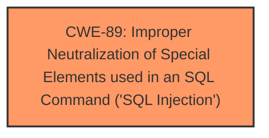

# Raw Analyzer Response for CVE-2025-1381

# Summary
| CWE ID | CWE Name | Confidence | CWE Abstraction Level | CWE Vulnerability Mapping Label | CWE-Vulnerability Mapping Notes |
|---|---|---|---|---|---|
| CWE-89 | Improper Neutralization of Special Elements used in an SQL Command ('SQL Injection') | 1.0 | Base | Allowed | Primary CWE. The vulnerability description explicitly states that the manipulation of the `CityName` argument leads to **SQL Injection**. |

## Evidence and Confidence

*   **Confidence Score:** 1.0
*   **Evidence Strength:** HIGH

## Relationship Analysis
The primary identified CWE is CWE-89, which is a base-level CWE. There are no direct parent-child or chain relationships that significantly influence the selection in this case, as the description directly points to SQL Injection.

## Vulnerability Chain
The vulnerability chain is straightforward:
1.  **Root Cause:** CWE-89 - **Improper Neutralization of Special Elements used in an SQL Command ('SQL Injection')** due to **lack of proper input validation** on the `CityName` argument.
2.  **Impact:** Remote attackers can manipulate SQL queries, potentially leading to unauthorized data access or modification.

## Summary of Analysis
The vulnerability description clearly states the presence of **SQL injection** due to the manipulation of the `CityName` argument in the `/ajax_city.php` file. This aligns directly with CWE-89, "Improper Neutralization of Special Elements used in an SQL Command ('SQL Injection')." The retriever results also list CWE-89 as the top candidate with a score of 1.0, further solidifying the choice.

The selection of CWE-89 is at the optimal level of specificity as it directly addresses the root cause of the vulnerability.

Relevant CWE Information:

# Enhanced Context (25 CWEs)
The following CWEs were identified as potentially relevant to this vulnerability:

## CWE-89: Improper Neutralization of Special Elements used in an SQL Command ('SQL Injection')
**Abstraction Level**: Base
**Similarity Score**: 0.77
**Source**: dense

**Description**:
The product constructs all or part of an SQL command using externally-influenced input from an upstream component, but it does not neutralize or incorrectly neutralizes special elements that could modify the intended SQL command when it is sent to a downstream component. Without sufficient removal or quoting of SQL syntax in user-controllable inputs, the generated SQL query can cause those inputs to be interpreted as SQL instead of ordinary user data.

**Mapping Guidance**:
- Usage: Allowed
- Rationale: This CWE entry is at the Base level of abstraction, which is a preferred level of abstraction for mapping to the root causes of vulnerabilities.

## CWE-79: Improper Neutralization of Input During Web Page Generation ('Cross-site Scripting')
While CWE-79, "Improper Neutralization of Input During Web Page Generation ('Cross-site Scripting')", was also a top result in the retriever, the vulnerability description specifically mentions **SQL injection**, making CWE-89 a more accurate fit.

## CWE-434: Unrestricted Upload of File with Dangerous Type
CWE-434, "Unrestricted Upload of File with Dangerous Type", is not relevant as the vulnerability is related to **SQL injection**, not file uploads.